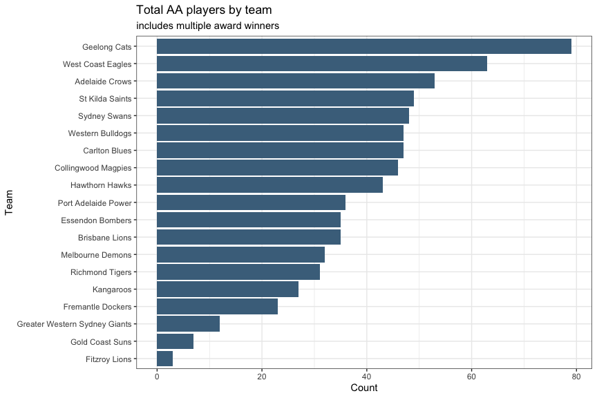
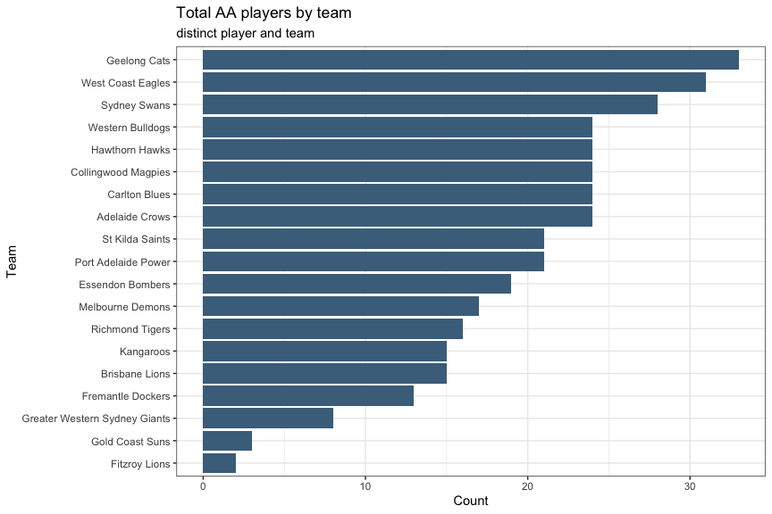
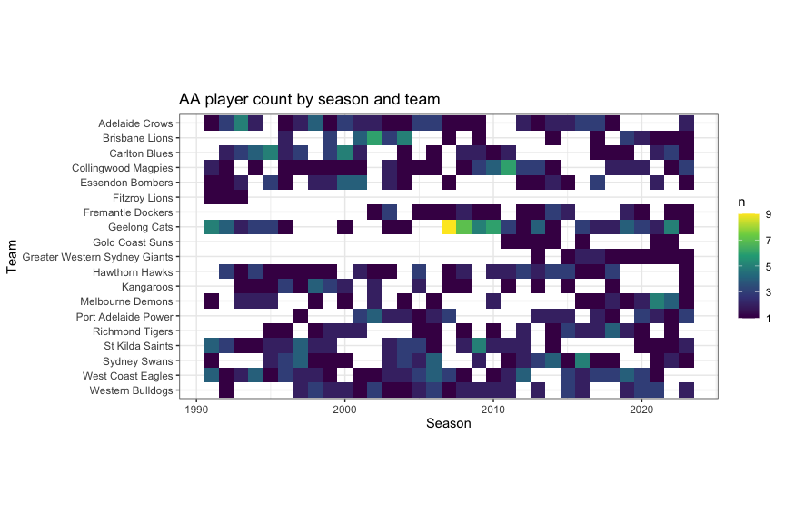
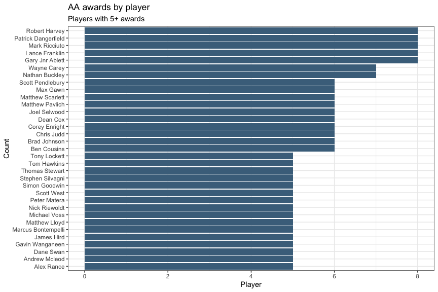
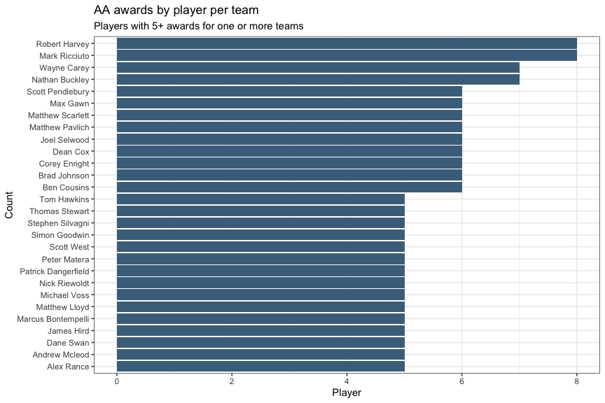
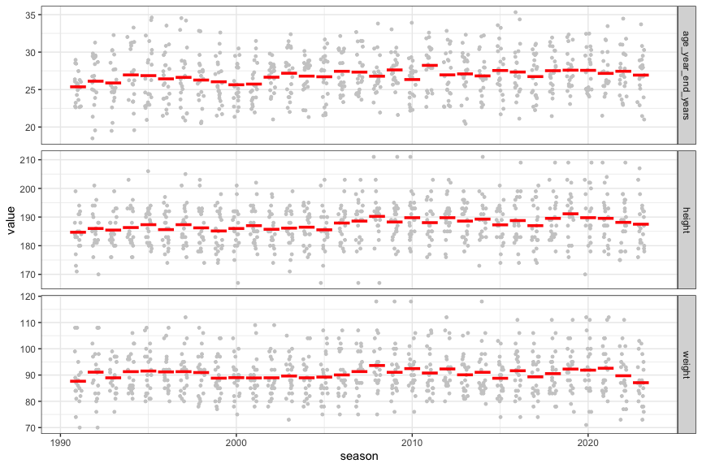

All-Australian Team Statistics
================
Neil Saunders
  
compiled 2023-08-31 21:07:08

# Summary

A look at some of the numbers around All-Australian (AA) AFL teams.

# Data

We start from the CSV file `all_australian_players.csv`. See the
Appendix for how it was generated.

We do some additional processing to extract the team name and unique
player name from the `href`.

Ages are calculated at the end of the year in which AA status was
awarded.

    ## Rows: 716
    ## Columns: 10
    ## $ season             <dbl> 1991, 1991, 1991, 1991, 1991, 1991, 1991, 1991, 1991, 1991, 1991, 1991, 1991, 1991, 1991, 1991, 1991, 1991, 1991, 1991, 1992, 1992,…
    ## $ href               <chr> "pp-west-coast-eagles--guy-mckenna", "pp-essendon-bombers--anthony-daniher", "pp-adelaide-crows--nigel-smart", "pp-st-kilda-saints-…
    ## $ name               <chr> "Guy McKenna", "Anthony Daniher", "Nigel Smart", "David Grant", "Paul Roos", "Ken Hinkley", "Chris Mainwaring", "Paul Couch", "Pete…
    ## $ dob                <date> 1969-05-11, 1963-01-21, 1969-05-21, 1966-08-07, 1963-06-27, 1966-09-30, 1965-12-27, 1964-07-19, 1969-04-03, 1967-09-25, 1968-05-23…
    ## $ height             <dbl> 184, 191, 188, 184, 188, 185, 177, 180, 183, 184, 194, 183, 171, 191, 182, 199, 180, 173, 192, 185, 190, 188, 181, 185, 194, 184, 1…
    ## $ weight             <dbl> 88, 90, 91, 84, 88, 80, 85, 82, 89, 86, 108, 81, 74, 108, 84, 99, 87, 70, 95, 84, 83, 88, 83, 80, 98, 91, 81, 92, 94, 86, 108, 97, …
    ## $ age_year_end_days  <dbl> 8269, 10571, 8259, 9277, 10414, 9223, 9500, 10026, 8307, 8863, 8622, 9593, 8309, 9428, 8484, 9383, 10387, 9520, 9103, 9625, 6750, 1…
    ## $ age_year_end_years <dbl> 22.65479, 28.96164, 22.62740, 25.41644, 28.53151, 25.26849, 26.02740, 27.46849, 22.75890, 24.28219, 23.62192, 26.28219, 22.76438, 2…
    ## $ team               <chr> "west-coast-eagles", "essendon-bombers", "adelaide-crows", "st-kilda-saints", "fitzroy-lions", "geelong-cats", "west-coast-eagles",…
    ## $ player             <chr> "guy-mckenna", "anthony-daniher", "nigel-smart", "david-grant", "paul-roos", "ken-hinkley", "chris-mainwaring", "paul-couch", "pete…

# Analysis

## Most Awards

### By team

This count includes players awarded AA for the team in multiple years.

<!-- -->

This count only counts one AA award per player per team.

<!-- -->

### By team and season

Geelong’s dominance in the late 2000s is apparent.

<!-- -->

### By player

Players with 5+ AA awards.

<!-- -->

### By player and team

Players with 5+ AA awards for one team. This drops some prominent
players *e.g.* Gary Ablett Jnr. and Lance Franklin, who each had 4
awards at 2 different clubs for 8 total.

<!-- -->

## Player selection

### Youngest

The top 20 youngest AA players.

<table class="table table-striped table-condensed" style="margin-left: auto; margin-right: auto;">
<caption>
20 youngest AA players by year first selected
</caption>
<thead>
<tr>
<th style="text-align:right;">
season
</th>
<th style="text-align:left;">
name
</th>
<th style="text-align:left;">
dob
</th>
<th style="text-align:right;">
height
</th>
<th style="text-align:right;">
weight
</th>
<th style="text-align:right;">
age_year_end_days
</th>
<th style="text-align:right;">
age_year_end_years
</th>
<th style="text-align:left;">
team
</th>
</tr>
</thead>
<tbody>
<tr>
<td style="text-align:right;">
1992
</td>
<td style="text-align:left;">
Ben Hart
</td>
<td style="text-align:left;">
1974-07-09
</td>
<td style="text-align:right;">
190
</td>
<td style="text-align:right;">
83
</td>
<td style="text-align:right;">
6750
</td>
<td style="text-align:right;">
18.49
</td>
<td style="text-align:left;">
Adelaide Crows
</td>
</tr>
<tr>
<td style="text-align:right;">
1992
</td>
<td style="text-align:left;">
Gavin Wanganeen
</td>
<td style="text-align:left;">
1973-06-16
</td>
<td style="text-align:right;">
181
</td>
<td style="text-align:right;">
83
</td>
<td style="text-align:right;">
7138
</td>
<td style="text-align:right;">
19.56
</td>
<td style="text-align:left;">
Essendon Bombers
</td>
</tr>
<tr>
<td style="text-align:right;">
1994
</td>
<td style="text-align:left;">
Mark Ricciuto
</td>
<td style="text-align:left;">
1975-06-08
</td>
<td style="text-align:right;">
184
</td>
<td style="text-align:right;">
92
</td>
<td style="text-align:right;">
7146
</td>
<td style="text-align:right;">
19.58
</td>
<td style="text-align:left;">
Adelaide Crows
</td>
</tr>
<tr>
<td style="text-align:right;">
2013
</td>
<td style="text-align:left;">
Chad Wingard
</td>
<td style="text-align:left;">
1993-07-29
</td>
<td style="text-align:right;">
183
</td>
<td style="text-align:right;">
82
</td>
<td style="text-align:right;">
7460
</td>
<td style="text-align:right;">
20.44
</td>
<td style="text-align:left;">
Port Adelaide Power
</td>
</tr>
<tr>
<td style="text-align:right;">
1998
</td>
<td style="text-align:left;">
Ben Cousins
</td>
<td style="text-align:left;">
1978-06-30
</td>
<td style="text-align:right;">
179
</td>
<td style="text-align:right;">
78
</td>
<td style="text-align:right;">
7489
</td>
<td style="text-align:right;">
20.52
</td>
<td style="text-align:left;">
West Coast Eagles
</td>
</tr>
<tr>
<td style="text-align:right;">
1998
</td>
<td style="text-align:left;">
Matthew Lloyd
</td>
<td style="text-align:left;">
1978-04-16
</td>
<td style="text-align:right;">
192
</td>
<td style="text-align:right;">
93
</td>
<td style="text-align:right;">
7564
</td>
<td style="text-align:right;">
20.72
</td>
<td style="text-align:left;">
Essendon Bombers
</td>
</tr>
<tr>
<td style="text-align:right;">
2013
</td>
<td style="text-align:left;">
Jeremy Cameron
</td>
<td style="text-align:left;">
1993-04-01
</td>
<td style="text-align:right;">
196
</td>
<td style="text-align:right;">
94
</td>
<td style="text-align:right;">
7579
</td>
<td style="text-align:right;">
20.76
</td>
<td style="text-align:left;">
Greater Western Sydney Giants
</td>
</tr>
<tr>
<td style="text-align:right;">
1997
</td>
<td style="text-align:left;">
Michael O’Loughlin
</td>
<td style="text-align:left;">
1977-02-20
</td>
<td style="text-align:right;">
189
</td>
<td style="text-align:right;">
90
</td>
<td style="text-align:right;">
7619
</td>
<td style="text-align:right;">
20.87
</td>
<td style="text-align:left;">
Sydney Swans
</td>
</tr>
<tr>
<td style="text-align:right;">
1995
</td>
<td style="text-align:left;">
David Neitz
</td>
<td style="text-align:left;">
1975-01-22
</td>
<td style="text-align:right;">
191
</td>
<td style="text-align:right;">
100
</td>
<td style="text-align:right;">
7648
</td>
<td style="text-align:right;">
20.95
</td>
<td style="text-align:left;">
Melbourne Demons
</td>
</tr>
<tr>
<td style="text-align:right;">
2023
</td>
<td style="text-align:left;">
Nick Daicos
</td>
<td style="text-align:left;">
2003-01-03
</td>
<td style="text-align:right;">
184
</td>
<td style="text-align:right;">
73
</td>
<td style="text-align:right;">
7667
</td>
<td style="text-align:right;">
21.01
</td>
<td style="text-align:left;">
Collingwood Magpies
</td>
</tr>
<tr>
<td style="text-align:right;">
2002
</td>
<td style="text-align:left;">
Matthew Pavlich
</td>
<td style="text-align:left;">
1981-12-31
</td>
<td style="text-align:right;">
192
</td>
<td style="text-align:right;">
99
</td>
<td style="text-align:right;">
7670
</td>
<td style="text-align:right;">
21.01
</td>
<td style="text-align:left;">
Fremantle Dockers
</td>
</tr>
<tr>
<td style="text-align:right;">
2016
</td>
<td style="text-align:left;">
Marcus Bontempelli
</td>
<td style="text-align:left;">
1995-11-24
</td>
<td style="text-align:right;">
193
</td>
<td style="text-align:right;">
93
</td>
<td style="text-align:right;">
7708
</td>
<td style="text-align:right;">
21.12
</td>
<td style="text-align:left;">
Western Bulldogs
</td>
</tr>
<tr>
<td style="text-align:right;">
1997
</td>
<td style="text-align:left;">
Austinn Jones
</td>
<td style="text-align:left;">
1976-09-28
</td>
<td style="text-align:right;">
176
</td>
<td style="text-align:right;">
82
</td>
<td style="text-align:right;">
7764
</td>
<td style="text-align:right;">
21.27
</td>
<td style="text-align:left;">
St Kilda Saints
</td>
</tr>
<tr>
<td style="text-align:right;">
2004
</td>
<td style="text-align:left;">
Chris Judd
</td>
<td style="text-align:left;">
1983-09-08
</td>
<td style="text-align:right;">
189
</td>
<td style="text-align:right;">
88
</td>
<td style="text-align:right;">
7785
</td>
<td style="text-align:right;">
21.33
</td>
<td style="text-align:left;">
West Coast Eagles
</td>
</tr>
<tr>
<td style="text-align:right;">
2000
</td>
<td style="text-align:left;">
Lance Whitnall
</td>
<td style="text-align:left;">
1979-08-23
</td>
<td style="text-align:right;">
192
</td>
<td style="text-align:right;">
100
</td>
<td style="text-align:right;">
7801
</td>
<td style="text-align:right;">
21.37
</td>
<td style="text-align:left;">
Carlton Blues
</td>
</tr>
<tr>
<td style="text-align:right;">
1992
</td>
<td style="text-align:left;">
Robert Harvey
</td>
<td style="text-align:left;">
1971-08-21
</td>
<td style="text-align:right;">
181
</td>
<td style="text-align:right;">
86
</td>
<td style="text-align:right;">
7803
</td>
<td style="text-align:right;">
21.38
</td>
<td style="text-align:left;">
St Kilda Saints
</td>
</tr>
<tr>
<td style="text-align:right;">
2018
</td>
<td style="text-align:left;">
Clayton Oliver
</td>
<td style="text-align:left;">
1997-07-22
</td>
<td style="text-align:right;">
189
</td>
<td style="text-align:right;">
87
</td>
<td style="text-align:right;">
7832
</td>
<td style="text-align:right;">
21.46
</td>
<td style="text-align:left;">
Melbourne Demons
</td>
</tr>
<tr>
<td style="text-align:right;">
2023
</td>
<td style="text-align:left;">
Errol Gulden
</td>
<td style="text-align:left;">
2002-07-18
</td>
<td style="text-align:right;">
176
</td>
<td style="text-align:right;">
78
</td>
<td style="text-align:right;">
7836
</td>
<td style="text-align:right;">
21.47
</td>
<td style="text-align:left;">
Sydney Swans
</td>
</tr>
<tr>
<td style="text-align:right;">
1996
</td>
<td style="text-align:left;">
Michael Voss
</td>
<td style="text-align:left;">
1975-07-07
</td>
<td style="text-align:right;">
183
</td>
<td style="text-align:right;">
88
</td>
<td style="text-align:right;">
7848
</td>
<td style="text-align:right;">
21.50
</td>
<td style="text-align:left;">
Brisbane Lions
</td>
</tr>
<tr>
<td style="text-align:right;">
2021
</td>
<td style="text-align:left;">
Sam Walsh
</td>
<td style="text-align:left;">
2000-07-02
</td>
<td style="text-align:right;">
184
</td>
<td style="text-align:right;">
84
</td>
<td style="text-align:right;">
7852
</td>
<td style="text-align:right;">
21.51
</td>
<td style="text-align:left;">
Carlton Blues
</td>
</tr>
</tbody>
</table>

### Youngest by team

The all-time youngest AA player by team.

<table class="table table-striped table-condensed" style="margin-left: auto; margin-right: auto;">
<caption>
Youngest AA player by team
</caption>
<thead>
<tr>
<th style="text-align:right;">
season
</th>
<th style="text-align:left;">
name
</th>
<th style="text-align:left;">
dob
</th>
<th style="text-align:right;">
height
</th>
<th style="text-align:right;">
weight
</th>
<th style="text-align:right;">
age_year_end_days
</th>
<th style="text-align:right;">
age_year_end_years
</th>
<th style="text-align:left;">
team
</th>
</tr>
</thead>
<tbody>
<tr>
<td style="text-align:right;">
1992
</td>
<td style="text-align:left;">
Ben Hart
</td>
<td style="text-align:left;">
1974-07-09
</td>
<td style="text-align:right;">
190
</td>
<td style="text-align:right;">
83
</td>
<td style="text-align:right;">
6750
</td>
<td style="text-align:right;">
18.49
</td>
<td style="text-align:left;">
Adelaide Crows
</td>
</tr>
<tr>
<td style="text-align:right;">
1996
</td>
<td style="text-align:left;">
Michael Voss
</td>
<td style="text-align:left;">
1975-07-07
</td>
<td style="text-align:right;">
183
</td>
<td style="text-align:right;">
88
</td>
<td style="text-align:right;">
7848
</td>
<td style="text-align:right;">
21.50
</td>
<td style="text-align:left;">
Brisbane Lions
</td>
</tr>
<tr>
<td style="text-align:right;">
2000
</td>
<td style="text-align:left;">
Lance Whitnall
</td>
<td style="text-align:left;">
1979-08-23
</td>
<td style="text-align:right;">
192
</td>
<td style="text-align:right;">
100
</td>
<td style="text-align:right;">
7801
</td>
<td style="text-align:right;">
21.37
</td>
<td style="text-align:left;">
Carlton Blues
</td>
</tr>
<tr>
<td style="text-align:right;">
2023
</td>
<td style="text-align:left;">
Nick Daicos
</td>
<td style="text-align:left;">
2003-01-03
</td>
<td style="text-align:right;">
184
</td>
<td style="text-align:right;">
73
</td>
<td style="text-align:right;">
7667
</td>
<td style="text-align:right;">
21.01
</td>
<td style="text-align:left;">
Collingwood Magpies
</td>
</tr>
<tr>
<td style="text-align:right;">
1992
</td>
<td style="text-align:left;">
Gavin Wanganeen
</td>
<td style="text-align:left;">
1973-06-16
</td>
<td style="text-align:right;">
181
</td>
<td style="text-align:right;">
83
</td>
<td style="text-align:right;">
7138
</td>
<td style="text-align:right;">
19.56
</td>
<td style="text-align:left;">
Essendon Bombers
</td>
</tr>
<tr>
<td style="text-align:right;">
1993
</td>
<td style="text-align:left;">
Alastair Lynch
</td>
<td style="text-align:left;">
1968-06-19
</td>
<td style="text-align:right;">
193
</td>
<td style="text-align:right;">
97
</td>
<td style="text-align:right;">
9326
</td>
<td style="text-align:right;">
25.55
</td>
<td style="text-align:left;">
Fitzroy Lions
</td>
</tr>
<tr>
<td style="text-align:right;">
2002
</td>
<td style="text-align:left;">
Matthew Pavlich
</td>
<td style="text-align:left;">
1981-12-31
</td>
<td style="text-align:right;">
192
</td>
<td style="text-align:right;">
99
</td>
<td style="text-align:right;">
7670
</td>
<td style="text-align:right;">
21.01
</td>
<td style="text-align:left;">
Fremantle Dockers
</td>
</tr>
<tr>
<td style="text-align:right;">
2009
</td>
<td style="text-align:left;">
Joel Selwood
</td>
<td style="text-align:left;">
1988-05-26
</td>
<td style="text-align:right;">
183
</td>
<td style="text-align:right;">
84
</td>
<td style="text-align:right;">
7889
</td>
<td style="text-align:right;">
21.61
</td>
<td style="text-align:left;">
Geelong Cats
</td>
</tr>
<tr>
<td style="text-align:right;">
2016
</td>
<td style="text-align:left;">
Tom Lynch
</td>
<td style="text-align:left;">
1992-10-31
</td>
<td style="text-align:right;">
199
</td>
<td style="text-align:right;">
99
</td>
<td style="text-align:right;">
8827
</td>
<td style="text-align:right;">
24.18
</td>
<td style="text-align:left;">
Gold Coast Suns
</td>
</tr>
<tr>
<td style="text-align:right;">
2013
</td>
<td style="text-align:left;">
Jeremy Cameron
</td>
<td style="text-align:left;">
1993-04-01
</td>
<td style="text-align:right;">
196
</td>
<td style="text-align:right;">
94
</td>
<td style="text-align:right;">
7579
</td>
<td style="text-align:right;">
20.76
</td>
<td style="text-align:left;">
Greater Western Sydney Giants
</td>
</tr>
<tr>
<td style="text-align:right;">
2005
</td>
<td style="text-align:left;">
Luke Hodge
</td>
<td style="text-align:left;">
1984-06-15
</td>
<td style="text-align:right;">
185
</td>
<td style="text-align:right;">
90
</td>
<td style="text-align:right;">
7869
</td>
<td style="text-align:right;">
21.56
</td>
<td style="text-align:left;">
Hawthorn Hawks
</td>
</tr>
<tr>
<td style="text-align:right;">
1999
</td>
<td style="text-align:left;">
Byron Pickett
</td>
<td style="text-align:left;">
1977-08-11
</td>
<td style="text-align:right;">
179
</td>
<td style="text-align:right;">
86
</td>
<td style="text-align:right;">
8177
</td>
<td style="text-align:right;">
22.40
</td>
<td style="text-align:left;">
Kangaroos
</td>
</tr>
<tr>
<td style="text-align:right;">
1995
</td>
<td style="text-align:left;">
David Neitz
</td>
<td style="text-align:left;">
1975-01-22
</td>
<td style="text-align:right;">
191
</td>
<td style="text-align:right;">
100
</td>
<td style="text-align:right;">
7648
</td>
<td style="text-align:right;">
20.95
</td>
<td style="text-align:left;">
Melbourne Demons
</td>
</tr>
<tr>
<td style="text-align:right;">
2013
</td>
<td style="text-align:left;">
Chad Wingard
</td>
<td style="text-align:left;">
1993-07-29
</td>
<td style="text-align:right;">
183
</td>
<td style="text-align:right;">
82
</td>
<td style="text-align:right;">
7460
</td>
<td style="text-align:right;">
20.44
</td>
<td style="text-align:left;">
Port Adelaide Power
</td>
</tr>
<tr>
<td style="text-align:right;">
1996
</td>
<td style="text-align:left;">
Matthew Richardson
</td>
<td style="text-align:left;">
1975-03-19
</td>
<td style="text-align:right;">
195
</td>
<td style="text-align:right;">
104
</td>
<td style="text-align:right;">
7958
</td>
<td style="text-align:right;">
21.80
</td>
<td style="text-align:left;">
Richmond Tigers
</td>
</tr>
<tr>
<td style="text-align:right;">
1997
</td>
<td style="text-align:left;">
Austinn Jones
</td>
<td style="text-align:left;">
1976-09-28
</td>
<td style="text-align:right;">
176
</td>
<td style="text-align:right;">
82
</td>
<td style="text-align:right;">
7764
</td>
<td style="text-align:right;">
21.27
</td>
<td style="text-align:left;">
St Kilda Saints
</td>
</tr>
<tr>
<td style="text-align:right;">
1997
</td>
<td style="text-align:left;">
Michael O’Loughlin
</td>
<td style="text-align:left;">
1977-02-20
</td>
<td style="text-align:right;">
189
</td>
<td style="text-align:right;">
90
</td>
<td style="text-align:right;">
7619
</td>
<td style="text-align:right;">
20.87
</td>
<td style="text-align:left;">
Sydney Swans
</td>
</tr>
<tr>
<td style="text-align:right;">
1998
</td>
<td style="text-align:left;">
Ben Cousins
</td>
<td style="text-align:left;">
1978-06-30
</td>
<td style="text-align:right;">
179
</td>
<td style="text-align:right;">
78
</td>
<td style="text-align:right;">
7489
</td>
<td style="text-align:right;">
20.52
</td>
<td style="text-align:left;">
West Coast Eagles
</td>
</tr>
<tr>
<td style="text-align:right;">
2016
</td>
<td style="text-align:left;">
Marcus Bontempelli
</td>
<td style="text-align:left;">
1995-11-24
</td>
<td style="text-align:right;">
193
</td>
<td style="text-align:right;">
93
</td>
<td style="text-align:right;">
7708
</td>
<td style="text-align:right;">
21.12
</td>
<td style="text-align:left;">
Western Bulldogs
</td>
</tr>
</tbody>
</table>

### Youngest by season

The youngest AA player each season.

<table class="table table-striped table-condensed" style="margin-left: auto; margin-right: auto;">
<caption>
Youngest AA player by season
</caption>
<thead>
<tr>
<th style="text-align:right;">
season
</th>
<th style="text-align:left;">
name
</th>
<th style="text-align:left;">
dob
</th>
<th style="text-align:right;">
height
</th>
<th style="text-align:right;">
weight
</th>
<th style="text-align:right;">
age_year_end_days
</th>
<th style="text-align:right;">
age_year_end_years
</th>
<th style="text-align:left;">
team
</th>
</tr>
</thead>
<tbody>
<tr>
<td style="text-align:right;">
1991
</td>
<td style="text-align:left;">
Nigel Smart
</td>
<td style="text-align:left;">
1969-05-21
</td>
<td style="text-align:right;">
188
</td>
<td style="text-align:right;">
91
</td>
<td style="text-align:right;">
8259
</td>
<td style="text-align:right;">
22.63
</td>
<td style="text-align:left;">
Adelaide Crows
</td>
</tr>
<tr>
<td style="text-align:right;">
1992
</td>
<td style="text-align:left;">
Ben Hart
</td>
<td style="text-align:left;">
1974-07-09
</td>
<td style="text-align:right;">
190
</td>
<td style="text-align:right;">
83
</td>
<td style="text-align:right;">
6750
</td>
<td style="text-align:right;">
18.49
</td>
<td style="text-align:left;">
Adelaide Crows
</td>
</tr>
<tr>
<td style="text-align:right;">
1993
</td>
<td style="text-align:left;">
Ben Hart
</td>
<td style="text-align:left;">
1974-07-09
</td>
<td style="text-align:right;">
190
</td>
<td style="text-align:right;">
83
</td>
<td style="text-align:right;">
7115
</td>
<td style="text-align:right;">
19.49
</td>
<td style="text-align:left;">
Adelaide Crows
</td>
</tr>
<tr>
<td style="text-align:right;">
1994
</td>
<td style="text-align:left;">
Mark Ricciuto
</td>
<td style="text-align:left;">
1975-06-08
</td>
<td style="text-align:right;">
184
</td>
<td style="text-align:right;">
92
</td>
<td style="text-align:right;">
7146
</td>
<td style="text-align:right;">
19.58
</td>
<td style="text-align:left;">
Adelaide Crows
</td>
</tr>
<tr>
<td style="text-align:right;">
1995
</td>
<td style="text-align:left;">
David Neitz
</td>
<td style="text-align:left;">
1975-01-22
</td>
<td style="text-align:right;">
191
</td>
<td style="text-align:right;">
100
</td>
<td style="text-align:right;">
7648
</td>
<td style="text-align:right;">
20.95
</td>
<td style="text-align:left;">
Melbourne Demons
</td>
</tr>
<tr>
<td style="text-align:right;">
1996
</td>
<td style="text-align:left;">
Michael Voss
</td>
<td style="text-align:left;">
1975-07-07
</td>
<td style="text-align:right;">
183
</td>
<td style="text-align:right;">
88
</td>
<td style="text-align:right;">
7848
</td>
<td style="text-align:right;">
21.50
</td>
<td style="text-align:left;">
Brisbane Lions
</td>
</tr>
<tr>
<td style="text-align:right;">
1997
</td>
<td style="text-align:left;">
Michael O’Loughlin
</td>
<td style="text-align:left;">
1977-02-20
</td>
<td style="text-align:right;">
189
</td>
<td style="text-align:right;">
90
</td>
<td style="text-align:right;">
7619
</td>
<td style="text-align:right;">
20.87
</td>
<td style="text-align:left;">
Sydney Swans
</td>
</tr>
<tr>
<td style="text-align:right;">
1998
</td>
<td style="text-align:left;">
Ben Cousins
</td>
<td style="text-align:left;">
1978-06-30
</td>
<td style="text-align:right;">
179
</td>
<td style="text-align:right;">
78
</td>
<td style="text-align:right;">
7489
</td>
<td style="text-align:right;">
20.52
</td>
<td style="text-align:left;">
West Coast Eagles
</td>
</tr>
<tr>
<td style="text-align:right;">
1999
</td>
<td style="text-align:left;">
Ben Cousins
</td>
<td style="text-align:left;">
1978-06-30
</td>
<td style="text-align:right;">
179
</td>
<td style="text-align:right;">
78
</td>
<td style="text-align:right;">
7854
</td>
<td style="text-align:right;">
21.52
</td>
<td style="text-align:left;">
West Coast Eagles
</td>
</tr>
<tr>
<td style="text-align:right;">
2000
</td>
<td style="text-align:left;">
Lance Whitnall
</td>
<td style="text-align:left;">
1979-08-23
</td>
<td style="text-align:right;">
192
</td>
<td style="text-align:right;">
100
</td>
<td style="text-align:right;">
7801
</td>
<td style="text-align:right;">
21.37
</td>
<td style="text-align:left;">
Carlton Blues
</td>
</tr>
<tr>
<td style="text-align:right;">
2001
</td>
<td style="text-align:left;">
Brad Ottens
</td>
<td style="text-align:left;">
1980-01-25
</td>
<td style="text-align:right;">
202
</td>
<td style="text-align:right;">
106
</td>
<td style="text-align:right;">
8011
</td>
<td style="text-align:right;">
21.95
</td>
<td style="text-align:left;">
Richmond Tigers
</td>
</tr>
<tr>
<td style="text-align:right;">
2002
</td>
<td style="text-align:left;">
Matthew Pavlich
</td>
<td style="text-align:left;">
1981-12-31
</td>
<td style="text-align:right;">
192
</td>
<td style="text-align:right;">
99
</td>
<td style="text-align:right;">
7670
</td>
<td style="text-align:right;">
21.01
</td>
<td style="text-align:left;">
Fremantle Dockers
</td>
</tr>
<tr>
<td style="text-align:right;">
2003
</td>
<td style="text-align:left;">
Matthew Pavlich
</td>
<td style="text-align:left;">
1981-12-31
</td>
<td style="text-align:right;">
192
</td>
<td style="text-align:right;">
99
</td>
<td style="text-align:right;">
8035
</td>
<td style="text-align:right;">
22.01
</td>
<td style="text-align:left;">
Fremantle Dockers
</td>
</tr>
<tr>
<td style="text-align:right;">
2004
</td>
<td style="text-align:left;">
Chris Judd
</td>
<td style="text-align:left;">
1983-09-08
</td>
<td style="text-align:right;">
189
</td>
<td style="text-align:right;">
88
</td>
<td style="text-align:right;">
7785
</td>
<td style="text-align:right;">
21.33
</td>
<td style="text-align:left;">
West Coast Eagles
</td>
</tr>
<tr>
<td style="text-align:right;">
2005
</td>
<td style="text-align:left;">
Luke Hodge
</td>
<td style="text-align:left;">
1984-06-15
</td>
<td style="text-align:right;">
185
</td>
<td style="text-align:right;">
90
</td>
<td style="text-align:right;">
7869
</td>
<td style="text-align:right;">
21.56
</td>
<td style="text-align:left;">
Hawthorn Hawks
</td>
</tr>
<tr>
<td style="text-align:right;">
2006
</td>
<td style="text-align:left;">
Chris Judd
</td>
<td style="text-align:left;">
1983-09-08
</td>
<td style="text-align:right;">
189
</td>
<td style="text-align:right;">
88
</td>
<td style="text-align:right;">
8515
</td>
<td style="text-align:right;">
23.33
</td>
<td style="text-align:left;">
West Coast Eagles
</td>
</tr>
<tr>
<td style="text-align:right;">
2007
</td>
<td style="text-align:left;">
Gary Ablett
</td>
<td style="text-align:left;">
1984-05-14
</td>
<td style="text-align:right;">
182
</td>
<td style="text-align:right;">
87
</td>
<td style="text-align:right;">
8631
</td>
<td style="text-align:right;">
23.65
</td>
<td style="text-align:left;">
Geelong Cats
</td>
</tr>
<tr>
<td style="text-align:right;">
2008
</td>
<td style="text-align:left;">
Lance Franklin
</td>
<td style="text-align:left;">
1987-01-30
</td>
<td style="text-align:right;">
199
</td>
<td style="text-align:right;">
106
</td>
<td style="text-align:right;">
8006
</td>
<td style="text-align:right;">
21.93
</td>
<td style="text-align:left;">
Hawthorn Hawks
</td>
</tr>
<tr>
<td style="text-align:right;">
2009
</td>
<td style="text-align:left;">
Joel Selwood
</td>
<td style="text-align:left;">
1988-05-26
</td>
<td style="text-align:right;">
183
</td>
<td style="text-align:right;">
84
</td>
<td style="text-align:right;">
7889
</td>
<td style="text-align:right;">
21.61
</td>
<td style="text-align:left;">
Geelong Cats
</td>
</tr>
<tr>
<td style="text-align:right;">
2010
</td>
<td style="text-align:left;">
Jack Riewoldt
</td>
<td style="text-align:left;">
1988-10-31
</td>
<td style="text-align:right;">
193
</td>
<td style="text-align:right;">
92
</td>
<td style="text-align:right;">
8096
</td>
<td style="text-align:right;">
22.18
</td>
<td style="text-align:left;">
Richmond Tigers
</td>
</tr>
<tr>
<td style="text-align:right;">
2011
</td>
<td style="text-align:left;">
Ben Reid
</td>
<td style="text-align:left;">
1989-04-29
</td>
<td style="text-align:right;">
196
</td>
<td style="text-align:right;">
98
</td>
<td style="text-align:right;">
8281
</td>
<td style="text-align:right;">
22.69
</td>
<td style="text-align:left;">
Collingwood Magpies
</td>
</tr>
<tr>
<td style="text-align:right;">
2012
</td>
<td style="text-align:left;">
Nicholas Naitanui
</td>
<td style="text-align:left;">
1990-05-04
</td>
<td style="text-align:right;">
202
</td>
<td style="text-align:right;">
112
</td>
<td style="text-align:right;">
8277
</td>
<td style="text-align:right;">
22.68
</td>
<td style="text-align:left;">
West Coast Eagles
</td>
</tr>
<tr>
<td style="text-align:right;">
2013
</td>
<td style="text-align:left;">
Chad Wingard
</td>
<td style="text-align:left;">
1993-07-29
</td>
<td style="text-align:right;">
183
</td>
<td style="text-align:right;">
82
</td>
<td style="text-align:right;">
7460
</td>
<td style="text-align:right;">
20.44
</td>
<td style="text-align:left;">
Port Adelaide Power
</td>
</tr>
<tr>
<td style="text-align:right;">
2014
</td>
<td style="text-align:left;">
Dyson Heppell
</td>
<td style="text-align:left;">
1992-05-14
</td>
<td style="text-align:right;">
189
</td>
<td style="text-align:right;">
87
</td>
<td style="text-align:right;">
8266
</td>
<td style="text-align:right;">
22.65
</td>
<td style="text-align:left;">
Essendon Bombers
</td>
</tr>
<tr>
<td style="text-align:right;">
2015
</td>
<td style="text-align:left;">
Jake Stringer
</td>
<td style="text-align:left;">
1994-04-25
</td>
<td style="text-align:right;">
192
</td>
<td style="text-align:right;">
90
</td>
<td style="text-align:right;">
7920
</td>
<td style="text-align:right;">
21.70
</td>
<td style="text-align:left;">
Western Bulldogs
</td>
</tr>
<tr>
<td style="text-align:right;">
2016
</td>
<td style="text-align:left;">
Marcus Bontempelli
</td>
<td style="text-align:left;">
1995-11-24
</td>
<td style="text-align:right;">
193
</td>
<td style="text-align:right;">
93
</td>
<td style="text-align:right;">
7708
</td>
<td style="text-align:right;">
21.12
</td>
<td style="text-align:left;">
Western Bulldogs
</td>
</tr>
<tr>
<td style="text-align:right;">
2017
</td>
<td style="text-align:left;">
Zachary Merrett
</td>
<td style="text-align:left;">
1995-10-03
</td>
<td style="text-align:right;">
179
</td>
<td style="text-align:right;">
85
</td>
<td style="text-align:right;">
8125
</td>
<td style="text-align:right;">
22.26
</td>
<td style="text-align:left;">
Essendon Bombers
</td>
</tr>
<tr>
<td style="text-align:right;">
2018
</td>
<td style="text-align:left;">
Clayton Oliver
</td>
<td style="text-align:left;">
1997-07-22
</td>
<td style="text-align:right;">
189
</td>
<td style="text-align:right;">
87
</td>
<td style="text-align:right;">
7832
</td>
<td style="text-align:right;">
21.46
</td>
<td style="text-align:left;">
Melbourne Demons
</td>
</tr>
<tr>
<td style="text-align:right;">
2019
</td>
<td style="text-align:left;">
Harris Andrews
</td>
<td style="text-align:left;">
1996-12-11
</td>
<td style="text-align:right;">
202
</td>
<td style="text-align:right;">
100
</td>
<td style="text-align:right;">
8420
</td>
<td style="text-align:right;">
23.07
</td>
<td style="text-align:left;">
Brisbane Lions
</td>
</tr>
<tr>
<td style="text-align:right;">
2020
</td>
<td style="text-align:left;">
Harris Andrews
</td>
<td style="text-align:left;">
1996-12-11
</td>
<td style="text-align:right;">
202
</td>
<td style="text-align:right;">
100
</td>
<td style="text-align:right;">
8786
</td>
<td style="text-align:right;">
24.07
</td>
<td style="text-align:left;">
Brisbane Lions
</td>
</tr>
<tr>
<td style="text-align:right;">
2021
</td>
<td style="text-align:left;">
Sam Walsh
</td>
<td style="text-align:left;">
2000-07-02
</td>
<td style="text-align:right;">
184
</td>
<td style="text-align:right;">
84
</td>
<td style="text-align:right;">
7852
</td>
<td style="text-align:right;">
21.51
</td>
<td style="text-align:left;">
Carlton Blues
</td>
</tr>
<tr>
<td style="text-align:right;">
2022
</td>
<td style="text-align:left;">
Connor Rozee
</td>
<td style="text-align:left;">
2000-01-22
</td>
<td style="text-align:right;">
185
</td>
<td style="text-align:right;">
80
</td>
<td style="text-align:right;">
8379
</td>
<td style="text-align:right;">
22.96
</td>
<td style="text-align:left;">
Port Adelaide Power
</td>
</tr>
<tr>
<td style="text-align:right;">
2023
</td>
<td style="text-align:left;">
Nick Daicos
</td>
<td style="text-align:left;">
2003-01-03
</td>
<td style="text-align:right;">
184
</td>
<td style="text-align:right;">
73
</td>
<td style="text-align:right;">
7667
</td>
<td style="text-align:right;">
21.01
</td>
<td style="text-align:left;">
Collingwood Magpies
</td>
</tr>
</tbody>
</table>

### Oldest

The top 20 oldest AA players.

<table class="table table-striped table-condensed" style="margin-left: auto; margin-right: auto;">
<caption>
20 oldest AA players by year last selected
</caption>
<thead>
<tr>
<th style="text-align:right;">
season
</th>
<th style="text-align:left;">
name
</th>
<th style="text-align:left;">
dob
</th>
<th style="text-align:right;">
height
</th>
<th style="text-align:right;">
weight
</th>
<th style="text-align:right;">
age_year_end_days
</th>
<th style="text-align:right;">
age_year_end_years
</th>
<th style="text-align:left;">
team
</th>
</tr>
</thead>
<tbody>
<tr>
<td style="text-align:right;">
2016
</td>
<td style="text-align:left;">
Corey Enright
</td>
<td style="text-align:left;">
1981-09-14
</td>
<td style="text-align:right;">
187
</td>
<td style="text-align:right;">
90
</td>
<td style="text-align:right;">
12892
</td>
<td style="text-align:right;">
35.32
</td>
<td style="text-align:left;">
Geelong Cats
</td>
</tr>
<tr>
<td style="text-align:right;">
1995
</td>
<td style="text-align:left;">
Justin Madden
</td>
<td style="text-align:left;">
1961-05-31
</td>
<td style="text-align:right;">
206
</td>
<td style="text-align:right;">
107
</td>
<td style="text-align:right;">
12632
</td>
<td style="text-align:right;">
34.61
</td>
<td style="text-align:left;">
Carlton Blues
</td>
</tr>
<tr>
<td style="text-align:right;">
1997
</td>
<td style="text-align:left;">
Paul Roos
</td>
<td style="text-align:left;">
1963-06-27
</td>
<td style="text-align:right;">
188
</td>
<td style="text-align:right;">
88
</td>
<td style="text-align:right;">
12606
</td>
<td style="text-align:right;">
34.54
</td>
<td style="text-align:left;">
Sydney Swans
</td>
</tr>
<tr>
<td style="text-align:right;">
2022
</td>
<td style="text-align:left;">
Tom Hawkins
</td>
<td style="text-align:left;">
1988-07-21
</td>
<td style="text-align:right;">
198
</td>
<td style="text-align:right;">
104
</td>
<td style="text-align:right;">
12581
</td>
<td style="text-align:right;">
34.47
</td>
<td style="text-align:left;">
Geelong Cats
</td>
</tr>
<tr>
<td style="text-align:right;">
2016
</td>
<td style="text-align:left;">
Matthew Boyd
</td>
<td style="text-align:left;">
1982-08-27
</td>
<td style="text-align:right;">
184
</td>
<td style="text-align:right;">
88
</td>
<td style="text-align:right;">
12545
</td>
<td style="text-align:right;">
34.37
</td>
<td style="text-align:left;">
Western Bulldogs
</td>
</tr>
<tr>
<td style="text-align:right;">
1995
</td>
<td style="text-align:left;">
Gary Ablett
</td>
<td style="text-align:left;">
1961-10-01
</td>
<td style="text-align:right;">
185
</td>
<td style="text-align:right;">
97
</td>
<td style="text-align:right;">
12509
</td>
<td style="text-align:right;">
34.27
</td>
<td style="text-align:left;">
Geelong Cats
</td>
</tr>
<tr>
<td style="text-align:right;">
1997
</td>
<td style="text-align:left;">
Craig Bradley
</td>
<td style="text-align:left;">
1963-10-23
</td>
<td style="text-align:right;">
180
</td>
<td style="text-align:right;">
81
</td>
<td style="text-align:right;">
12488
</td>
<td style="text-align:right;">
34.21
</td>
<td style="text-align:left;">
Carlton Blues
</td>
</tr>
<tr>
<td style="text-align:right;">
2010
</td>
<td style="text-align:left;">
Barry Hall
</td>
<td style="text-align:left;">
1977-02-08
</td>
<td style="text-align:right;">
194
</td>
<td style="text-align:right;">
104
</td>
<td style="text-align:right;">
12379
</td>
<td style="text-align:right;">
33.92
</td>
<td style="text-align:left;">
Western Bulldogs
</td>
</tr>
<tr>
<td style="text-align:right;">
2008
</td>
<td style="text-align:left;">
Matthew Richardson
</td>
<td style="text-align:left;">
1975-03-19
</td>
<td style="text-align:right;">
195
</td>
<td style="text-align:right;">
104
</td>
<td style="text-align:right;">
12341
</td>
<td style="text-align:right;">
33.81
</td>
<td style="text-align:left;">
Richmond Tigers
</td>
</tr>
<tr>
<td style="text-align:right;">
2023
</td>
<td style="text-align:left;">
Taylor Walker
</td>
<td style="text-align:left;">
1990-04-25
</td>
<td style="text-align:right;">
194
</td>
<td style="text-align:right;">
102
</td>
<td style="text-align:right;">
12303
</td>
<td style="text-align:right;">
33.71
</td>
<td style="text-align:left;">
Adelaide Crows
</td>
</tr>
<tr>
<td style="text-align:right;">
2015
</td>
<td style="text-align:left;">
Robert Murphy
</td>
<td style="text-align:left;">
1982-06-09
</td>
<td style="text-align:right;">
187
</td>
<td style="text-align:right;">
81
</td>
<td style="text-align:right;">
12258
</td>
<td style="text-align:right;">
33.58
</td>
<td style="text-align:left;">
Western Bulldogs
</td>
</tr>
<tr>
<td style="text-align:right;">
2015
</td>
<td style="text-align:left;">
Sam Mitchell
</td>
<td style="text-align:left;">
1982-10-12
</td>
<td style="text-align:right;">
180
</td>
<td style="text-align:right;">
84
</td>
<td style="text-align:right;">
12133
</td>
<td style="text-align:right;">
33.24
</td>
<td style="text-align:left;">
Hawthorn Hawks
</td>
</tr>
<tr>
<td style="text-align:right;">
2009
</td>
<td style="text-align:left;">
Simon Goodwin
</td>
<td style="text-align:left;">
1976-12-26
</td>
<td style="text-align:right;">
185
</td>
<td style="text-align:right;">
86
</td>
<td style="text-align:right;">
12058
</td>
<td style="text-align:right;">
33.04
</td>
<td style="text-align:left;">
Adelaide Crows
</td>
</tr>
<tr>
<td style="text-align:right;">
1997
</td>
<td style="text-align:left;">
Paul Salmon
</td>
<td style="text-align:left;">
1965-01-20
</td>
<td style="text-align:right;">
205
</td>
<td style="text-align:right;">
112
</td>
<td style="text-align:right;">
12033
</td>
<td style="text-align:right;">
32.97
</td>
<td style="text-align:left;">
Hawthorn Hawks
</td>
</tr>
<tr>
<td style="text-align:right;">
2012
</td>
<td style="text-align:left;">
Stephen Milne
</td>
<td style="text-align:left;">
1980-03-08
</td>
<td style="text-align:right;">
176
</td>
<td style="text-align:right;">
83
</td>
<td style="text-align:right;">
11986
</td>
<td style="text-align:right;">
32.84
</td>
<td style="text-align:left;">
St Kilda Saints
</td>
</tr>
<tr>
<td style="text-align:right;">
1998
</td>
<td style="text-align:left;">
Tony Lockett
</td>
<td style="text-align:left;">
1966-03-09
</td>
<td style="text-align:right;">
191
</td>
<td style="text-align:right;">
108
</td>
<td style="text-align:right;">
11985
</td>
<td style="text-align:right;">
32.84
</td>
<td style="text-align:left;">
Sydney Swans
</td>
</tr>
<tr>
<td style="text-align:right;">
1998
</td>
<td style="text-align:left;">
Todd Viney
</td>
<td style="text-align:left;">
1966-03-30
</td>
<td style="text-align:right;">
183
</td>
<td style="text-align:right;">
92
</td>
<td style="text-align:right;">
11964
</td>
<td style="text-align:right;">
32.78
</td>
<td style="text-align:left;">
Melbourne Demons
</td>
</tr>
<tr>
<td style="text-align:right;">
2007
</td>
<td style="text-align:left;">
Dustin Fletcher
</td>
<td style="text-align:left;">
1975-05-07
</td>
<td style="text-align:right;">
198
</td>
<td style="text-align:right;">
92
</td>
<td style="text-align:right;">
11926
</td>
<td style="text-align:right;">
32.67
</td>
<td style="text-align:left;">
Essendon Bombers
</td>
</tr>
<tr>
<td style="text-align:right;">
1999
</td>
<td style="text-align:left;">
Stephen Silvagni
</td>
<td style="text-align:left;">
1967-05-31
</td>
<td style="text-align:right;">
194
</td>
<td style="text-align:right;">
95
</td>
<td style="text-align:right;">
11902
</td>
<td style="text-align:right;">
32.61
</td>
<td style="text-align:left;">
Carlton Blues
</td>
</tr>
<tr>
<td style="text-align:right;">
2011
</td>
<td style="text-align:left;">
Matthew Scarlett
</td>
<td style="text-align:left;">
1979-06-05
</td>
<td style="text-align:right;">
192
</td>
<td style="text-align:right;">
94
</td>
<td style="text-align:right;">
11897
</td>
<td style="text-align:right;">
32.59
</td>
<td style="text-align:left;">
Geelong Cats
</td>
</tr>
</tbody>
</table>

### Oldest by team

The all-time oldest AA player by team.

<table class="table table-striped table-condensed" style="margin-left: auto; margin-right: auto;">
<caption>
Oldest AA player by team
</caption>
<thead>
<tr>
<th style="text-align:right;">
season
</th>
<th style="text-align:left;">
name
</th>
<th style="text-align:left;">
dob
</th>
<th style="text-align:right;">
height
</th>
<th style="text-align:right;">
weight
</th>
<th style="text-align:right;">
age_year_end_days
</th>
<th style="text-align:right;">
age_year_end_years
</th>
<th style="text-align:left;">
team
</th>
</tr>
</thead>
<tbody>
<tr>
<td style="text-align:right;">
2023
</td>
<td style="text-align:left;">
Taylor Walker
</td>
<td style="text-align:left;">
1990-04-25
</td>
<td style="text-align:right;">
194
</td>
<td style="text-align:right;">
102
</td>
<td style="text-align:right;">
12303
</td>
<td style="text-align:right;">
33.71
</td>
<td style="text-align:left;">
Adelaide Crows
</td>
</tr>
<tr>
<td style="text-align:right;">
2021
</td>
<td style="text-align:left;">
Daniel Rich
</td>
<td style="text-align:left;">
1990-06-07
</td>
<td style="text-align:right;">
183
</td>
<td style="text-align:right;">
95
</td>
<td style="text-align:right;">
11530
</td>
<td style="text-align:right;">
31.59
</td>
<td style="text-align:left;">
Brisbane Lions
</td>
</tr>
<tr>
<td style="text-align:right;">
1995
</td>
<td style="text-align:left;">
Justin Madden
</td>
<td style="text-align:left;">
1961-05-31
</td>
<td style="text-align:right;">
206
</td>
<td style="text-align:right;">
107
</td>
<td style="text-align:right;">
12632
</td>
<td style="text-align:right;">
34.61
</td>
<td style="text-align:left;">
Carlton Blues
</td>
</tr>
<tr>
<td style="text-align:right;">
2019
</td>
<td style="text-align:left;">
Scott Pendlebury
</td>
<td style="text-align:left;">
1988-01-07
</td>
<td style="text-align:right;">
191
</td>
<td style="text-align:right;">
86
</td>
<td style="text-align:right;">
11681
</td>
<td style="text-align:right;">
32.00
</td>
<td style="text-align:left;">
Collingwood Magpies
</td>
</tr>
<tr>
<td style="text-align:right;">
2007
</td>
<td style="text-align:left;">
Dustin Fletcher
</td>
<td style="text-align:left;">
1975-05-07
</td>
<td style="text-align:right;">
198
</td>
<td style="text-align:right;">
92
</td>
<td style="text-align:right;">
11926
</td>
<td style="text-align:right;">
32.67
</td>
<td style="text-align:left;">
Essendon Bombers
</td>
</tr>
<tr>
<td style="text-align:right;">
1992
</td>
<td style="text-align:left;">
Paul Roos
</td>
<td style="text-align:left;">
1963-06-27
</td>
<td style="text-align:right;">
188
</td>
<td style="text-align:right;">
88
</td>
<td style="text-align:right;">
10780
</td>
<td style="text-align:right;">
29.53
</td>
<td style="text-align:left;">
Fitzroy Lions
</td>
</tr>
<tr>
<td style="text-align:right;">
2014
</td>
<td style="text-align:left;">
Aaron Sandilands
</td>
<td style="text-align:left;">
1982-12-06
</td>
<td style="text-align:right;">
211
</td>
<td style="text-align:right;">
118
</td>
<td style="text-align:right;">
11713
</td>
<td style="text-align:right;">
32.09
</td>
<td style="text-align:left;">
Fremantle Dockers
</td>
</tr>
<tr>
<td style="text-align:right;">
2016
</td>
<td style="text-align:left;">
Corey Enright
</td>
<td style="text-align:left;">
1981-09-14
</td>
<td style="text-align:right;">
187
</td>
<td style="text-align:right;">
90
</td>
<td style="text-align:right;">
12892
</td>
<td style="text-align:right;">
35.32
</td>
<td style="text-align:left;">
Geelong Cats
</td>
</tr>
<tr>
<td style="text-align:right;">
2014
</td>
<td style="text-align:left;">
Gary Ablett
</td>
<td style="text-align:left;">
1984-05-14
</td>
<td style="text-align:right;">
182
</td>
<td style="text-align:right;">
87
</td>
<td style="text-align:right;">
11188
</td>
<td style="text-align:right;">
30.65
</td>
<td style="text-align:left;">
Gold Coast Suns
</td>
</tr>
<tr>
<td style="text-align:right;">
2016
</td>
<td style="text-align:left;">
Heath Shaw
</td>
<td style="text-align:left;">
1985-11-27
</td>
<td style="text-align:right;">
183
</td>
<td style="text-align:right;">
86
</td>
<td style="text-align:right;">
11357
</td>
<td style="text-align:right;">
31.12
</td>
<td style="text-align:left;">
Greater Western Sydney Giants
</td>
</tr>
<tr>
<td style="text-align:right;">
2015
</td>
<td style="text-align:left;">
Sam Mitchell
</td>
<td style="text-align:left;">
1982-10-12
</td>
<td style="text-align:right;">
180
</td>
<td style="text-align:right;">
84
</td>
<td style="text-align:right;">
12133
</td>
<td style="text-align:right;">
33.24
</td>
<td style="text-align:left;">
Hawthorn Hawks
</td>
</tr>
<tr>
<td style="text-align:right;">
2018
</td>
<td style="text-align:left;">
Shaun Higgins
</td>
<td style="text-align:left;">
1988-03-04
</td>
<td style="text-align:right;">
184
</td>
<td style="text-align:right;">
89
</td>
<td style="text-align:right;">
11259
</td>
<td style="text-align:right;">
30.85
</td>
<td style="text-align:left;">
Kangaroos
</td>
</tr>
<tr>
<td style="text-align:right;">
1998
</td>
<td style="text-align:left;">
Todd Viney
</td>
<td style="text-align:left;">
1966-03-30
</td>
<td style="text-align:right;">
183
</td>
<td style="text-align:right;">
92
</td>
<td style="text-align:right;">
11964
</td>
<td style="text-align:right;">
32.78
</td>
<td style="text-align:left;">
Melbourne Demons
</td>
</tr>
<tr>
<td style="text-align:right;">
2020
</td>
<td style="text-align:left;">
Travis Boak
</td>
<td style="text-align:left;">
1988-08-01
</td>
<td style="text-align:right;">
183
</td>
<td style="text-align:right;">
85
</td>
<td style="text-align:right;">
11840
</td>
<td style="text-align:right;">
32.44
</td>
<td style="text-align:left;">
Port Adelaide Power
</td>
</tr>
<tr>
<td style="text-align:right;">
2008
</td>
<td style="text-align:left;">
Matthew Richardson
</td>
<td style="text-align:left;">
1975-03-19
</td>
<td style="text-align:right;">
195
</td>
<td style="text-align:right;">
104
</td>
<td style="text-align:right;">
12341
</td>
<td style="text-align:right;">
33.81
</td>
<td style="text-align:left;">
Richmond Tigers
</td>
</tr>
<tr>
<td style="text-align:right;">
2012
</td>
<td style="text-align:left;">
Stephen Milne
</td>
<td style="text-align:left;">
1980-03-08
</td>
<td style="text-align:right;">
176
</td>
<td style="text-align:right;">
83
</td>
<td style="text-align:right;">
11986
</td>
<td style="text-align:right;">
32.84
</td>
<td style="text-align:left;">
St Kilda Saints
</td>
</tr>
<tr>
<td style="text-align:right;">
1997
</td>
<td style="text-align:left;">
Paul Roos
</td>
<td style="text-align:left;">
1963-06-27
</td>
<td style="text-align:right;">
188
</td>
<td style="text-align:right;">
88
</td>
<td style="text-align:right;">
12606
</td>
<td style="text-align:right;">
34.54
</td>
<td style="text-align:left;">
Sydney Swans
</td>
</tr>
<tr>
<td style="text-align:right;">
2019
</td>
<td style="text-align:left;">
Shannon Hurn
</td>
<td style="text-align:left;">
1987-09-04
</td>
<td style="text-align:right;">
187
</td>
<td style="text-align:right;">
95
</td>
<td style="text-align:right;">
11806
</td>
<td style="text-align:right;">
32.35
</td>
<td style="text-align:left;">
West Coast Eagles
</td>
</tr>
<tr>
<td style="text-align:right;">
2016
</td>
<td style="text-align:left;">
Matthew Boyd
</td>
<td style="text-align:left;">
1982-08-27
</td>
<td style="text-align:right;">
184
</td>
<td style="text-align:right;">
88
</td>
<td style="text-align:right;">
12545
</td>
<td style="text-align:right;">
34.37
</td>
<td style="text-align:left;">
Western Bulldogs
</td>
</tr>
</tbody>
</table>

### Oldest by season

The oldest AA player each season.

<table class="table table-striped table-condensed" style="margin-left: auto; margin-right: auto;">
<caption>
Oldest AA player by season
</caption>
<thead>
<tr>
<th style="text-align:right;">
season
</th>
<th style="text-align:left;">
name
</th>
<th style="text-align:left;">
dob
</th>
<th style="text-align:right;">
height
</th>
<th style="text-align:right;">
weight
</th>
<th style="text-align:right;">
age_year_end_days
</th>
<th style="text-align:right;">
age_year_end_years
</th>
<th style="text-align:left;">
team
</th>
</tr>
</thead>
<tbody>
<tr>
<td style="text-align:right;">
1991
</td>
<td style="text-align:left;">
Anthony Daniher
</td>
<td style="text-align:left;">
1963-01-21
</td>
<td style="text-align:right;">
191
</td>
<td style="text-align:right;">
90
</td>
<td style="text-align:right;">
10571
</td>
<td style="text-align:right;">
28.96
</td>
<td style="text-align:left;">
Essendon Bombers
</td>
</tr>
<tr>
<td style="text-align:right;">
1992
</td>
<td style="text-align:left;">
Gary Ablett
</td>
<td style="text-align:left;">
1961-10-01
</td>
<td style="text-align:right;">
185
</td>
<td style="text-align:right;">
97
</td>
<td style="text-align:right;">
11414
</td>
<td style="text-align:right;">
31.27
</td>
<td style="text-align:left;">
Geelong Cats
</td>
</tr>
<tr>
<td style="text-align:right;">
1993
</td>
<td style="text-align:left;">
Gary Ablett
</td>
<td style="text-align:left;">
1961-10-01
</td>
<td style="text-align:right;">
185
</td>
<td style="text-align:right;">
97
</td>
<td style="text-align:right;">
11779
</td>
<td style="text-align:right;">
32.27
</td>
<td style="text-align:left;">
Geelong Cats
</td>
</tr>
<tr>
<td style="text-align:right;">
1994
</td>
<td style="text-align:left;">
Gary Ablett
</td>
<td style="text-align:left;">
1961-10-01
</td>
<td style="text-align:right;">
185
</td>
<td style="text-align:right;">
97
</td>
<td style="text-align:right;">
12144
</td>
<td style="text-align:right;">
33.27
</td>
<td style="text-align:left;">
Geelong Cats
</td>
</tr>
<tr>
<td style="text-align:right;">
1995
</td>
<td style="text-align:left;">
Justin Madden
</td>
<td style="text-align:left;">
1961-05-31
</td>
<td style="text-align:right;">
206
</td>
<td style="text-align:right;">
107
</td>
<td style="text-align:right;">
12632
</td>
<td style="text-align:right;">
34.61
</td>
<td style="text-align:left;">
Carlton Blues
</td>
</tr>
<tr>
<td style="text-align:right;">
1996
</td>
<td style="text-align:left;">
Paul Roos
</td>
<td style="text-align:left;">
1963-06-27
</td>
<td style="text-align:right;">
188
</td>
<td style="text-align:right;">
88
</td>
<td style="text-align:right;">
12241
</td>
<td style="text-align:right;">
33.54
</td>
<td style="text-align:left;">
Sydney Swans
</td>
</tr>
<tr>
<td style="text-align:right;">
1997
</td>
<td style="text-align:left;">
Paul Roos
</td>
<td style="text-align:left;">
1963-06-27
</td>
<td style="text-align:right;">
188
</td>
<td style="text-align:right;">
88
</td>
<td style="text-align:right;">
12606
</td>
<td style="text-align:right;">
34.54
</td>
<td style="text-align:left;">
Sydney Swans
</td>
</tr>
<tr>
<td style="text-align:right;">
1998
</td>
<td style="text-align:left;">
Tony Lockett
</td>
<td style="text-align:left;">
1966-03-09
</td>
<td style="text-align:right;">
191
</td>
<td style="text-align:right;">
108
</td>
<td style="text-align:right;">
11985
</td>
<td style="text-align:right;">
32.84
</td>
<td style="text-align:left;">
Sydney Swans
</td>
</tr>
<tr>
<td style="text-align:right;">
1999
</td>
<td style="text-align:left;">
Stephen Silvagni
</td>
<td style="text-align:left;">
1967-05-31
</td>
<td style="text-align:right;">
194
</td>
<td style="text-align:right;">
95
</td>
<td style="text-align:right;">
11902
</td>
<td style="text-align:right;">
32.61
</td>
<td style="text-align:left;">
Carlton Blues
</td>
</tr>
<tr>
<td style="text-align:right;">
2000
</td>
<td style="text-align:left;">
Andrew McKay
</td>
<td style="text-align:left;">
1970-07-14
</td>
<td style="text-align:right;">
185
</td>
<td style="text-align:right;">
90
</td>
<td style="text-align:right;">
11128
</td>
<td style="text-align:right;">
30.49
</td>
<td style="text-align:left;">
Carlton Blues
</td>
</tr>
<tr>
<td style="text-align:right;">
2001
</td>
<td style="text-align:left;">
Andrew McKay
</td>
<td style="text-align:left;">
1970-07-14
</td>
<td style="text-align:right;">
185
</td>
<td style="text-align:right;">
90
</td>
<td style="text-align:right;">
11493
</td>
<td style="text-align:right;">
31.49
</td>
<td style="text-align:left;">
Carlton Blues
</td>
</tr>
<tr>
<td style="text-align:right;">
2002
</td>
<td style="text-align:left;">
Glenn Archer
</td>
<td style="text-align:left;">
1973-03-24
</td>
<td style="text-align:right;">
182
</td>
<td style="text-align:right;">
92
</td>
<td style="text-align:right;">
10874
</td>
<td style="text-align:right;">
29.79
</td>
<td style="text-align:left;">
Kangaroos
</td>
</tr>
<tr>
<td style="text-align:right;">
2003
</td>
<td style="text-align:left;">
Robert Harvey
</td>
<td style="text-align:left;">
1971-08-21
</td>
<td style="text-align:right;">
181
</td>
<td style="text-align:right;">
86
</td>
<td style="text-align:right;">
11820
</td>
<td style="text-align:right;">
32.38
</td>
<td style="text-align:left;">
St Kilda Saints
</td>
</tr>
<tr>
<td style="text-align:right;">
2004
</td>
<td style="text-align:left;">
Scott West
</td>
<td style="text-align:left;">
1974-11-14
</td>
<td style="text-align:right;">
178
</td>
<td style="text-align:right;">
83
</td>
<td style="text-align:right;">
11005
</td>
<td style="text-align:right;">
30.15
</td>
<td style="text-align:left;">
Western Bulldogs
</td>
</tr>
<tr>
<td style="text-align:right;">
2005
</td>
<td style="text-align:left;">
Peter Everitt
</td>
<td style="text-align:left;">
1974-05-03
</td>
<td style="text-align:right;">
201
</td>
<td style="text-align:right;">
102
</td>
<td style="text-align:right;">
11565
</td>
<td style="text-align:right;">
31.68
</td>
<td style="text-align:left;">
Hawthorn Hawks
</td>
</tr>
<tr>
<td style="text-align:right;">
2006
</td>
<td style="text-align:left;">
Scott West
</td>
<td style="text-align:left;">
1974-11-14
</td>
<td style="text-align:right;">
178
</td>
<td style="text-align:right;">
83
</td>
<td style="text-align:right;">
11735
</td>
<td style="text-align:right;">
32.15
</td>
<td style="text-align:left;">
Western Bulldogs
</td>
</tr>
<tr>
<td style="text-align:right;">
2007
</td>
<td style="text-align:left;">
Dustin Fletcher
</td>
<td style="text-align:left;">
1975-05-07
</td>
<td style="text-align:right;">
198
</td>
<td style="text-align:right;">
92
</td>
<td style="text-align:right;">
11926
</td>
<td style="text-align:right;">
32.67
</td>
<td style="text-align:left;">
Essendon Bombers
</td>
</tr>
<tr>
<td style="text-align:right;">
2008
</td>
<td style="text-align:left;">
Matthew Richardson
</td>
<td style="text-align:left;">
1975-03-19
</td>
<td style="text-align:right;">
195
</td>
<td style="text-align:right;">
104
</td>
<td style="text-align:right;">
12341
</td>
<td style="text-align:right;">
33.81
</td>
<td style="text-align:left;">
Richmond Tigers
</td>
</tr>
<tr>
<td style="text-align:right;">
2009
</td>
<td style="text-align:left;">
Simon Goodwin
</td>
<td style="text-align:left;">
1976-12-26
</td>
<td style="text-align:right;">
185
</td>
<td style="text-align:right;">
86
</td>
<td style="text-align:right;">
12058
</td>
<td style="text-align:right;">
33.04
</td>
<td style="text-align:left;">
Adelaide Crows
</td>
</tr>
<tr>
<td style="text-align:right;">
2010
</td>
<td style="text-align:left;">
Barry Hall
</td>
<td style="text-align:left;">
1977-02-08
</td>
<td style="text-align:right;">
194
</td>
<td style="text-align:right;">
104
</td>
<td style="text-align:right;">
12379
</td>
<td style="text-align:right;">
33.92
</td>
<td style="text-align:left;">
Western Bulldogs
</td>
</tr>
<tr>
<td style="text-align:right;">
2011
</td>
<td style="text-align:left;">
Matthew Scarlett
</td>
<td style="text-align:left;">
1979-06-05
</td>
<td style="text-align:right;">
192
</td>
<td style="text-align:right;">
94
</td>
<td style="text-align:right;">
11897
</td>
<td style="text-align:right;">
32.59
</td>
<td style="text-align:left;">
Geelong Cats
</td>
</tr>
<tr>
<td style="text-align:right;">
2012
</td>
<td style="text-align:left;">
Stephen Milne
</td>
<td style="text-align:left;">
1980-03-08
</td>
<td style="text-align:right;">
176
</td>
<td style="text-align:right;">
83
</td>
<td style="text-align:right;">
11986
</td>
<td style="text-align:right;">
32.84
</td>
<td style="text-align:left;">
St Kilda Saints
</td>
</tr>
<tr>
<td style="text-align:right;">
2013
</td>
<td style="text-align:left;">
Corey Enright
</td>
<td style="text-align:left;">
1981-09-14
</td>
<td style="text-align:right;">
187
</td>
<td style="text-align:right;">
90
</td>
<td style="text-align:right;">
11796
</td>
<td style="text-align:right;">
32.32
</td>
<td style="text-align:left;">
Geelong Cats
</td>
</tr>
<tr>
<td style="text-align:right;">
2014
</td>
<td style="text-align:left;">
Nick Riewoldt
</td>
<td style="text-align:left;">
1982-10-17
</td>
<td style="text-align:right;">
193
</td>
<td style="text-align:right;">
92
</td>
<td style="text-align:right;">
11763
</td>
<td style="text-align:right;">
32.23
</td>
<td style="text-align:left;">
St Kilda Saints
</td>
</tr>
<tr>
<td style="text-align:right;">
2015
</td>
<td style="text-align:left;">
Robert Murphy
</td>
<td style="text-align:left;">
1982-06-09
</td>
<td style="text-align:right;">
187
</td>
<td style="text-align:right;">
81
</td>
<td style="text-align:right;">
12258
</td>
<td style="text-align:right;">
33.58
</td>
<td style="text-align:left;">
Western Bulldogs
</td>
</tr>
<tr>
<td style="text-align:right;">
2016
</td>
<td style="text-align:left;">
Corey Enright
</td>
<td style="text-align:left;">
1981-09-14
</td>
<td style="text-align:right;">
187
</td>
<td style="text-align:right;">
90
</td>
<td style="text-align:right;">
12892
</td>
<td style="text-align:right;">
35.32
</td>
<td style="text-align:left;">
Geelong Cats
</td>
</tr>
<tr>
<td style="text-align:right;">
2017
</td>
<td style="text-align:left;">
Eddie Betts
</td>
<td style="text-align:left;">
1986-11-26
</td>
<td style="text-align:right;">
174
</td>
<td style="text-align:right;">
74
</td>
<td style="text-align:right;">
11358
</td>
<td style="text-align:right;">
31.12
</td>
<td style="text-align:left;">
Adelaide Crows
</td>
</tr>
<tr>
<td style="text-align:right;">
2018
</td>
<td style="text-align:left;">
Lance Franklin
</td>
<td style="text-align:left;">
1987-01-30
</td>
<td style="text-align:right;">
199
</td>
<td style="text-align:right;">
106
</td>
<td style="text-align:right;">
11658
</td>
<td style="text-align:right;">
31.94
</td>
<td style="text-align:left;">
Sydney Swans
</td>
</tr>
<tr>
<td style="text-align:right;">
2019
</td>
<td style="text-align:left;">
Shannon Hurn
</td>
<td style="text-align:left;">
1987-09-04
</td>
<td style="text-align:right;">
187
</td>
<td style="text-align:right;">
95
</td>
<td style="text-align:right;">
11806
</td>
<td style="text-align:right;">
32.35
</td>
<td style="text-align:left;">
West Coast Eagles
</td>
</tr>
<tr>
<td style="text-align:right;">
2020
</td>
<td style="text-align:left;">
Tom Hawkins
</td>
<td style="text-align:left;">
1988-07-21
</td>
<td style="text-align:right;">
198
</td>
<td style="text-align:right;">
104
</td>
<td style="text-align:right;">
11851
</td>
<td style="text-align:right;">
32.47
</td>
<td style="text-align:left;">
Geelong Cats
</td>
</tr>
<tr>
<td style="text-align:right;">
2021
</td>
<td style="text-align:left;">
Tom Hawkins
</td>
<td style="text-align:left;">
1988-07-21
</td>
<td style="text-align:right;">
198
</td>
<td style="text-align:right;">
104
</td>
<td style="text-align:right;">
12216
</td>
<td style="text-align:right;">
33.47
</td>
<td style="text-align:left;">
Geelong Cats
</td>
</tr>
<tr>
<td style="text-align:right;">
2022
</td>
<td style="text-align:left;">
Tom Hawkins
</td>
<td style="text-align:left;">
1988-07-21
</td>
<td style="text-align:right;">
198
</td>
<td style="text-align:right;">
104
</td>
<td style="text-align:right;">
12581
</td>
<td style="text-align:right;">
34.47
</td>
<td style="text-align:left;">
Geelong Cats
</td>
</tr>
<tr>
<td style="text-align:right;">
2023
</td>
<td style="text-align:left;">
Taylor Walker
</td>
<td style="text-align:left;">
1990-04-25
</td>
<td style="text-align:right;">
194
</td>
<td style="text-align:right;">
102
</td>
<td style="text-align:right;">
12303
</td>
<td style="text-align:right;">
33.71
</td>
<td style="text-align:left;">
Adelaide Crows
</td>
</tr>
</tbody>
</table>

## Trends

Any obvious trends in age, height or weight?

More recent AA players (2005 onwards) are taller on average, though
there has been a small decline in the most recent years.

<!-- -->

<table class="table table-striped table-condensed" style="margin-left: auto; margin-right: auto;">
<caption>
Season with the youngest, shortest and lightest AA team
</caption>
<thead>
<tr>
<th style="text-align:right;">
season
</th>
<th style="text-align:left;">
name
</th>
<th style="text-align:right;">
value
</th>
</tr>
</thead>
<tbody>
<tr>
<td style="text-align:right;">
1991
</td>
<td style="text-align:left;">
mean_age
</td>
<td style="text-align:right;">
25.36
</td>
</tr>
<tr>
<td style="text-align:right;">
1991
</td>
<td style="text-align:left;">
mean_height
</td>
<td style="text-align:right;">
184.70
</td>
</tr>
<tr>
<td style="text-align:right;">
2023
</td>
<td style="text-align:left;">
mean_weight
</td>
<td style="text-align:right;">
87.09
</td>
</tr>
</tbody>
</table>
<table class="table table-striped table-condensed" style="margin-left: auto; margin-right: auto;">
<caption>
Season with the oldest, tallest, heaviest AA team
</caption>
<thead>
<tr>
<th style="text-align:right;">
season
</th>
<th style="text-align:left;">
name
</th>
<th style="text-align:right;">
value
</th>
</tr>
</thead>
<tbody>
<tr>
<td style="text-align:right;">
2011
</td>
<td style="text-align:left;">
mean_age
</td>
<td style="text-align:right;">
28.23
</td>
</tr>
<tr>
<td style="text-align:right;">
2019
</td>
<td style="text-align:left;">
mean_height
</td>
<td style="text-align:right;">
191.14
</td>
</tr>
<tr>
<td style="text-align:right;">
2008
</td>
<td style="text-align:left;">
mean_weight
</td>
<td style="text-align:right;">
93.64
</td>
</tr>
</tbody>
</table>

## Sydney Swans

Special interest :)

All Swans AA players.

<table class="table table-striped table-condensed" style="margin-left: auto; margin-right: auto;">
<caption>
All Sydney Swans AA players
</caption>
<thead>
<tr>
<th style="text-align:right;">
season
</th>
<th style="text-align:left;">
name
</th>
<th style="text-align:left;">
dob
</th>
<th style="text-align:right;">
height
</th>
<th style="text-align:right;">
weight
</th>
<th style="text-align:right;">
age_year_end_days
</th>
<th style="text-align:right;">
age_year_end_years
</th>
</tr>
</thead>
<tbody>
<tr>
<td style="text-align:right;">
1991
</td>
<td style="text-align:left;">
Barry Mitchell
</td>
<td style="text-align:left;">
1965-12-07
</td>
<td style="text-align:right;">
173
</td>
<td style="text-align:right;">
70
</td>
<td style="text-align:right;">
9520
</td>
<td style="text-align:right;">
26.08
</td>
</tr>
<tr>
<td style="text-align:right;">
1995
</td>
<td style="text-align:left;">
Tony Lockett
</td>
<td style="text-align:left;">
1966-03-09
</td>
<td style="text-align:right;">
191
</td>
<td style="text-align:right;">
108
</td>
<td style="text-align:right;">
10889
</td>
<td style="text-align:right;">
29.83
</td>
</tr>
<tr>
<td style="text-align:right;">
1995
</td>
<td style="text-align:left;">
Paul Kelly
</td>
<td style="text-align:left;">
1969-07-28
</td>
<td style="text-align:right;">
179
</td>
<td style="text-align:right;">
83
</td>
<td style="text-align:right;">
9652
</td>
<td style="text-align:right;">
26.44
</td>
</tr>
<tr>
<td style="text-align:right;">
1996
</td>
<td style="text-align:left;">
Paul Roos
</td>
<td style="text-align:left;">
1963-06-27
</td>
<td style="text-align:right;">
188
</td>
<td style="text-align:right;">
88
</td>
<td style="text-align:right;">
12241
</td>
<td style="text-align:right;">
33.54
</td>
</tr>
<tr>
<td style="text-align:right;">
1996
</td>
<td style="text-align:left;">
Paul Kelly
</td>
<td style="text-align:left;">
1969-07-28
</td>
<td style="text-align:right;">
179
</td>
<td style="text-align:right;">
83
</td>
<td style="text-align:right;">
10018
</td>
<td style="text-align:right;">
27.45
</td>
</tr>
<tr>
<td style="text-align:right;">
1996
</td>
<td style="text-align:left;">
Tony Lockett
</td>
<td style="text-align:left;">
1966-03-09
</td>
<td style="text-align:right;">
191
</td>
<td style="text-align:right;">
108
</td>
<td style="text-align:right;">
11255
</td>
<td style="text-align:right;">
30.84
</td>
</tr>
<tr>
<td style="text-align:right;">
1997
</td>
<td style="text-align:left;">
Paul Roos
</td>
<td style="text-align:left;">
1963-06-27
</td>
<td style="text-align:right;">
188
</td>
<td style="text-align:right;">
88
</td>
<td style="text-align:right;">
12606
</td>
<td style="text-align:right;">
34.54
</td>
</tr>
<tr>
<td style="text-align:right;">
1997
</td>
<td style="text-align:left;">
Michael O’Loughlin
</td>
<td style="text-align:left;">
1977-02-20
</td>
<td style="text-align:right;">
189
</td>
<td style="text-align:right;">
90
</td>
<td style="text-align:right;">
7619
</td>
<td style="text-align:right;">
20.87
</td>
</tr>
<tr>
<td style="text-align:right;">
1997
</td>
<td style="text-align:left;">
Paul Kelly
</td>
<td style="text-align:left;">
1969-07-28
</td>
<td style="text-align:right;">
179
</td>
<td style="text-align:right;">
83
</td>
<td style="text-align:right;">
10383
</td>
<td style="text-align:right;">
28.45
</td>
</tr>
<tr>
<td style="text-align:right;">
1997
</td>
<td style="text-align:left;">
Daryn Cresswell
</td>
<td style="text-align:left;">
1971-05-22
</td>
<td style="text-align:right;">
183
</td>
<td style="text-align:right;">
84
</td>
<td style="text-align:right;">
9720
</td>
<td style="text-align:right;">
26.63
</td>
</tr>
<tr>
<td style="text-align:right;">
1998
</td>
<td style="text-align:left;">
Tony Lockett
</td>
<td style="text-align:left;">
1966-03-09
</td>
<td style="text-align:right;">
191
</td>
<td style="text-align:right;">
108
</td>
<td style="text-align:right;">
11985
</td>
<td style="text-align:right;">
32.84
</td>
</tr>
<tr>
<td style="text-align:right;">
1999
</td>
<td style="text-align:left;">
Wayne Schwass
</td>
<td style="text-align:left;">
1968-11-27
</td>
<td style="text-align:right;">
180
</td>
<td style="text-align:right;">
80
</td>
<td style="text-align:right;">
11356
</td>
<td style="text-align:right;">
31.11
</td>
</tr>
<tr>
<td style="text-align:right;">
2000
</td>
<td style="text-align:left;">
Michael O’Loughlin
</td>
<td style="text-align:left;">
1977-02-20
</td>
<td style="text-align:right;">
189
</td>
<td style="text-align:right;">
90
</td>
<td style="text-align:right;">
8715
</td>
<td style="text-align:right;">
23.88
</td>
</tr>
<tr>
<td style="text-align:right;">
2003
</td>
<td style="text-align:left;">
Paul Williams
</td>
<td style="text-align:left;">
1973-04-03
</td>
<td style="text-align:right;">
177
</td>
<td style="text-align:right;">
83
</td>
<td style="text-align:right;">
11229
</td>
<td style="text-align:right;">
30.76
</td>
</tr>
<tr>
<td style="text-align:right;">
2003
</td>
<td style="text-align:left;">
Adam Goodes
</td>
<td style="text-align:left;">
1980-01-08
</td>
<td style="text-align:right;">
191
</td>
<td style="text-align:right;">
100
</td>
<td style="text-align:right;">
8758
</td>
<td style="text-align:right;">
23.99
</td>
</tr>
<tr>
<td style="text-align:right;">
2004
</td>
<td style="text-align:left;">
Leo Barry
</td>
<td style="text-align:left;">
1977-05-19
</td>
<td style="text-align:right;">
184
</td>
<td style="text-align:right;">
89
</td>
<td style="text-align:right;">
10088
</td>
<td style="text-align:right;">
27.64
</td>
</tr>
<tr>
<td style="text-align:right;">
2004
</td>
<td style="text-align:left;">
Barry Hall
</td>
<td style="text-align:left;">
1977-02-08
</td>
<td style="text-align:right;">
194
</td>
<td style="text-align:right;">
104
</td>
<td style="text-align:right;">
10188
</td>
<td style="text-align:right;">
27.91
</td>
</tr>
<tr>
<td style="text-align:right;">
2004
</td>
<td style="text-align:left;">
Brett Kirk
</td>
<td style="text-align:left;">
1976-10-25
</td>
<td style="text-align:right;">
184
</td>
<td style="text-align:right;">
80
</td>
<td style="text-align:right;">
10294
</td>
<td style="text-align:right;">
28.20
</td>
</tr>
<tr>
<td style="text-align:right;">
2005
</td>
<td style="text-align:left;">
Barry Hall
</td>
<td style="text-align:left;">
1977-02-08
</td>
<td style="text-align:right;">
194
</td>
<td style="text-align:right;">
104
</td>
<td style="text-align:right;">
10553
</td>
<td style="text-align:right;">
28.91
</td>
</tr>
<tr>
<td style="text-align:right;">
2005
</td>
<td style="text-align:left;">
Leo Barry
</td>
<td style="text-align:left;">
1977-05-19
</td>
<td style="text-align:right;">
184
</td>
<td style="text-align:right;">
89
</td>
<td style="text-align:right;">
10453
</td>
<td style="text-align:right;">
28.64
</td>
</tr>
<tr>
<td style="text-align:right;">
2006
</td>
<td style="text-align:left;">
Craig Bolton
</td>
<td style="text-align:left;">
1980-05-31
</td>
<td style="text-align:right;">
189
</td>
<td style="text-align:right;">
83
</td>
<td style="text-align:right;">
9710
</td>
<td style="text-align:right;">
26.60
</td>
</tr>
<tr>
<td style="text-align:right;">
2006
</td>
<td style="text-align:left;">
Adam Goodes
</td>
<td style="text-align:left;">
1980-01-08
</td>
<td style="text-align:right;">
191
</td>
<td style="text-align:right;">
100
</td>
<td style="text-align:right;">
9854
</td>
<td style="text-align:right;">
27.00
</td>
</tr>
<tr>
<td style="text-align:right;">
2006
</td>
<td style="text-align:left;">
Barry Hall
</td>
<td style="text-align:left;">
1977-02-08
</td>
<td style="text-align:right;">
194
</td>
<td style="text-align:right;">
104
</td>
<td style="text-align:right;">
10918
</td>
<td style="text-align:right;">
29.91
</td>
</tr>
<tr>
<td style="text-align:right;">
2006
</td>
<td style="text-align:left;">
Ryan O’Keefe
</td>
<td style="text-align:left;">
1981-01-24
</td>
<td style="text-align:right;">
187
</td>
<td style="text-align:right;">
88
</td>
<td style="text-align:right;">
9472
</td>
<td style="text-align:right;">
25.95
</td>
</tr>
<tr>
<td style="text-align:right;">
2009
</td>
<td style="text-align:left;">
Craig Bolton
</td>
<td style="text-align:left;">
1980-05-31
</td>
<td style="text-align:right;">
189
</td>
<td style="text-align:right;">
83
</td>
<td style="text-align:right;">
10806
</td>
<td style="text-align:right;">
29.61
</td>
</tr>
<tr>
<td style="text-align:right;">
2009
</td>
<td style="text-align:left;">
Adam Goodes
</td>
<td style="text-align:left;">
1980-01-08
</td>
<td style="text-align:right;">
191
</td>
<td style="text-align:right;">
100
</td>
<td style="text-align:right;">
10950
</td>
<td style="text-align:right;">
30.00
</td>
</tr>
<tr>
<td style="text-align:right;">
2011
</td>
<td style="text-align:left;">
Adam Goodes
</td>
<td style="text-align:left;">
1980-01-08
</td>
<td style="text-align:right;">
191
</td>
<td style="text-align:right;">
100
</td>
<td style="text-align:right;">
11680
</td>
<td style="text-align:right;">
32.00
</td>
</tr>
<tr>
<td style="text-align:right;">
2012
</td>
<td style="text-align:left;">
Ted Richards
</td>
<td style="text-align:left;">
1983-01-11
</td>
<td style="text-align:right;">
193
</td>
<td style="text-align:right;">
92
</td>
<td style="text-align:right;">
10947
</td>
<td style="text-align:right;">
29.99
</td>
</tr>
<tr>
<td style="text-align:right;">
2012
</td>
<td style="text-align:left;">
Josh P. Kennedy
</td>
<td style="text-align:left;">
1988-06-20
</td>
<td style="text-align:right;">
188
</td>
<td style="text-align:right;">
96
</td>
<td style="text-align:right;">
8960
</td>
<td style="text-align:right;">
24.55
</td>
</tr>
<tr>
<td style="text-align:right;">
2013
</td>
<td style="text-align:left;">
Jarrad McVeigh
</td>
<td style="text-align:left;">
1985-04-07
</td>
<td style="text-align:right;">
184
</td>
<td style="text-align:right;">
84
</td>
<td style="text-align:right;">
10495
</td>
<td style="text-align:right;">
28.75
</td>
</tr>
<tr>
<td style="text-align:right;">
2013
</td>
<td style="text-align:left;">
Kieren Jack
</td>
<td style="text-align:left;">
1987-06-28
</td>
<td style="text-align:right;">
178
</td>
<td style="text-align:right;">
81
</td>
<td style="text-align:right;">
9683
</td>
<td style="text-align:right;">
26.53
</td>
</tr>
<tr>
<td style="text-align:right;">
2013
</td>
<td style="text-align:left;">
Daniel Hannebery
</td>
<td style="text-align:left;">
1991-02-24
</td>
<td style="text-align:right;">
181
</td>
<td style="text-align:right;">
81
</td>
<td style="text-align:right;">
8346
</td>
<td style="text-align:right;">
22.87
</td>
</tr>
<tr>
<td style="text-align:right;">
2014
</td>
<td style="text-align:left;">
Nick Smith
</td>
<td style="text-align:left;">
1988-06-12
</td>
<td style="text-align:right;">
183
</td>
<td style="text-align:right;">
83
</td>
<td style="text-align:right;">
9698
</td>
<td style="text-align:right;">
26.57
</td>
</tr>
<tr>
<td style="text-align:right;">
2014
</td>
<td style="text-align:left;">
Nick Malceski
</td>
<td style="text-align:left;">
1984-08-15
</td>
<td style="text-align:right;">
189
</td>
<td style="text-align:right;">
86
</td>
<td style="text-align:right;">
11095
</td>
<td style="text-align:right;">
30.40
</td>
</tr>
<tr>
<td style="text-align:right;">
2014
</td>
<td style="text-align:left;">
Josh P. Kennedy
</td>
<td style="text-align:left;">
1988-06-20
</td>
<td style="text-align:right;">
188
</td>
<td style="text-align:right;">
96
</td>
<td style="text-align:right;">
9690
</td>
<td style="text-align:right;">
26.55
</td>
</tr>
<tr>
<td style="text-align:right;">
2014
</td>
<td style="text-align:left;">
Lance Franklin
</td>
<td style="text-align:left;">
1987-01-30
</td>
<td style="text-align:right;">
199
</td>
<td style="text-align:right;">
106
</td>
<td style="text-align:right;">
10197
</td>
<td style="text-align:right;">
27.94
</td>
</tr>
<tr>
<td style="text-align:right;">
2015
</td>
<td style="text-align:left;">
Daniel Hannebery
</td>
<td style="text-align:left;">
1991-02-24
</td>
<td style="text-align:right;">
181
</td>
<td style="text-align:right;">
81
</td>
<td style="text-align:right;">
9076
</td>
<td style="text-align:right;">
24.87
</td>
</tr>
<tr>
<td style="text-align:right;">
2016
</td>
<td style="text-align:left;">
Dane Rampe
</td>
<td style="text-align:left;">
1990-06-02
</td>
<td style="text-align:right;">
188
</td>
<td style="text-align:right;">
91
</td>
<td style="text-align:right;">
9709
</td>
<td style="text-align:right;">
26.60
</td>
</tr>
<tr>
<td style="text-align:right;">
2016
</td>
<td style="text-align:left;">
Daniel Hannebery
</td>
<td style="text-align:left;">
1991-02-24
</td>
<td style="text-align:right;">
181
</td>
<td style="text-align:right;">
81
</td>
<td style="text-align:right;">
9442
</td>
<td style="text-align:right;">
25.87
</td>
</tr>
<tr>
<td style="text-align:right;">
2016
</td>
<td style="text-align:left;">
Josh P. Kennedy
</td>
<td style="text-align:left;">
1988-06-20
</td>
<td style="text-align:right;">
188
</td>
<td style="text-align:right;">
96
</td>
<td style="text-align:right;">
10421
</td>
<td style="text-align:right;">
28.55
</td>
</tr>
<tr>
<td style="text-align:right;">
2016
</td>
<td style="text-align:left;">
Lance Franklin
</td>
<td style="text-align:left;">
1987-01-30
</td>
<td style="text-align:right;">
199
</td>
<td style="text-align:right;">
106
</td>
<td style="text-align:right;">
10928
</td>
<td style="text-align:right;">
29.94
</td>
</tr>
<tr>
<td style="text-align:right;">
2016
</td>
<td style="text-align:left;">
Luke Parker
</td>
<td style="text-align:left;">
1992-10-25
</td>
<td style="text-align:right;">
183
</td>
<td style="text-align:right;">
88
</td>
<td style="text-align:right;">
8833
</td>
<td style="text-align:right;">
24.20
</td>
</tr>
<tr>
<td style="text-align:right;">
2017
</td>
<td style="text-align:left;">
Lance Franklin
</td>
<td style="text-align:left;">
1987-01-30
</td>
<td style="text-align:right;">
199
</td>
<td style="text-align:right;">
106
</td>
<td style="text-align:right;">
11293
</td>
<td style="text-align:right;">
30.94
</td>
</tr>
<tr>
<td style="text-align:right;">
2018
</td>
<td style="text-align:left;">
Lance Franklin
</td>
<td style="text-align:left;">
1987-01-30
</td>
<td style="text-align:right;">
199
</td>
<td style="text-align:right;">
106
</td>
<td style="text-align:right;">
11658
</td>
<td style="text-align:right;">
31.94
</td>
</tr>
<tr>
<td style="text-align:right;">
2021
</td>
<td style="text-align:left;">
Tom Papley
</td>
<td style="text-align:left;">
1996-07-13
</td>
<td style="text-align:right;">
177
</td>
<td style="text-align:right;">
80
</td>
<td style="text-align:right;">
9302
</td>
<td style="text-align:right;">
25.48
</td>
</tr>
<tr>
<td style="text-align:right;">
2022
</td>
<td style="text-align:left;">
Callum Mills
</td>
<td style="text-align:left;">
1997-04-02
</td>
<td style="text-align:right;">
187
</td>
<td style="text-align:right;">
87
</td>
<td style="text-align:right;">
9404
</td>
<td style="text-align:right;">
25.76
</td>
</tr>
<tr>
<td style="text-align:right;">
2022
</td>
<td style="text-align:left;">
Isaac Heeney
</td>
<td style="text-align:left;">
1996-05-05
</td>
<td style="text-align:right;">
185
</td>
<td style="text-align:right;">
87
</td>
<td style="text-align:right;">
9736
</td>
<td style="text-align:right;">
26.67
</td>
</tr>
<tr>
<td style="text-align:right;">
2023
</td>
<td style="text-align:left;">
Errol Gulden
</td>
<td style="text-align:left;">
2002-07-18
</td>
<td style="text-align:right;">
176
</td>
<td style="text-align:right;">
78
</td>
<td style="text-align:right;">
7836
</td>
<td style="text-align:right;">
21.47
</td>
</tr>
</tbody>
</table>

# Appendix

Creating the AA players dataset.

``` r
## get Footywire AA players by season
get_aa <- function(season) {
  aa <- read_html(paste0("https://www.footywire.com/afl/footy/all_australian_selection?year=", season))
  
  n <- case_when(
    season > 1997 ~ 22,
    between(season, 1994, 1997) ~ 21,
    between(season, 1991, 1993) ~ 20
  )
  
  aa_df <- tibble(
    season = season,
    href = aa %>%
      html_nodes("a") %>% 
      html_attr("href") %>% 
      .[str_detect(., "^pp")] %>% 
      .[1:n])
  
  aa_df
}

## get player Footywire data using an href
get_player_data <- function(href) {
  print(href)
  u <- paste0("https://www.footywire.com/afl/footy/", href)
  p <- read_html(u)
  
  player <- tibble(
    name = p %>% html_node("#playerProfileName") %>% html_text(),
    dob = p %>% html_node("#playerProfileData1") %>% html_text() %>% str_match(., "Born: (.*?\\d{4}) ") %>% .[, 2] %>% mdy(),
    height = p %>% html_node("#playerProfileData2") %>% html_text() %>% str_match(., "Height: (.*?)cm") %>% .[, 2] %>% as.numeric(),
    weight = p %>% html_node("#playerProfileData2") %>% html_text() %>% str_match(., "Weight: (.*?)kg") %>% .[, 2] %>% as.numeric(),
  )
  
  player
}

# start by creating a data frame with seasons and the AA team nested
# then unnest to get 2 columns: season and href (link to the players)
all_australian_players <- tibble(
  season = 1991:2022
) %>% 
  mutate(aa = map(season, get_aa)) %>% 
  select(-season) %>% 
  unnest(aa)

# then use href to get player data nested
# and unnest again
# finally calculate the ages from dob and season
# can then write to all_australian_players.csv
all_australian_players <- all_australian_players %>% 
  mutate(data = map(href, get_player_data)) %>% 
  unnest(data) %>% 
  mutate(age_year_end_days = as.numeric(ymd(paste(season, 12, 31)) - dob), 
         age_year_end_years = age_year_end_days / 365)
```
