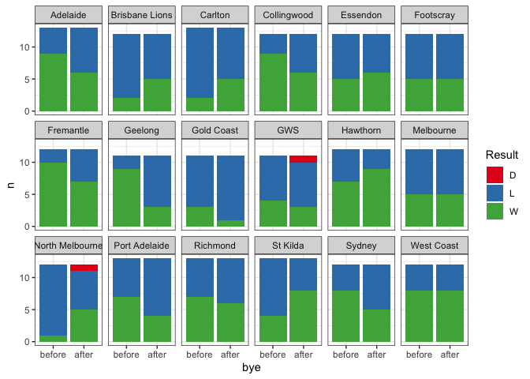
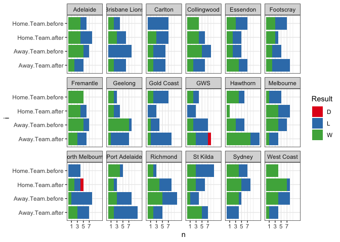

AFL: wins and losses after the bye
================
Neil Saunders
2022-06-18 18:57:21

-   [Introduction](#introduction)
-   [Data](#data)
-   [Processing](#processing)
-   [Analysis](#analysis)
    -   [Visualisation](#visualisation)
    -   [Fisher exact test](#fisher-exact-test)
    -   [Visualisation by home/away](#visualisation-by-homeaway)
    -   [Odds](#odds)
-   [Conclusion](#conclusion)

# Introduction

Geelong have not won a game after the bye since 2011. Is this unusual?
Can we shed any light as to why?

# Data

Our data comes from two sources:

-   `fitzRoy::get_match_results()`
-   AFL historical odds in Excel format [available from
    here](http://www.aussportsbetting.com/data/historical-afl-results-and-odds-data/)

# Processing

First question: when asking whether wins/losses after the bye are
unusual, we need to ask “compared with what?”

For this study we’ll compare the round before the bye with the week
after.

A very long dplyr/tidyr chain gives us the relevant games. 327 games
have been played either side of a bye since 2011. Of these, 218 games
involved one team in the bye, and 109 involved both teams in the bye.

# Analysis

## Visualisation

Let’s confirm that Geelong have indeed not won a game after a bye since
2011:

| Season | Round | Date       | Venue             | Margin | Status    | Team    | bye    | Result |
|-------:|:------|:-----------|:------------------|-------:|:----------|:--------|:-------|:-------|
|   2011 | R5    | 2011-04-26 | M.C.G.            |     19 | Away.Team | Geelong | before | W      |
|   2011 | R7    | 2011-05-07 | Kardinia Park     |     66 | Home.Team | Geelong | after  | W      |
|   2011 | R21   | 2011-08-14 | Football Park     |     11 | Away.Team | Geelong | before | W      |
|   2011 | R23   | 2011-08-27 | Kardinia Park     |    -13 | Home.Team | Geelong | after  | L      |
|   2012 | R11   | 2012-06-08 | Docklands         |     12 | Away.Team | Geelong | before | W      |
|   2012 | R13   | 2012-06-22 | S.C.G.            |     -6 | Away.Team | Geelong | after  | L      |
|   2013 | R11   | 2013-06-08 | Sydney Showground |     59 | Away.Team | Geelong | before | W      |
|   2013 | R13   | 2013-06-23 | Gabba             |     -5 | Away.Team | Geelong | after  | L      |
|   2014 | R7    | 2014-05-04 | M.C.G.            |      5 | Home.Team | Geelong | before | W      |
|   2014 | R9    | 2014-05-17 | Subiaco           |    -32 | Away.Team | Geelong | after  | L      |
|   2016 | R14   | 2016-06-25 | Docklands         |     -3 | Away.Team | Geelong | before | L      |
|   2016 | R16   | 2016-07-08 | Kardinia Park     |    -38 | Home.Team | Geelong | after  | L      |
|   2017 | R11   | 2017-06-02 | Kardinia Park     |     22 | Home.Team | Geelong | before | W      |
|   2017 | R13   | 2017-06-15 | Subiaco           |    -13 | Away.Team | Geelong | after  | L      |
|   2018 | R13   | 2018-06-17 | M.C.G.            |    -18 | Home.Team | Geelong | before | L      |
|   2018 | R15   | 2018-06-29 | Docklands         |     -2 | Away.Team | Geelong | after  | L      |
|   2019 | R12   | 2019-06-07 | M.C.G.            |     67 | Away.Team | Geelong | before | W      |
|   2019 | R14   | 2019-06-22 | Adelaide Oval     |    -11 | Away.Team | Geelong | after  | L      |
|   2020 | R14   | 2020-08-28 | Carrara           |     11 | Away.Team | Geelong | before | W      |
|   2020 | R16   | 2020-09-06 | Gabba             |     66 | Home.Team | Geelong | after  | W      |
|   2021 | R11   | 2021-05-29 | M.C.G.            |     10 | Away.Team | Geelong | before | W      |
|   2021 | R13   | 2021-06-10 | Adelaide Oval     |     21 | Away.Team | Geelong | after  | W      |

Various ways to visualise this:

<!-- -->

## Fisher exact test

We’ll try a Fisher exact test to compare the win/loss count before the
bye with the count after the bye.

The result is significant for Geelong alone at *p* \< 0.05, albeit with
a very wide confidence interval.

    ## Warning: All elements of `...` must be named.
    ## Did you want `data = -Team`?

    ## Warning: `cols` is now required when using unnest().
    ## Please use `cols = c(summary)`

|      Team       | estimate | p.value | conf.low | conf.high |
|:---------------:|:--------:|:-------:|:--------:|:---------:|
|     Geelong     |   10.4   | 0.02997 |   1.19   |   157.5   |
| North Melbourne |  0.1206  | 0.06865 | 0.002126 |   1.434   |
|    St Kilda     |  0.2928  | 0.2377  | 0.04018  |   1.798   |
| Brisbane Lions  |  0.2956  | 0.3707  | 0.02204  |   2.475   |
|    Fremantle    |  3.383   | 0.3707  |  0.4041  |   45.38   |
|     Carlton     |  0.3053  | 0.3783  | 0.02334  |   2.475   |
|   Collingwood   |  2.861   | 0.4003  |  0.4075  |   25.13   |
|     Sydney      |  2.678   | 0.4136  |  0.4098  |   20.26   |
|    Adelaide     |  2.526   | 0.4283  |  0.4121  |   17.79   |
|  Port Adelaide  |  2.526   | 0.4283  |  0.4121  |   17.79   |
|   Gold Coast    |  3.538   | 0.5865  |  0.2311  |   215.8   |
|    Hawthorn     |  0.4819  | 0.6668  | 0.05464  |   3.536   |
|    Essendon     |  0.7244  |    1    |  0.1072  |   4.678   |
|    Footscray    |    1     |    1    |  0.1486  |   6.73    |
|       GWS       |  1.315   |    1    |  0.1533  |   12.6    |
|    Melbourne    |    1     |    1    |  0.1486  |   6.73    |
|    Richmond     |  1.345   |    1    |  0.2272  |   8.26    |
|   West Coast    |    1     |    1    |  0.1324  |   7.554   |

## Visualisation by home/away

Splitting the results further by home/away is interesting: Geelong has
lost all away games that occurred after a bye.

The only comparable team in that respect is Port Adelaide. However,
other teams have struggled to win away *before* a bye (Brisbane), or *at
home before* a bye (Carlton, North Melbourne). Of course, some teams
struggle to win regardless of venue, opponent or proximity to a bye
(Gold Coast).

<!-- -->

Note that several of the lost post-bye away games were at venues
traditionally viewed as being difficult to win at for an away team
(Adelaide, Perth):

| Season | Round | Date       | Venue         | Margin | Status    | Team    | bye   | Result |
|-------:|:------|:-----------|:--------------|-------:|:----------|:--------|:------|:-------|
|   2012 | R13   | 2012-06-22 | S.C.G.        |     -6 | Away.Team | Geelong | after | L      |
|   2013 | R13   | 2013-06-23 | Gabba         |     -5 | Away.Team | Geelong | after | L      |
|   2014 | R9    | 2014-05-17 | Subiaco       |    -32 | Away.Team | Geelong | after | L      |
|   2017 | R13   | 2017-06-15 | Subiaco       |    -13 | Away.Team | Geelong | after | L      |
|   2018 | R15   | 2018-06-29 | Docklands     |     -2 | Away.Team | Geelong | after | L      |
|   2019 | R14   | 2019-06-22 | Adelaide Oval |    -11 | Away.Team | Geelong | after | L      |
|   2021 | R13   | 2021-06-10 | Adelaide Oval |     21 | Away.Team | Geelong | after | W      |

Also, three of the losses were against a side also coming off the bye,
but playing at home:

| Season | Round | Date       | Venue         | Margin | Status    | Team    | bye   | Result |
|-------:|:------|:-----------|:--------------|-------:|:----------|:--------|:------|:-------|
|   2012 | R13   | 2012-06-22 | S.C.G.        |     -6 | Away.Team | Geelong | after | L      |
|   2014 | R9    | 2014-05-17 | Subiaco       |    -32 | Away.Team | Geelong | after | L      |
|   2017 | R13   | 2017-06-15 | Subiaco       |    -13 | Away.Team | Geelong | after | L      |
|   2021 | R13   | 2021-06-10 | Adelaide Oval |     21 | Away.Team | Geelong | after | W      |

For comparison, the away games before byes:

| Season | Round | Date       | Venue             | Margin | Status    | Team    | bye    | Result |
|-------:|:------|:-----------|:------------------|-------:|:----------|:--------|:-------|:-------|
|   2011 | R5    | 2011-04-26 | M.C.G.            |     19 | Away.Team | Geelong | before | W      |
|   2011 | R21   | 2011-08-14 | Football Park     |     11 | Away.Team | Geelong | before | W      |
|   2012 | R11   | 2012-06-08 | Docklands         |     12 | Away.Team | Geelong | before | W      |
|   2013 | R11   | 2013-06-08 | Sydney Showground |     59 | Away.Team | Geelong | before | W      |
|   2016 | R14   | 2016-06-25 | Docklands         |     -3 | Away.Team | Geelong | before | L      |
|   2019 | R12   | 2019-06-07 | M.C.G.            |     67 | Away.Team | Geelong | before | W      |
|   2020 | R14   | 2020-08-28 | Carrara           |     11 | Away.Team | Geelong | before | W      |
|   2021 | R11   | 2021-05-29 | M.C.G.            |     10 | Away.Team | Geelong | before | W      |

## Odds

We might ask of the games lost after a bye - how many were Geelong
expected to win?

For this we join the dataset with historical betting odds. Their
accuracy is taken at face value.

Note that Geelong have never won after a bye when expected to lose. Of
their 8 losses after the bye, 2 were expected and 6 were not. Joining,
by = c(“Date”, “Team”)

| bye    | Result | Expected |   n |
|:-------|:-------|:---------|----:|
| after  | L      | L        |   2 |
| after  | L      | W        |   6 |
| after  | W      | W        |   3 |
| before | L      | L        |   1 |
| before | L      | W        |   1 |
| before | W      | L        |   1 |
| before | W      | W        |   8 |

# Conclusion

Geelong’s win/loss record after the bye does seem to be somewhat
unusual. Losses after the bye compared with before are significant and
unexpected.

Six of the eight post-bye losses have been away games, three of which
were against teams with strong records at home. Scheduling might
therefore explain some of the results.
