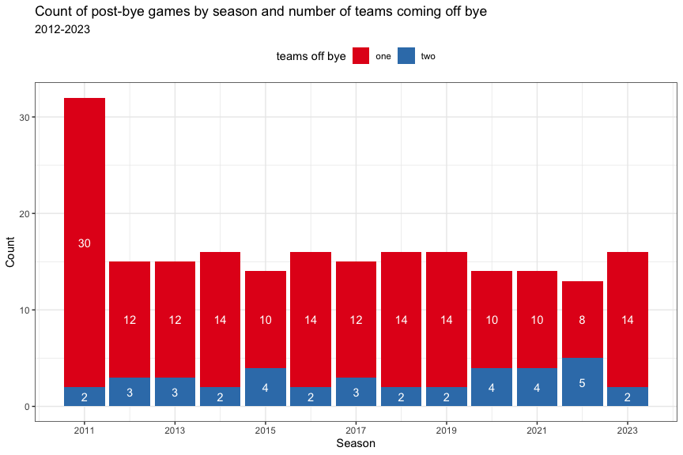
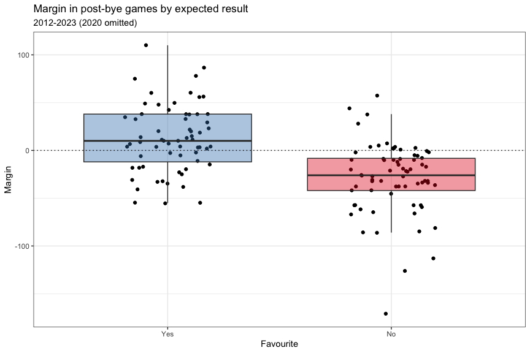
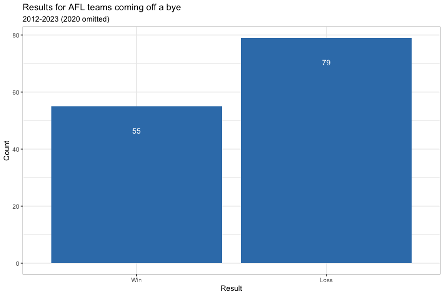
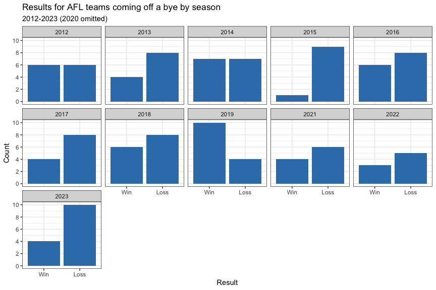
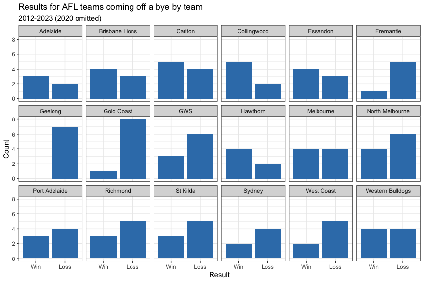
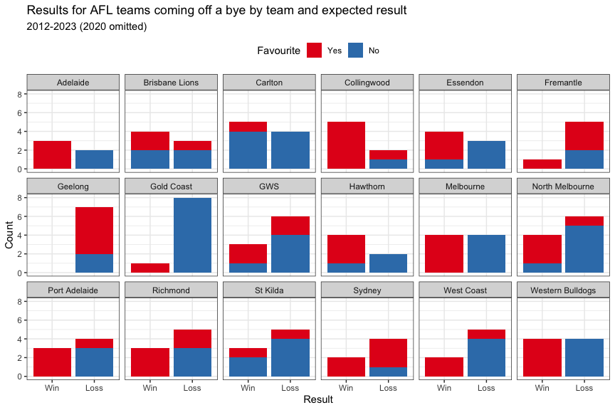
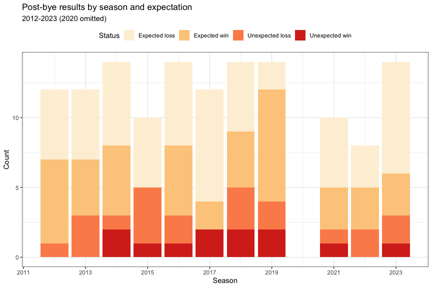
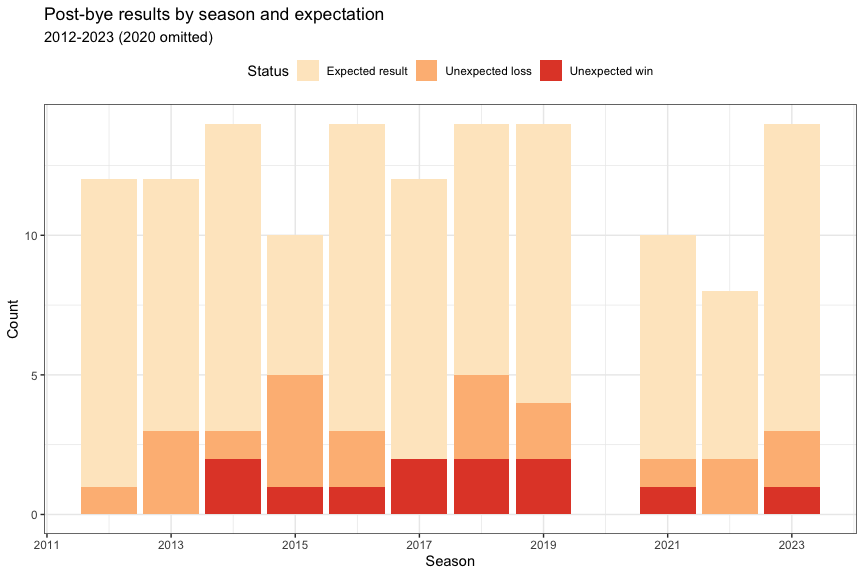
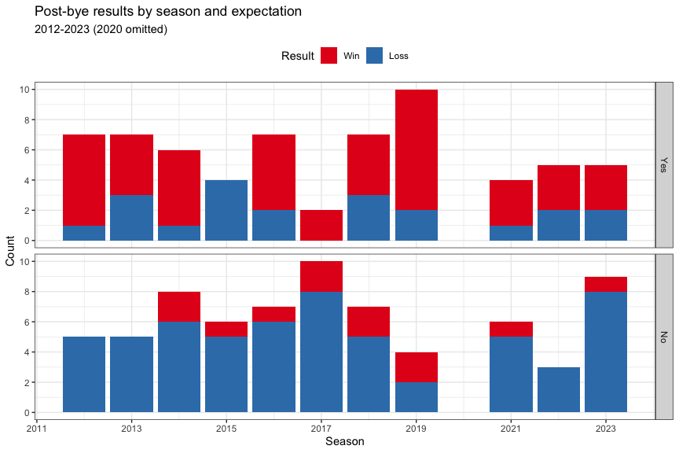

AFL: post-bye results
================
Neil Saunders
2023-07-04 12:57:51

- [Summary](#summary)
- [Data](#data)
- [Processing](#processing)
- [Analysis](#analysis)
  - [Visualization of bye rounds](#visualization-of-bye-rounds)
    - [Bye rounds by season](#bye-rounds-by-season)
    - [Bye rounds by team](#bye-rounds-by-team)
    - [Bye rounds by season and team](#bye-rounds-by-season-and-team)
    - [Post-bye rounds by teams coming off the
      bye](#post-bye-rounds-by-teams-coming-off-the-bye)
  - [Wins and losses](#wins-and-losses)
    - [Distribution of margins by expected
      result](#distribution-of-margins-by-expected-result)
    - [Overall](#overall)
    - [Overall by home/away](#overall-by-homeaway)
    - [Overall by expected result](#overall-by-expected-result)
    - [By season](#by-season)
    - [By season and expected result](#by-season-and-expected-result)
    - [By team](#by-team)
    - [By team and expected result](#by-team-and-expected-result)
    - [Unexpected wins and losses by
      season](#unexpected-wins-and-losses-by-season)
  - [Comparison of expected results with other
    games](#comparison-of-expected-results-with-other-games)
  - [Comparison to media articles](#comparison-to-media-articles)
    - [SEN June 25 2023](#sen-june-25-2023)
    - [AFL June 6 2023](#afl-june-6-2023)
    - [The Age](#the-age)

# Summary

Since the introduction in 2012 of mid-season byes to the AFL
competition, there has been a lot of discussion in the media and online
regarding the so-called “curse of the bye”: a perceived tendency to lose
the game following a bye round.

A lot of this discussion uses simplistic counts of wins and losses for
each team in post-bye games. However, this fails to take three important
factors into account.

1.  Whether one or both teams in the game came off a bye round
2.  Scheduling - whether the post-bye team played at home or away
3.  Expected result - whether the post-bye team was the favourite to win

When these variables are examined, we see that in general only a small
number of post-bye games each season have an unexpected result.

# Data

Our data comes from 3 sources:

- the fitzRoy package for match dates, rounds and results
- a custom CSV file `afl_byes.csv` containing data about bye rounds
  derived from AFL Tables
- historical betting odds data from [Historical AFL Results and Odds
  Data](https://www.aussportsbetting.com/data/historical-afl-results-and-odds-data/)

# Processing

- fetch results from AFL Tables data for season 2011 onwards.
- read the CSV file `afl_byes.csv`
- read the `afl.xlsx` file with historical odds

Then:

- pivot the odds data to long form, rename teams and flag the favourites
  (lowest odds)
- pivot the results data, rename teams, join with the odds and byes
  data, add margins and results
- join with pivoted results data to add the opponent team

The final dataset `post_bye_games` looks like this. It gets [written to
CSV](https://github.com/neilfws/aflstats/blob/master/data/afl_byes.csv).

    ## Rows: 250
    ## Columns: 16
    ## $ Game         <dbl> 13775, 13782, 13794, 13795, 13795, 13800, 13802, 13802, 13803, 13809, 13811, 13812, 13817, 13825, 13836, 13841, 13854, 13864, 13868, 1388…
    ## $ Season       <dbl> 2011, 2011, 2011, 2011, 2011, 2011, 2011, 2011, 2011, 2011, 2011, 2011, 2011, 2011, 2011, 2011, 2011, 2011, 2011, 2011, 2011, 2011, 2011,…
    ## $ Date         <date> 2011-04-02, 2011-04-09, 2011-04-17, 2011-04-21, 2011-04-21, 2011-04-25, 2011-04-28, 2011-04-28, 2011-04-29, 2011-05-06, 2011-05-07, 2011…
    ## $ Round        <chr> "R2", "R3", "R4", "R5", "R5", "R5", "R6", "R6", "R6", "R7", "R7", "R7", "R8", "R9", "R10", "R11", "R12", "R13", "R14", "R15", "R16", "R17…
    ## $ Round.Number <int> 2, 3, 4, 5, 5, 5, 6, 6, 6, 7, 7, 7, 8, 9, 10, 11, 12, 13, 14, 15, 16, 17, 17, 17, 18, 19, 20, 20, 20, 21, 22, 23, 24, 25, 12, 12, 12, 12,…
    ## $ Home.Points  <int> 52, 54, 127, 76, 76, 85, 106, 106, 71, 72, 127, 148, 65, 100, 73, 68, 75, 110, 93, 70, 96, 73, 113, 87, 78, 111, 100, 105, 147, 101, 143,…
    ## $ Away.Points  <int> 171, 79, 98, 89, 89, 78, 52, 52, 87, 104, 61, 99, 62, 102, 139, 101, 65, 88, 99, 79, 88, 84, 92, 98, 132, 79, 99, 110, 90, 150, 45, 99, 8…
    ## $ HA.Name      <chr> "Home.Team", "Home.Team", "Away.Team", "Home.Team", "Away.Team", "Away.Team", "Home.Team", "Away.Team", "Home.Team", "Away.Team", "Home.T…
    ## $ Team         <chr> "Gold Coast", "Adelaide", "North Melbourne", "Brisbane Lions", "St Kilda", "Western Bulldogs", "West Coast", "Melbourne", "Sydney", "Hawt…
    ## $ ByeRound     <chr> "R1", "R2", "R3", "R4", "R4", "R4", "R5", "R5", "R5", "R6", "R6", "R6", "R7", "R8", "R9", "R10", "R11", "R12", "R13", "R14", "R15", "R16"…
    ## $ Margin       <int> -119, -25, -29, -13, 13, -7, 54, -54, -16, 32, 66, -49, -3, -2, -66, -33, -10, -22, 6, 9, 8, -11, 21, 11, 54, -32, -1, -5, -57, -49, 98, …
    ## $ Result       <chr> "L", "L", "L", "L", "W", "L", "W", "L", "L", "W", "W", "L", "L", "L", "L", "L", "L", "L", "W", "W", "W", "L", "W", "W", "W", "L", "L", "L…
    ## $ Venue        <chr> "Gabba", "AAMI Stadium", "Domain Stadium", "Gabba", "Gabba", "Domain Stadium", "Domain Stadium", "Domain Stadium", "SCG", "AAMI Stadium",…
    ## $ Odds         <dbl> 3.96, 1.49, 4.82, 3.66, 1.28, 2.15, 1.56, 2.41, 1.66, 1.20, 1.07, 1.64, 1.48, 2.74, 12.50, 1.24, 3.86, 8.45, 1.15, 1.79, 2.25, 2.05, 1.27…
    ## $ Favourite    <chr> "N", "Y", "N", "N", "Y", "N", "Y", "N", "Y", "Y", "Y", "Y", "Y", "N", "N", "Y", "N", "N", "Y", "Y", "N", "N", "Y", "N", "Y", "N", "N", "Y…
    ## $ Opponent     <chr> "Carlton", "Fremantle", "Fremantle", "St Kilda", "Brisbane Lions", "Fremantle", "Melbourne", "West Coast", "Carlton", "Port Adelaide", "N…

# Analysis

## Visualization of bye rounds

### Bye rounds by season

In 2011 there was a bye every round, featuring at least one team.

From 2012 onwards the mid-season bye was introduced. Most commonly there
are 3 consecutive bye rounds with 6 teams per round.

However, there are variations on the number of bye rounds, teams per
round and which rounds are byes.

Note that 2020 was a disrupted season due to COVID. For example, the R3
game was postponed due to a player testing positive.

<!-- -->

### Bye rounds by team

We see the 2011 byes scattered through each round, and more concentrated
values for the mid-season byes.

Notably Collingwood’s bye has fallen in Round 13 six times.

<!-- -->

### Bye rounds by season and team

Another attempt to visualise the bye rounds. Again we see the difference
between the 2011 byes and the mid-season byes.

It’s interesting that we see contiguous blocks - is the draw for byes as
much alphabetical sometimes as anything else!

<!-- -->

### Post-bye rounds by teams coming off the bye

Post-bye ames might feature one or both teams coming off a bye. If the
bye were a factor influencing the post-bye game, we might assume the
effect would be stronger when only one team comes off a bye.

In most seasons (disregarding 2011) there are 2-5 games where both teams
come off a bye, but the majority involve one post-bye team.

<!-- -->

## Wins and losses

Let’s start looking at wins and losses in post-bye games. In the
following sections we look only at games where one team comes off a bye.
We include season 2011 even though byes in that season were not
mid-season.

### Distribution of margins by expected result

One important factor missing from many analyses looking at post-bye
games is: what was the expected result? For the purposes of this report,
expected result means “who was favourite according to the betting odds”.

Plotting post-bye game margins versus expected winner shows that on
average, favourites win and non-favourites lose. But there are always
exceptions!

<!-- -->

### Overall

A simple count of post-bye results shows that more teams lose coming off
a bye then win.

However, this doesn’t tell us very much about why this should be the
case.

<!-- -->

### Overall by home/away

Scheduling plays an important role in influencing post-bye results.

More teams coming off a bye were playing away from home. And away teams
are more likely to lose a game.

<!-- -->

The home/away win/loss difference has p \< 0.05 in a Fisher’s exact
test.

<table class="table table-striped" style="margin-left: auto; margin-right: auto;">
<thead>
<tr>
<th style="text-align:left;">
Result
</th>
<th style="text-align:right;">
Away.Team
</th>
<th style="text-align:right;">
Home.Team
</th>
</tr>
</thead>
<tbody>
<tr>
<td style="text-align:left;">
Loss
</td>
<td style="text-align:right;">
69
</td>
<td style="text-align:right;">
34
</td>
</tr>
<tr>
<td style="text-align:left;">
Win
</td>
<td style="text-align:right;">
34
</td>
<td style="text-align:right;">
37
</td>
</tr>
</tbody>
</table>
<table class="table table-striped" style="margin-left: auto; margin-right: auto;">
<thead>
<tr>
<th style="text-align:right;">
estimate
</th>
<th style="text-align:right;">
p.value
</th>
<th style="text-align:right;">
conf.low
</th>
<th style="text-align:right;">
conf.high
</th>
<th style="text-align:left;">
method
</th>
<th style="text-align:left;">
alternative
</th>
</tr>
</thead>
<tbody>
<tr>
<td style="text-align:right;">
2.198086
</td>
<td style="text-align:right;">
0.0127839
</td>
<td style="text-align:right;">
1.133005
</td>
<td style="text-align:right;">
4.305763
</td>
<td style="text-align:left;">
Fisher’s Exact Test for Count Data
</td>
<td style="text-align:left;">
two.sided
</td>
</tr>
</tbody>
</table>

### Overall by expected result

When we look at post-bye results by expected result, it’s clear that a
majority of favourites win, and a majority of non-favourites lose.

<!-- -->

### By season

If coming off a bye were a consistent disadvantage, we might expect to
see post-bye teams losing at a similar rate across seasons.

In fact we see all combinations: seasons where teams in post-bye games
have more losses, more wins and equal numbers of losses and wins.

<!-- -->

### By season and expected result

When we include expected results we see that in a majority of cases,
favourites win post-bye games and non-favourites lose them.

<!-- -->

### By team

Do some teams suffer from “the curse of the bye”?

Certainly, using a simple win-loss count, some teams do seem to lose a
lot of post-bye games: notably Geelong and Gold Coast.

<!-- -->

### By team and expected result

However, once again the introduction of expected result can paint a
different picture.

Gold Coast, for example, were not the favourite to win in any of their
post-bye losses. In other words they lose a lot of games in general, not
just post-bye games.

Geelong on the other hand were favourites in the majority of their
post-bye losses.

<!-- -->

### Unexpected wins and losses by season

Here, we try a few ways to visualise post-bye results by season and
expectation.

First: combine expectation and result into a new variable, then plot the
proportion of unexpected results by season.

<!-- -->

Second - a similar idea but combine expected wins and losses into one
“expected result” variable, to show more clearly unexpected wins and
losses as a proportion.

<!-- -->

Third, split the data by expectation and plot the proportion of wins and
losses.

<!-- -->

Fourth, filter for favourite/loss or non-favourite/win and just plot the
counts of unexpected wins and losses.

This one shows that unexpected losses are slightly more frequent than
unexpected wins.

<!-- -->

## Comparison of expected results with other games

This section is somewhat experimental.

We might ask: is the proportion of post-bye games with unexpected
results very different to other games?

The question then is: with which “other games” should we compare? Some
ideas are:

- all of the games that were not post-bye over the same period
- all of the games that were not post-bye in the same rounds
- all of the games that were not post-bye on the same dates

To address this, we generate 3 new datasets corresponding to each set in
the list, and combine Favourite and Result into a new variable. Then we
can count expected results (favourite wins or non-favourite loses) and
unexpected results (favourite loses, non-favourite wins).

Some notes:

In these datasets games are from the perspective of the home team
(clearly if one team loses the other wins and if one is the favourite,
the other is not, so we only need one row per game).

Drawn games are omitted. There are 20 drawn games in this time period.

Games with no favourite (equal odds) are omitted. There are 3 such games
in this time period.

**Summary** - we see:

- a slightly *higher* percentage of unexpected results in post-bye games
  compared with non-post-bye games played in the same rounds, or on the
  same dates
- a slightly *lower* percentage of unexpected results in post-bye games
  compared with all non-post-bye games in the same time period

It’s probably best not to over-interpret here, until we have a clearer
idea about what makes a good comparison.

<table>
<caption>
Game results by favourite 2011-2023
</caption>
<thead>
<tr>
<th style="empty-cells: hide;border-bottom:hidden;" colspan="1">
</th>
<th style="border-bottom:hidden;padding-bottom:0; padding-left:3px;padding-right:3px;text-align: center; " colspan="4">

Favourite/Result

</th>
<th style="empty-cells: hide;border-bottom:hidden;" colspan="1">
</th>
</tr>
<tr>
<th style="text-align:left;">
dataset
</th>
<th style="text-align:right;">
Yes/Win
</th>
<th style="text-align:right;">
No/Loss
</th>
<th style="text-align:right;">
Yes/Loss
</th>
<th style="text-align:right;">
No/Win
</th>
<th style="text-align:right;">
% unexpected
</th>
</tr>
</thead>
<tbody>
<tr>
<td style="text-align:left;">
Post-bye games 2011-2023
</td>
<td style="text-align:right;">
55
</td>
<td style="text-align:right;">
73
</td>
<td style="text-align:right;">
30
</td>
<td style="text-align:right;">
16
</td>
<td style="text-align:right;">
26.44
</td>
</tr>
<tr>
<td style="text-align:left;">
All non-post-bye games 2011-2023
</td>
<td style="text-align:right;">
1015
</td>
<td style="text-align:right;">
634
</td>
<td style="text-align:right;">
382
</td>
<td style="text-align:right;">
297
</td>
<td style="text-align:right;">
29.17
</td>
</tr>
<tr>
<td style="text-align:left;">
Same round non-post-bye games 2011-2023
</td>
<td style="text-align:right;">
133
</td>
<td style="text-align:right;">
80
</td>
<td style="text-align:right;">
39
</td>
<td style="text-align:right;">
28
</td>
<td style="text-align:right;">
23.93
</td>
</tr>
<tr>
<td style="text-align:left;">
Same date non-post-bye games 2011-2023
</td>
<td style="text-align:right;">
61
</td>
<td style="text-align:right;">
34
</td>
<td style="text-align:right;">
13
</td>
<td style="text-align:right;">
10
</td>
<td style="text-align:right;">
19.49
</td>
</tr>
</tbody>
</table>

## Comparison to media articles

Now let’s look at some media articles about post-bye results and
compare.

### SEN June 25 2023

[The numbers that don’t bode well for the weekend’s bye
teams](https://www.sen.com.au/news/2023/06/25/the-numbers-that-dont-bode-well-for-the-weekends-bye-teams/)

> Who is a fan of the bye? So far this year, teams coming off the bye
> own a pitiful 2-10 win-loss record from 12 matches. Of those dozen
> matches, only two have featured both teams coming off the bye - Sydney
> v St Kilda in Round 13 and Collingwood v Adelaide in Round 15. Let’s
> take those results out of it and it’s 0-8 for teams coming off the bye
> playing a non-bye team that week.

All of that is quite correct. However, when we look at the eight
post-bye losses to R14, only two of the teams were expected to win, and
one of those teams was playing away.

The bye rounds for 2023 have since completed: of 14 teams coming off the
bye, there were ten losses and four wins. The final tally is two
unexpected losses and one unexpected win.

<table class="table table-striped" style="margin-left: auto; margin-right: auto;">
<caption>
Season 2023 post-bye games
</caption>
<thead>
<tr>
<th style="text-align:right;">
Season
</th>
<th style="text-align:left;">
Round
</th>
<th style="text-align:left;">
Team
</th>
<th style="text-align:left;">
HA.Name
</th>
<th style="text-align:left;">
Opponent
</th>
<th style="text-align:right;">
Margin
</th>
<th style="text-align:left;">
Result
</th>
<th style="text-align:right;">
Odds
</th>
<th style="text-align:left;">
Favourite
</th>
</tr>
</thead>
<tbody>
<tr>
<td style="text-align:right;">
2023
</td>
<td style="text-align:left;">
R13
</td>
<td style="text-align:left;">
Brisbane Lions
</td>
<td style="text-align:left;">
Away.Team
</td>
<td style="text-align:left;">
Hawthorn
</td>
<td style="text-align:right;">
-25
</td>
<td style="text-align:left;">
L
</td>
<td style="text-align:right;">
1.25
</td>
<td style="text-align:left;">
Y
</td>
</tr>
<tr>
<td style="text-align:right;">
2023
</td>
<td style="text-align:left;">
R13
</td>
<td style="text-align:left;">
Fremantle
</td>
<td style="text-align:left;">
Home.Team
</td>
<td style="text-align:left;">
Richmond
</td>
<td style="text-align:right;">
-15
</td>
<td style="text-align:left;">
L
</td>
<td style="text-align:right;">
1.63
</td>
<td style="text-align:left;">
Y
</td>
</tr>
<tr>
<td style="text-align:right;">
2023
</td>
<td style="text-align:left;">
R14
</td>
<td style="text-align:left;">
Geelong
</td>
<td style="text-align:left;">
Away.Team
</td>
<td style="text-align:left;">
Port Adelaide
</td>
<td style="text-align:right;">
-38
</td>
<td style="text-align:left;">
L
</td>
<td style="text-align:right;">
2.34
</td>
<td style="text-align:left;">
N
</td>
</tr>
<tr>
<td style="text-align:right;">
2023
</td>
<td style="text-align:left;">
R14
</td>
<td style="text-align:left;">
Gold Coast
</td>
<td style="text-align:left;">
Away.Team
</td>
<td style="text-align:left;">
Carlton
</td>
<td style="text-align:right;">
-59
</td>
<td style="text-align:left;">
L
</td>
<td style="text-align:right;">
2.21
</td>
<td style="text-align:left;">
N
</td>
</tr>
<tr>
<td style="text-align:right;">
2023
</td>
<td style="text-align:left;">
R15
</td>
<td style="text-align:left;">
Melbourne
</td>
<td style="text-align:left;">
Away.Team
</td>
<td style="text-align:left;">
Geelong
</td>
<td style="text-align:right;">
-15
</td>
<td style="text-align:left;">
L
</td>
<td style="text-align:right;">
1.99
</td>
<td style="text-align:left;">
N
</td>
</tr>
<tr>
<td style="text-align:right;">
2023
</td>
<td style="text-align:left;">
R15
</td>
<td style="text-align:left;">
West Coast
</td>
<td style="text-align:left;">
Away.Team
</td>
<td style="text-align:left;">
Sydney
</td>
<td style="text-align:right;">
-171
</td>
<td style="text-align:left;">
L
</td>
<td style="text-align:right;">
12.23
</td>
<td style="text-align:left;">
N
</td>
</tr>
<tr>
<td style="text-align:right;">
2023
</td>
<td style="text-align:left;">
R15
</td>
<td style="text-align:left;">
Essendon
</td>
<td style="text-align:left;">
Away.Team
</td>
<td style="text-align:left;">
Fremantle
</td>
<td style="text-align:right;">
-32
</td>
<td style="text-align:left;">
L
</td>
<td style="text-align:right;">
2.16
</td>
<td style="text-align:left;">
N
</td>
</tr>
<tr>
<td style="text-align:right;">
2023
</td>
<td style="text-align:left;">
R15
</td>
<td style="text-align:left;">
Hawthorn
</td>
<td style="text-align:left;">
Away.Team
</td>
<td style="text-align:left;">
Gold Coast
</td>
<td style="text-align:right;">
-67
</td>
<td style="text-align:left;">
L
</td>
<td style="text-align:right;">
3.61
</td>
<td style="text-align:left;">
N
</td>
</tr>
<tr>
<td style="text-align:right;">
2023
</td>
<td style="text-align:left;">
R16
</td>
<td style="text-align:left;">
Richmond
</td>
<td style="text-align:left;">
Away.Team
</td>
<td style="text-align:left;">
Brisbane Lions
</td>
<td style="text-align:right;">
-81
</td>
<td style="text-align:left;">
L
</td>
<td style="text-align:right;">
3.21
</td>
<td style="text-align:left;">
N
</td>
</tr>
<tr>
<td style="text-align:right;">
2023
</td>
<td style="text-align:left;">
R16
</td>
<td style="text-align:left;">
North Melbourne
</td>
<td style="text-align:left;">
Away.Team
</td>
<td style="text-align:left;">
Adelaide
</td>
<td style="text-align:right;">
-66
</td>
<td style="text-align:left;">
L
</td>
<td style="text-align:right;">
8.22
</td>
<td style="text-align:left;">
N
</td>
</tr>
<tr>
<td style="text-align:right;">
2023
</td>
<td style="text-align:left;">
R16
</td>
<td style="text-align:left;">
Western Bulldogs
</td>
<td style="text-align:left;">
Home.Team
</td>
<td style="text-align:left;">
Fremantle
</td>
<td style="text-align:right;">
29
</td>
<td style="text-align:left;">
W
</td>
<td style="text-align:right;">
1.52
</td>
<td style="text-align:left;">
Y
</td>
</tr>
<tr>
<td style="text-align:right;">
2023
</td>
<td style="text-align:left;">
R16
</td>
<td style="text-align:left;">
Port Adelaide
</td>
<td style="text-align:left;">
Away.Team
</td>
<td style="text-align:left;">
Essendon
</td>
<td style="text-align:right;">
4
</td>
<td style="text-align:left;">
W
</td>
<td style="text-align:right;">
1.44
</td>
<td style="text-align:left;">
Y
</td>
</tr>
<tr>
<td style="text-align:right;">
2023
</td>
<td style="text-align:left;">
R16
</td>
<td style="text-align:left;">
Carlton
</td>
<td style="text-align:left;">
Away.Team
</td>
<td style="text-align:left;">
Hawthorn
</td>
<td style="text-align:right;">
60
</td>
<td style="text-align:left;">
W
</td>
<td style="text-align:right;">
1.34
</td>
<td style="text-align:left;">
Y
</td>
</tr>
<tr>
<td style="text-align:right;">
2023
</td>
<td style="text-align:left;">
R16
</td>
<td style="text-align:left;">
GWS
</td>
<td style="text-align:left;">
Away.Team
</td>
<td style="text-align:left;">
Melbourne
</td>
<td style="text-align:right;">
2
</td>
<td style="text-align:left;">
W
</td>
<td style="text-align:right;">
2.88
</td>
<td style="text-align:left;">
N
</td>
</tr>
</tbody>
</table>

### AFL June 6 2023

[Beware the bye: How your club fares after its mid-season
break](https://www.afl.com.au/news/944914/beware-the-bye-how-your-club-fares-after-its-mid-season-break)

> EVERY team should beware their mid-season bye. Statistics show that
> over the past 10 years not one club has mastered how to come out the
> other side of their week off with consistent success. In fact, just
> four clubs hold a winning record over that period in their first match
> after the break, with Fremantle, Hawthorn, Richmond and St Kilda all
> sporting a 6-4 win-loss mark since 2013.

The AFL article looks at post-bye win-loss records 2013-2022.

We can mostly reproduce their numbers by counting results by team - but
they have included games where both teams came off the bye! They also
have Sydney at 5-5 (wins-losses), whereas my data has them at 4-6.

Using only games with one team coming off the bye for years 2013-2022
makes quite a difference to the numbers. Brisbane for example move from
5-5 (wins-losses) to 5-1.

<table class="table table-striped" style="margin-left: auto; margin-right: auto;">
<caption>
Post-bye win-loss count 2011-2022
</caption>
<thead>
<tr>
<th style="empty-cells: hide;border-bottom:hidden;" colspan="1">
</th>
<th style="border-bottom:hidden;padding-bottom:0; padding-left:3px;padding-right:3px;text-align: center; " colspan="3">

Count (SMH)

</th>
<th style="border-bottom:hidden;padding-bottom:0; padding-left:3px;padding-right:3px;text-align: center; " colspan="2">

Count (1 team off bye)

</th>
</tr>
<tr>
<th style="text-align:left;">
Team
</th>
<th style="text-align:right;">
Win
</th>
<th style="text-align:right;">
Draw
</th>
<th style="text-align:right;">
Loss
</th>
<th style="text-align:right;">
Win
</th>
<th style="text-align:right;">
Loss
</th>
</tr>
</thead>
<tbody>
<tr>
<td style="text-align:left;">
Adelaide
</td>
<td style="text-align:right;">
5
</td>
<td style="text-align:right;">
</td>
<td style="text-align:right;">
5
</td>
<td style="text-align:right;">
3
</td>
<td style="text-align:right;">
2
</td>
</tr>
<tr>
<td style="text-align:left;">
Brisbane Lions
</td>
<td style="text-align:right;">
5
</td>
<td style="text-align:right;">
</td>
<td style="text-align:right;">
5
</td>
<td style="text-align:right;">
5
</td>
<td style="text-align:right;">
1
</td>
</tr>
<tr>
<td style="text-align:left;">
Carlton
</td>
<td style="text-align:right;">
5
</td>
<td style="text-align:right;">
</td>
<td style="text-align:right;">
5
</td>
<td style="text-align:right;">
4
</td>
<td style="text-align:right;">
4
</td>
</tr>
<tr>
<td style="text-align:left;">
Collingwood
</td>
<td style="text-align:right;">
5
</td>
<td style="text-align:right;">
</td>
<td style="text-align:right;">
5
</td>
<td style="text-align:right;">
5
</td>
<td style="text-align:right;">
2
</td>
</tr>
<tr>
<td style="text-align:left;">
Essendon
</td>
<td style="text-align:right;">
5
</td>
<td style="text-align:right;">
</td>
<td style="text-align:right;">
5
</td>
<td style="text-align:right;">
4
</td>
<td style="text-align:right;">
3
</td>
</tr>
<tr>
<td style="text-align:left;">
Fremantle
</td>
<td style="text-align:right;">
6
</td>
<td style="text-align:right;">
</td>
<td style="text-align:right;">
4
</td>
<td style="text-align:right;">
1
</td>
<td style="text-align:right;">
4
</td>
</tr>
<tr>
<td style="text-align:left;">
GWS
</td>
<td style="text-align:right;">
3
</td>
<td style="text-align:right;">
1
</td>
<td style="text-align:right;">
6
</td>
<td style="text-align:right;">
2
</td>
<td style="text-align:right;">
5
</td>
</tr>
<tr>
<td style="text-align:left;">
Geelong
</td>
<td style="text-align:right;">
3
</td>
<td style="text-align:right;">
</td>
<td style="text-align:right;">
7
</td>
<td style="text-align:right;">
1
</td>
<td style="text-align:right;">
6
</td>
</tr>
<tr>
<td style="text-align:left;">
Gold Coast
</td>
<td style="text-align:right;">
2
</td>
<td style="text-align:right;">
</td>
<td style="text-align:right;">
8
</td>
<td style="text-align:right;">
1
</td>
<td style="text-align:right;">
7
</td>
</tr>
<tr>
<td style="text-align:left;">
Hawthorn
</td>
<td style="text-align:right;">
6
</td>
<td style="text-align:right;">
</td>
<td style="text-align:right;">
4
</td>
<td style="text-align:right;">
4
</td>
<td style="text-align:right;">
1
</td>
</tr>
<tr>
<td style="text-align:left;">
Melbourne
</td>
<td style="text-align:right;">
4
</td>
<td style="text-align:right;">
</td>
<td style="text-align:right;">
6
</td>
<td style="text-align:right;">
3
</td>
<td style="text-align:right;">
4
</td>
</tr>
<tr>
<td style="text-align:left;">
North Melbourne
</td>
<td style="text-align:right;">
3
</td>
<td style="text-align:right;">
1
</td>
<td style="text-align:right;">
6
</td>
<td style="text-align:right;">
3
</td>
<td style="text-align:right;">
5
</td>
</tr>
<tr>
<td style="text-align:left;">
Port Adelaide
</td>
<td style="text-align:right;">
4
</td>
<td style="text-align:right;">
</td>
<td style="text-align:right;">
6
</td>
<td style="text-align:right;">
2
</td>
<td style="text-align:right;">
3
</td>
</tr>
<tr>
<td style="text-align:left;">
Richmond
</td>
<td style="text-align:right;">
6
</td>
<td style="text-align:right;">
</td>
<td style="text-align:right;">
4
</td>
<td style="text-align:right;">
4
</td>
<td style="text-align:right;">
3
</td>
</tr>
<tr>
<td style="text-align:left;">
St Kilda
</td>
<td style="text-align:right;">
6
</td>
<td style="text-align:right;">
</td>
<td style="text-align:right;">
4
</td>
<td style="text-align:right;">
4
</td>
<td style="text-align:right;">
4
</td>
</tr>
<tr>
<td style="text-align:left;">
Sydney
</td>
<td style="text-align:right;">
4
</td>
<td style="text-align:right;">
</td>
<td style="text-align:right;">
6
</td>
<td style="text-align:right;">
2
</td>
<td style="text-align:right;">
4
</td>
</tr>
<tr>
<td style="text-align:left;">
West Coast
</td>
<td style="text-align:right;">
5
</td>
<td style="text-align:right;">
</td>
<td style="text-align:right;">
5
</td>
<td style="text-align:right;">
1
</td>
<td style="text-align:right;">
4
</td>
</tr>
<tr>
<td style="text-align:left;">
Western Bulldogs
</td>
<td style="text-align:right;">
5
</td>
<td style="text-align:right;">
</td>
<td style="text-align:right;">
5
</td>
<td style="text-align:right;">
3
</td>
<td style="text-align:right;">
4
</td>
</tr>
</tbody>
</table>

### The Age

The Age [Beveridge’s Bulldogs have eye on high-flying Pies after bucking
bye
curse](https://www.theage.com.au/sport/afl/western-bulldogs-buck-bye-curse-with-a-bang-against-slow-firing-fremantle-dockers-20230701-p5dl00.html)

It’s not clear what the “bye curse” refers to in this article, since it
makes no mention of the Western Bulldogs post-bye record.

However, it does say:

> Western Bulldogs coach Luke Beveridge has credited the mindset of his
> team to bounce back from the bye and buck the mid-season trend of
> teams losing upon their return

So let’s focus on only mid-season byes (2012-2023), where the Bulldogs
were the only team coming off the bye.

Their record is 5-4 (wins-losses) and they were not favourites to win in
any of the four losses.

<table class="table table-striped" style="margin-left: auto; margin-right: auto;">
<caption>
Post-bye result Western Bulldogs 2012-2023
</caption>
<thead>
<tr>
<th style="text-align:right;">
Season
</th>
<th style="text-align:left;">
Round
</th>
<th style="text-align:left;">
Team
</th>
<th style="text-align:left;">
HA.Name
</th>
<th style="text-align:left;">
Opponent
</th>
<th style="text-align:right;">
Margin
</th>
<th style="text-align:left;">
Result
</th>
<th style="text-align:right;">
Odds
</th>
<th style="text-align:left;">
Favourite
</th>
</tr>
</thead>
<tbody>
<tr>
<td style="text-align:right;">
2012
</td>
<td style="text-align:left;">
R12
</td>
<td style="text-align:left;">
Western Bulldogs
</td>
<td style="text-align:left;">
Home.Team
</td>
<td style="text-align:left;">
Port Adelaide
</td>
<td style="text-align:right;">
38
</td>
<td style="text-align:left;">
W
</td>
<td style="text-align:right;">
1.45
</td>
<td style="text-align:left;">
Y
</td>
</tr>
<tr>
<td style="text-align:right;">
2013
</td>
<td style="text-align:left;">
R12
</td>
<td style="text-align:left;">
Western Bulldogs
</td>
<td style="text-align:left;">
Away.Team
</td>
<td style="text-align:left;">
Collingwood
</td>
<td style="text-align:right;">
-34
</td>
<td style="text-align:left;">
L
</td>
<td style="text-align:right;">
6.41
</td>
<td style="text-align:left;">
N
</td>
</tr>
<tr>
<td style="text-align:right;">
2014
</td>
<td style="text-align:left;">
R10
</td>
<td style="text-align:left;">
Western Bulldogs
</td>
<td style="text-align:left;">
Away.Team
</td>
<td style="text-align:left;">
Gold Coast
</td>
<td style="text-align:right;">
-45
</td>
<td style="text-align:left;">
L
</td>
<td style="text-align:right;">
4.31
</td>
<td style="text-align:left;">
N
</td>
</tr>
<tr>
<td style="text-align:right;">
2018
</td>
<td style="text-align:left;">
R13
</td>
<td style="text-align:left;">
Western Bulldogs
</td>
<td style="text-align:left;">
Away.Team
</td>
<td style="text-align:left;">
Port Adelaide
</td>
<td style="text-align:right;">
-57
</td>
<td style="text-align:left;">
L
</td>
<td style="text-align:right;">
6.94
</td>
<td style="text-align:left;">
N
</td>
</tr>
<tr>
<td style="text-align:right;">
2019
</td>
<td style="text-align:left;">
R13
</td>
<td style="text-align:left;">
Western Bulldogs
</td>
<td style="text-align:left;">
Away.Team
</td>
<td style="text-align:left;">
Carlton
</td>
<td style="text-align:right;">
3
</td>
<td style="text-align:left;">
W
</td>
<td style="text-align:right;">
1.49
</td>
<td style="text-align:left;">
Y
</td>
</tr>
<tr>
<td style="text-align:right;">
2020
</td>
<td style="text-align:left;">
R16
</td>
<td style="text-align:left;">
Western Bulldogs
</td>
<td style="text-align:left;">
Home.Team
</td>
<td style="text-align:left;">
West Coast
</td>
<td style="text-align:right;">
2
</td>
<td style="text-align:left;">
W
</td>
<td style="text-align:right;">
1.72
</td>
<td style="text-align:left;">
Y
</td>
</tr>
<tr>
<td style="text-align:right;">
2021
</td>
<td style="text-align:left;">
R14
</td>
<td style="text-align:left;">
Western Bulldogs
</td>
<td style="text-align:left;">
Away.Team
</td>
<td style="text-align:left;">
Geelong
</td>
<td style="text-align:right;">
-5
</td>
<td style="text-align:left;">
L
</td>
<td style="text-align:right;">
2.43
</td>
<td style="text-align:left;">
N
</td>
</tr>
<tr>
<td style="text-align:right;">
2022
</td>
<td style="text-align:left;">
R14
</td>
<td style="text-align:left;">
Western Bulldogs
</td>
<td style="text-align:left;">
Away.Team
</td>
<td style="text-align:left;">
GWS
</td>
<td style="text-align:right;">
20
</td>
<td style="text-align:left;">
W
</td>
<td style="text-align:right;">
1.58
</td>
<td style="text-align:left;">
Y
</td>
</tr>
<tr>
<td style="text-align:right;">
2023
</td>
<td style="text-align:left;">
R16
</td>
<td style="text-align:left;">
Western Bulldogs
</td>
<td style="text-align:left;">
Home.Team
</td>
<td style="text-align:left;">
Fremantle
</td>
<td style="text-align:right;">
29
</td>
<td style="text-align:left;">
W
</td>
<td style="text-align:right;">
1.52
</td>
<td style="text-align:left;">
Y
</td>
</tr>
</tbody>
</table>
