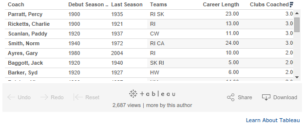
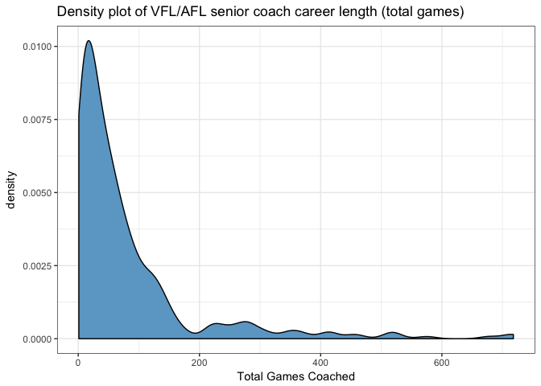
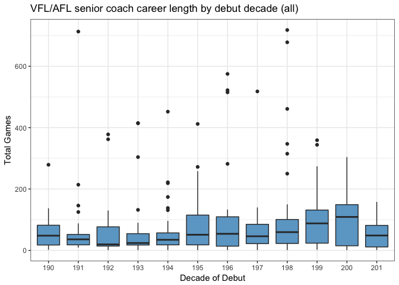
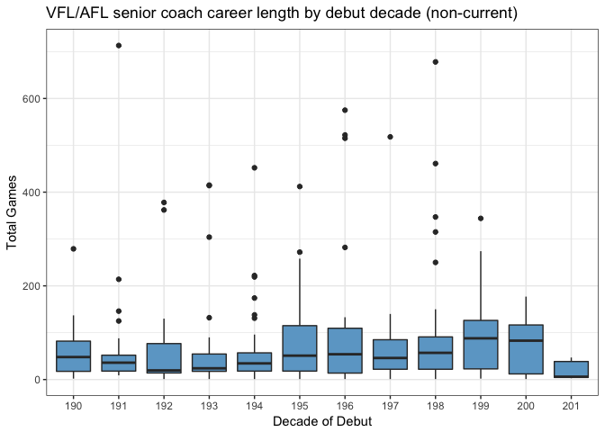
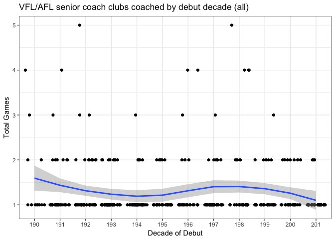
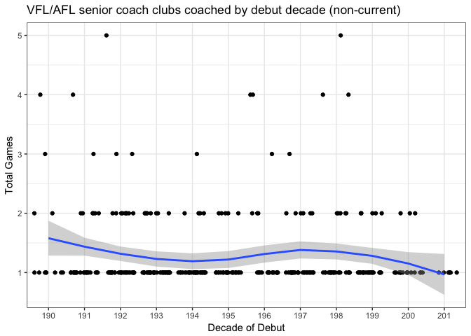

# Career length of senior AFL coaches: R versus The Age
Neil Saunders  
`r Sys.time()`  

## 1. Introduction
This report was inspired by an article in The Age titled [Black hole looms for sacked senior coaches](http://www.theage.com.au/afl/afl-news/black-hole-looms-for-sacked-senior-coaches-20141001-10otho.html). It claims that the average career length of senior coaches has fallen in recent years.

There are some serious problems with the article.

First, it opens with 2 bar charts, average career length and average clubs coaches, overlayed with linear regression lines. There are no clear linear trends in these charts and their appearance suggests that whoever did the analysis lacks basic skills.

Second and more seriously: the article includes an embedded table generated using Tableau. It is clear from manual inspection that the table contains many errors. For example:

- in the first row, teams listed for Percy Parratt are "RI SK", yet clubs coached = 3.0
- Percy Parratt did not coach those teams; at [AFL Tables](http://afltables.com/afl/stats/coaches/Percy_Parratt.html) they are listed as "FI CA GE"
- Debut and last seasons for Percy Parratt are listed as 1900 and 1935 respectively; at AFL Tables the dates are 1913 - 1935
- Career length should not be measured as (last season year) - (debut season year) as many coaches have had interrupted careers with breaks between positions

These errors are apparent for many other coaches in the Tableau table. Presumably the data were obtained from the AFL Tables website and something has gone very wrong during import.



## 2. Getting the data
Getting the data using R is quite simple.


```r
library(ggplot2)
getCoaches <- function() {
    require(XML)
    coaches <- readHTMLTable("http://afltables.com/afl/stats/coaches/coaches_idx.html", 
        stringsAsFactors = FALSE)
    return(coaches[[1]])
}
coaches <- getCoaches()
head(coaches)
```

```
##             Coach       Teams      Seas   W D   L   T     %  W D  L  T
## 1 Malthouse, Mick FO WC CW CA 1984-2015 379 5 282 666 57.28 27 2 23 52
## 2    McHale, Jock          CW 1912-1949 440 8 207 655 67.79 26 2 30 58
## 3   Sheedy, Kevin       ES GW 1981-2013 366 6 263 635 58.11 23   20 43
## 4    Jeans, Allan    SK HW RI 1961-1992 335 2 197 534 62.92 22   19 41
## 5      Hafey, Tom RI CW GE SY 1966-1988 312 2 166 480 65.21 24 2 16 42
## 6   Parkin, David    HW CA FI 1977-2000 287 2 193 482 59.75 19   17 36
##       %   W  D   L   T     % PR  GF
## 1 53.85 406  7 305 718 57.03  3  8*
## 2 46.55 466 10 237 713 66.06  7  16
## 3 53.49 389  6 283 678 57.82  4   7
## 4 53.66 357  2 216 575 62.26  4   9
## 5 59.52 336  4 182 522 64.75  4 10*
## 6 52.78 306  2 210 518 59.27  4   6
```

We add a new column to count the number of clubs coached.


```r
coaches$clubs <- sapply(coaches$Teams, function(x) length(strsplit(x, " ")[[1]]))
```

We create a column indicating debut decade; _e.g._ 1977 becomes 197.


```r
coaches$debut <- substr(coaches$Seas, 1, 3)
```

We can also create a column indicating whether the coach is currently active, based on whether their final season was before 2014.


```r
coaches$current <- ifelse(as.numeric(substr(coaches$Seas, nchar(coaches$Seas) - 
    3, nchar(coaches$Seas))) < 2014, 0, 1)
```

To examine years, we could parse data from the website page for each individual coach. However, an easier measure of career length is total games coached.
The same column names appear several times for home & away games, finals and total games, so we rename column 17 which contains total games.


```r
colnames(coaches)[17] <- "total"
```


## 3. Analysis
### 3.1 Career length
Mean career length is not a very useful statistic, particularly given the skewed distribution of career length: most careers are short, a few are very long.


```r
ggplot(coaches) + geom_density(aes(x = as.numeric(total)), fill = "skyblue3") + 
    theme_bw() + labs(title = "Density plot of VFL/AFL senior coach career length (total games)", 
    x = "Total Games Coached")
```

<!-- -->

Instead we plot the distribution of career length by decade. If anything, this shows a steady rise in the median total games coached since the 1970s.


```r
ggplot(coaches) + geom_boxplot(aes(debut, as.numeric(total)), fill = "skyblue3") + 
    theme_bw() + labs(title = "VFL/AFL senior coach career length by debut decade (all)", 
    x = "Decade of Debut", y = "Total Games")
```

<!-- -->

However, we should exclude current coaches since they have generally coached fewer games because they debuted more recently. Now there is a decline in median total games coached from the 2000s onwards.


```r
coaches$current <- ifelse(as.numeric(substr(coaches$Seas, nchar(coaches$Seas) - 
    3, nchar(coaches$Seas))) < 2014, 0, 1)
ggplot(subset(coaches, current == 0)) + geom_boxplot(aes(debut, as.numeric(total)), 
    fill = "skyblue3") + theme_bw() + labs(title = "VFL/AFL senior coach career length by debut decade (non-current)", 
    x = "Decade of Debut", y = "Total Games")
```

<!-- -->

### 3.2 Clubs coached
Once again, average clubs coached is not a useful statistic given the skewed distribution; most coaches coach 1 or 2 clubs. Plotting distributions is less useful given the small ranges, so we plot number of clubs coached by decade as jittered points.

First for all coaches.


```r
ggplot(coaches) + geom_jitter(aes(debut, clubs), position = position_jitter(height = 0)) + 
    theme_bw() + labs(title = "VFL/AFL senior coach clubs coached by debut decade (all)", 
    x = "Decade of Debut", y = "Total Games") + geom_smooth(aes(debut, clubs, 
    group = 1))
```

<!-- -->

And then for non-current coaches. In this and the previous plot, there is some indication that coaches who debuted from the 2000s onwards are less likely to have coached more than one club.


```r
ggplot(subset(coaches, current == 0)) + geom_jitter(aes(debut, clubs), position = position_jitter(height = 0)) + 
    theme_bw() + labs(title = "VFL/AFL senior coach clubs coached by debut decade (non-current)", 
    x = "Decade of Debut", y = "Total Games") + geom_smooth(aes(debut, clubs, 
    group = 1))
```

<!-- -->

## 4. Summary
1. There is some substance to the claim made by the Age article that both coaching career length (total games) and total clubs coached have declined for coaches debuting since 2000. 
2. This is despite the apparent poor data quality of the Tableau table used in the article - is it just displayed incorrectly by the news website or are the findings coincidentally valid despite the poor data?
