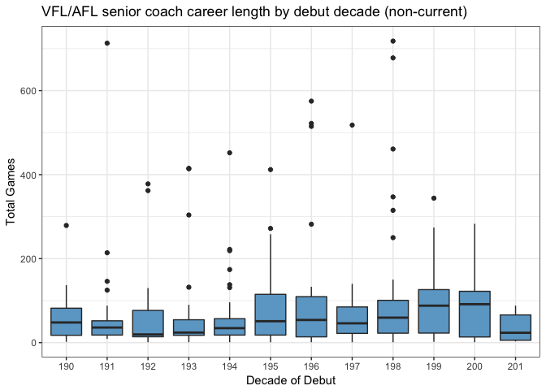
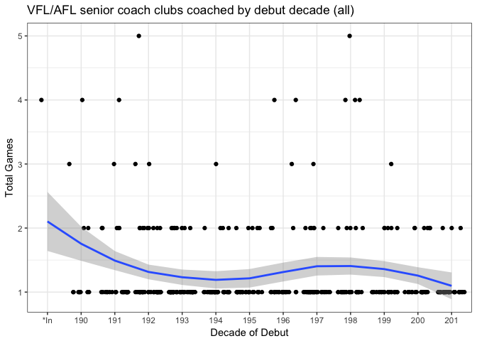

Career length of senior AFL coaches: R versus The Age
================
Neil Saunders
2018-03-21 07:33:59

-   [1. Introduction](#introduction)
-   [2. Getting the data](#getting-the-data)
-   [3. Analysis](#analysis)
    -   [3.1 Career length](#career-length)
    -   [3.2 Clubs coached](#clubs-coached)
-   [4. Summary](#summary)

1. Introduction
---------------

This report was inspired by an article in The Age titled [Black hole looms for sacked senior coaches](http://www.theage.com.au/afl/afl-news/black-hole-looms-for-sacked-senior-coaches-20141001-10otho.html). It claims that the average career length of senior coaches has fallen in recent years.

There are some problems with the article.

First, it opens with 2 bar charts, average career length and average clubs coaches, overlayed with linear regression lines. There are no clear linear trends in these charts.

Second and more seriously: the article includes an embedded table generated using Tableau. It is clear from manual inspection that the table contains many errors. For example:

-   in the first row, teams listed for Percy Parratt are "RI SK", yet clubs coached = 3.0
-   Percy Parratt did not coach those teams; at [AFL Tables](http://afltables.com/afl/stats/coaches/Percy_Parratt.html) they are listed as "FI CA GE"
-   Debut and last seasons for Percy Parratt are listed as 1900 and 1935 respectively; at AFL Tables the dates are 1913 - 1935
-   Career length should not be measured as (last season year) - (debut season year) as many coaches have had interrupted careers with breaks between positions

These errors are apparent for many other coaches in the Tableau table. Presumably the data were obtained from the AFL Tables website and something has gone very wrong during import.

2. Getting the data
-------------------

Getting the data using R is quite simple.

To examine years, we could parse data from the website page for each individual coach. However, an easier measure of career length is total games coached.

3. Analysis
-----------

### 3.1 Career length

Mean career length is not a very useful statistic, particularly given the skewed distribution of career length: most careers are short, a few are very long.

Instead we plot the distribution of career length by decade. If anything, this shows a steady rise in the median total games coached since the 1970s.

However, we should exclude current coaches since they have generally coached fewer games because they debuted more recently. Now there is a decline in median total games coached from the 2000s onwards.

### 3.2 Clubs coached

Once again, average clubs coached is not a useful statistic given the skewed distribution; most coaches coach 1 or 2 clubs. Plotting distributions is less useful given the small ranges, so we plot number of clubs coached by decade as jittered points.

First for all coaches.

And then for non-current coaches. In this and the previous plot, there is some indication that coaches who debuted from the 2000s onwards are less likely to have coached more than one club.

4. Summary
----------

1.  There is some substance to the claim made by the Age article that both coaching career length (total games) and total clubs coached have declined for coaches debuting since 2000.
2.  This is despite the apparent poor data quality of the Tableau table used in the article - is it just displayed incorrectly by the news website or are the findings coincidentally valid despite the poor data?
