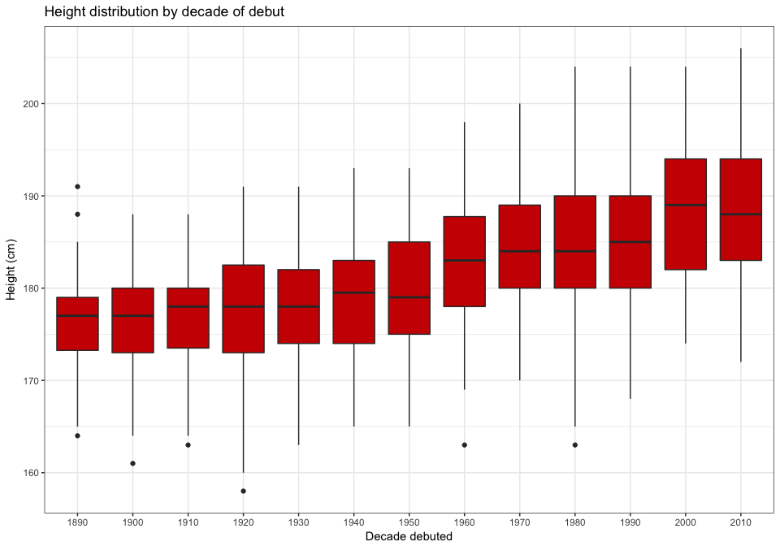
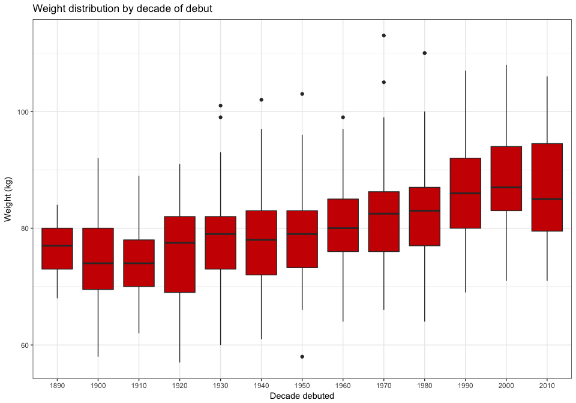
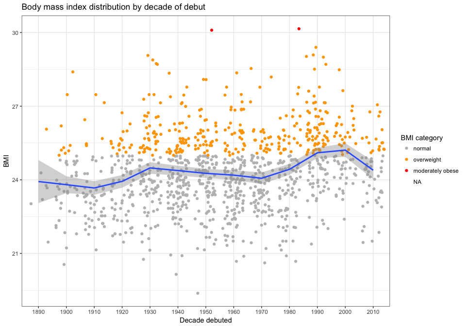
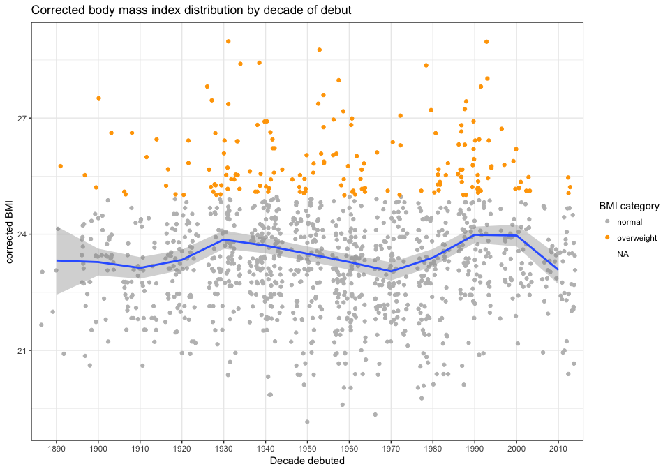
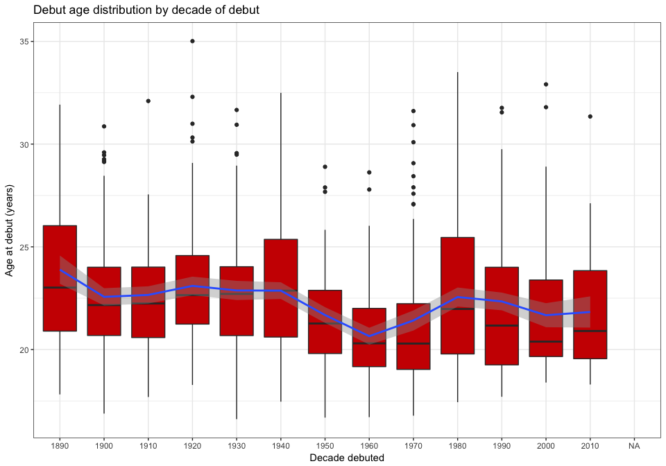
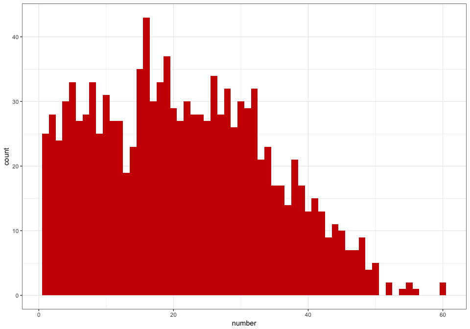
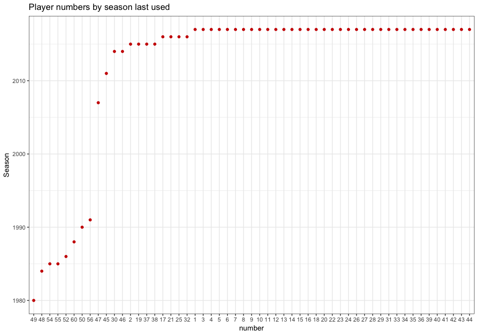

The Sydney Swans/SMFC all-time player list
================
Neil Saunders
21/01/2015

-   [Introduction](#introduction)
-   [Games & Goals](#games-goals)
    -   [Most, least and inbetween](#most-least-and-inbetween)
    -   [Milestones](#milestones)
    -   [Comebacks](#comebacks)
    -   [Goals](#goals)
-   [Physical attributes](#physical-attributes)
    -   [Height and weight](#height-and-weight)
    -   [Age](#age)
-   [Names & Numbers](#names-numbers)
    -   [Common names](#common-names)
    -   [Number usage](#number-usage)
    -   [Last use of numbers](#last-use-of-numbers)

Introduction
============

A collection of "fun facts" derived from the South Melbourne and Sydney all-time player list at [AFL Tables](https://afltables.com/afl/stats/alltime/swans.html).

Since the inception of the VFL in 1897, 1412 men have played for the team.

Games & Goals
=============

Most, least and inbetween
-------------------------

Only 4 players have played 300 or more games.

<table style="width:39%;">
<colgroup>
<col width="29%" />
<col width="9%" />
</colgroup>
<thead>
<tr class="header">
<th align="center">Player</th>
<th align="center">Games</th>
</tr>
</thead>
<tbody>
<tr class="odd">
<td align="center">Goodes, Adam</td>
<td align="center">372</td>
</tr>
<tr class="even">
<td align="center">Bolton, Jude</td>
<td align="center">325</td>
</tr>
<tr class="odd">
<td align="center">OLoughlin, Michael</td>
<td align="center">303</td>
</tr>
<tr class="even">
<td align="center">McVeigh, Jarrad</td>
<td align="center">300</td>
</tr>
<tr class="odd">
<td align="center">OKeefe, Ryan</td>
<td align="center">286</td>
</tr>
<tr class="even">
<td align="center">Rantall, John</td>
<td align="center">260</td>
</tr>
<tr class="odd">
<td align="center">Browning, Mark</td>
<td align="center">251</td>
</tr>
<tr class="even">
<td align="center">Wright, Stephen</td>
<td align="center">246</td>
</tr>
<tr class="odd">
<td align="center">Bayes, Mark</td>
<td align="center">246</td>
</tr>
<tr class="even">
<td align="center">Cresswell, Daryn</td>
<td align="center">244</td>
</tr>
</tbody>
</table>

To illustrate further what an achievement this is, note that 75% of players have played only 43 games or less.

    ##   minimum q1 median    mean q3 maximum na
    ## 1       1  4     13 33.8944 43     372  1

Milestones
----------

Players who have reached 50, 100, 150, 200, 250, 300 or 350 games.

Comebacks
---------

160 players have left the team or missed whole seasons, then returned to play in subsequent seasons.

Of these, 10 left for a second time, then returned for a third career with the team.

We can define the most successful comeback players as those who played the most games overall, following 2 or 3 stints with the team.

**Top 10 2-stint players**

<table style="width:93%;">
<colgroup>
<col width="12%" />
<col width="25%" />
<col width="25%" />
<col width="30%" />
</colgroup>
<thead>
<tr class="header">
<th align="center"> </th>
<th align="center">Player</th>
<th align="center">Games (W-D-L)</th>
<th align="center">Seasons</th>
</tr>
</thead>
<tbody>
<tr class="odd">
<td align="center"><strong>6</strong></td>
<td align="center">Rantall, John</td>
<td align="center">260 (89-2-169)</td>
<td align="center">1963-1972, 1976-1979</td>
</tr>
<tr class="even">
<td align="center"><strong>12</strong></td>
<td align="center">Skilton, Bob</td>
<td align="center">237 (88-3-146)</td>
<td align="center">1956-1968, 1970-1971</td>
</tr>
<tr class="odd">
<td align="center"><strong>16</strong></td>
<td align="center">Clegg, Ron</td>
<td align="center">231 (100-3-128)</td>
<td align="center">1945-1954, 1956-1960</td>
</tr>
<tr class="even">
<td align="center"><strong>21</strong></td>
<td align="center">Belcher, Vic</td>
<td align="center">226 (151-3-72)</td>
<td align="center">1907-1915, 1917-1920</td>
</tr>
<tr class="odd">
<td align="center"><strong>28</strong></td>
<td align="center">Tandy, Mark</td>
<td align="center">207 (117-2-88)</td>
<td align="center">1911-1915, 1917-1926</td>
</tr>
<tr class="even">
<td align="center"><strong>30</strong></td>
<td align="center">Mathews, Ben</td>
<td align="center">198 (108-2-88)</td>
<td align="center">1997, 1999-2008</td>
</tr>
<tr class="odd">
<td align="center"><strong>31</strong></td>
<td align="center">Kennelly, Tadhg</td>
<td align="center">197 (120-1-76)</td>
<td align="center">2001-2008, 2010-2011</td>
</tr>
<tr class="even">
<td align="center"><strong>37</strong></td>
<td align="center">Thomas, Len</td>
<td align="center">187 (98-1-88)</td>
<td align="center">1927-1934, 1936-1938</td>
</tr>
<tr class="odd">
<td align="center"><strong>38</strong></td>
<td align="center">Hiskins, Arthur</td>
<td align="center">185 (105-3-77)</td>
<td align="center">1908-1915, 1919-1923</td>
</tr>
<tr class="even">
<td align="center"><strong>52</strong></td>
<td align="center">Pratt, Bob</td>
<td align="center">158 (97-0-61)</td>
<td align="center">1930-1939, 1946</td>
</tr>
</tbody>
</table>

**And - there are only 10 3-stint players**

<table style="width:99%;">
<colgroup>
<col width="13%" />
<col width="23%" />
<col width="22%" />
<col width="38%" />
</colgroup>
<thead>
<tr class="header">
<th align="center"> </th>
<th align="center">Player</th>
<th align="center">Games (W-D-L)</th>
<th align="center">Seasons</th>
</tr>
</thead>
<tbody>
<tr class="odd">
<td align="center"><strong>103</strong></td>
<td align="center">Richards, Reg</td>
<td align="center">117 (56-1-60)</td>
<td align="center">1936, 1938-1941, 1943-1947</td>
</tr>
<tr class="even">
<td align="center"><strong>176</strong></td>
<td align="center">Way, Fred</td>
<td align="center">81 (28-0-53)</td>
<td align="center">1964, 1966, 1969-1971</td>
</tr>
<tr class="odd">
<td align="center"><strong>219</strong></td>
<td align="center">Doherty, Jock</td>
<td align="center">67 (43-0-24)</td>
<td align="center">1915, 1917-1920, 1922</td>
</tr>
<tr class="even">
<td align="center"><strong>268</strong></td>
<td align="center">Bywater, Ron</td>
<td align="center">58 (19-1-38)</td>
<td align="center">1942, 1944, 1946-1950</td>
</tr>
<tr class="odd">
<td align="center"><strong>287</strong></td>
<td align="center">McKenzie, Jock</td>
<td align="center">55 (41-0-14)</td>
<td align="center">1931, 1933-1936, 1940</td>
</tr>
<tr class="even">
<td align="center"><strong>323</strong></td>
<td align="center">Sutton, Bert</td>
<td align="center">49 (27-0-22)</td>
<td align="center">1921, 1923-1924, 1926-1927</td>
</tr>
<tr class="odd">
<td align="center"><strong>457</strong></td>
<td align="center">Stewart, Jim</td>
<td align="center">29 (16-0-13)</td>
<td align="center">1915, 1917, 1919-1920</td>
</tr>
<tr class="even">
<td align="center"><strong>514</strong></td>
<td align="center">Baxter, Archie</td>
<td align="center">23 (16-0-7)</td>
<td align="center">1941, 1944, 1946</td>
</tr>
<tr class="odd">
<td align="center"><strong>595</strong></td>
<td align="center">James, Heath</td>
<td align="center">18 (9-0-9)</td>
<td align="center">1999, 2001, 2003-2004</td>
</tr>
<tr class="even">
<td align="center"><strong>938</strong></td>
<td align="center">Russell, Bert</td>
<td align="center">6 (1-0-5)</td>
<td align="center">1921, 1923, 1925</td>
</tr>
</tbody>
</table>

Goals
-----

Clearly, not every player is going to be a leading goal kicker. Here are the all-time top 10.

<table style="width:39%;">
<colgroup>
<col width="29%" />
<col width="9%" />
</colgroup>
<thead>
<tr class="header">
<th align="center">Player</th>
<th align="center">Goals</th>
</tr>
</thead>
<tbody>
<tr class="odd">
<td align="center">Pratt, Bob</td>
<td align="center">681</td>
</tr>
<tr class="even">
<td align="center">OLoughlin, Michael</td>
<td align="center">521</td>
</tr>
<tr class="odd">
<td align="center">Hall, Barry</td>
<td align="center">467</td>
</tr>
<tr class="even">
<td align="center">Goodes, Adam</td>
<td align="center">464</td>
</tr>
<tr class="odd">
<td align="center">Lockett, Tony</td>
<td align="center">462</td>
</tr>
<tr class="even">
<td align="center">Skilton, Bob</td>
<td align="center">412</td>
</tr>
<tr class="odd">
<td align="center">Morwood, Tony</td>
<td align="center">397</td>
</tr>
<tr class="even">
<td align="center">Johnson, Ted</td>
<td align="center">385</td>
</tr>
<tr class="odd">
<td align="center">Bedford, Peter</td>
<td align="center">325</td>
</tr>
<tr class="even">
<td align="center">Capper, Warwick</td>
<td align="center">317</td>
</tr>
</tbody>
</table>

Physical attributes
===================

Height and weight
-----------------

It's no surprise that AFL players tend to be taller and heavier than most of us, but how do the Swans compare and how have they changed over time?

Let's start with a boxplot of height by decade that players debuted. 

Median height of players who debuted in the 1890s was 177 cm. Median height has increased with time to 188 cm for players who debuted this decade, the 2010s.

The same analysis for weight. Obviously taller players are also heavier. 

Median weight has increased from 77 kg for players debuting in the 1890s to 85 kg this decade.

For a bit of fun, we can calculate body mass index (BMI). For normal people values greater than 25 are considered overweight, so we'll colour those values. 

Athletes are not normal people, since muscle contributes much more to their body mass. Several versions of a BMI calculation modified for athletes have been proposed, including this one. 

The modified version removes "obese" players, but it's doubtful that many (or even any) players are or were truly overweight - the aim here is to highlight the deficiency of BMI for athletes. It does appear that the 1980s and 1990s were a "beefier" time.

**Tallest...**

<table style="width:29%;">
<colgroup>
<col width="22%" />
<col width="6%" />
</colgroup>
<thead>
<tr class="header">
<th align="center">Player</th>
<th align="center">HT</th>
</tr>
</thead>
<tbody>
<tr class="odd">
<td align="center">Naismith, Sam</td>
<td align="center">206</td>
</tr>
</tbody>
</table>

**...and shortest**

<table style="width:29%;">
<colgroup>
<col width="22%" />
<col width="6%" />
</colgroup>
<thead>
<tr class="header">
<th align="center">Player</th>
<th align="center">HT</th>
</tr>
</thead>
<tbody>
<tr class="odd">
<td align="center">Cameron, Paul</td>
<td align="center">158</td>
</tr>
</tbody>
</table>

**Heaviest...**

<table style="width:31%;">
<colgroup>
<col width="23%" />
<col width="6%" />
</colgroup>
<thead>
<tr class="header">
<th align="center">Player</th>
<th align="center">WT</th>
</tr>
</thead>
<tbody>
<tr class="odd">
<td align="center">Roberts, Brian</td>
<td align="center">113</td>
</tr>
</tbody>
</table>

**...and lightest**

<table style="width:28%;">
<colgroup>
<col width="22%" />
<col width="5%" />
</colgroup>
<thead>
<tr class="header">
<th align="center">Player</th>
<th align="center">WT</th>
</tr>
</thead>
<tbody>
<tr class="odd">
<td align="center">Cameron, Paul</td>
<td align="center">57</td>
</tr>
</tbody>
</table>

Age
---

Let's look at debut age by debut decade. 

There may be a slight downwards trend. There's also an interesting dip in debut age from the 1950s to the 1970s.

**The oldest on debut...**

<table style="width:33%;">
<colgroup>
<col width="23%" />
<col width="9%" />
</colgroup>
<thead>
<tr class="header">
<th align="center">Player</th>
<th align="center">age</th>
</tr>
</thead>
<tbody>
<tr class="odd">
<td align="center">Billett, Billy</td>
<td align="center">35.01</td>
</tr>
</tbody>
</table>

**...and the youngest**

<table style="width:35%;">
<colgroup>
<col width="25%" />
<col width="9%" />
</colgroup>
<thead>
<tr class="header">
<th align="center">Player</th>
<th align="center">age</th>
</tr>
</thead>
<tbody>
<tr class="odd">
<td align="center">Traynor, Harold</td>
<td align="center">16.61</td>
</tr>
</tbody>
</table>

Names & Numbers
===============

Common names
------------

We can split names into first names and surnames. Lots of simple, "old-fashioned" names in the top 10: Jack, Bill, John and Jim.

<table style="width:22%;">
<colgroup>
<col width="16%" />
<col width="5%" />
</colgroup>
<thead>
<tr class="header">
<th align="center">firstname</th>
<th align="center">n</th>
</tr>
</thead>
<tbody>
<tr class="odd">
<td align="center">Jack</td>
<td align="center">59</td>
</tr>
<tr class="even">
<td align="center">Bill</td>
<td align="center">49</td>
</tr>
<tr class="odd">
<td align="center">John</td>
<td align="center">40</td>
</tr>
<tr class="even">
<td align="center">Jim</td>
<td align="center">37</td>
</tr>
<tr class="odd">
<td align="center">George</td>
<td align="center">25</td>
</tr>
<tr class="even">
<td align="center">Tom</td>
<td align="center">25</td>
</tr>
<tr class="odd">
<td align="center">Harry</td>
<td align="center">23</td>
</tr>
<tr class="even">
<td align="center">Frank</td>
<td align="center">22</td>
</tr>
<tr class="odd">
<td align="center">Fred</td>
<td align="center">22</td>
</tr>
<tr class="even">
<td align="center">Peter</td>
<td align="center">22</td>
</tr>
</tbody>
</table>

I'd guess that the top 10 surnames are probably what you'd expect from the general populations of the time.

<table style="width:22%;">
<colgroup>
<col width="16%" />
<col width="5%" />
</colgroup>
<thead>
<tr class="header">
<th align="center">surname</th>
<th align="center">n</th>
</tr>
</thead>
<tbody>
<tr class="odd">
<td align="center">Smith</td>
<td align="center">15</td>
</tr>
<tr class="even">
<td align="center">Williams</td>
<td align="center">9</td>
</tr>
<tr class="odd">
<td align="center">Scott</td>
<td align="center">8</td>
</tr>
<tr class="even">
<td align="center">Matthews</td>
<td align="center">7</td>
</tr>
<tr class="odd">
<td align="center">Robertson</td>
<td align="center">7</td>
</tr>
<tr class="even">
<td align="center">Taylor</td>
<td align="center">7</td>
</tr>
<tr class="odd">
<td align="center">Thomas</td>
<td align="center">7</td>
</tr>
<tr class="even">
<td align="center">Brown</td>
<td align="center">6</td>
</tr>
<tr class="odd">
<td align="center">Davis</td>
<td align="center">6</td>
</tr>
<tr class="even">
<td align="center">Johnson</td>
<td align="center">6</td>
</tr>
<tr class="odd">
<td align="center">Jones</td>
<td align="center">6</td>
</tr>
<tr class="even">
<td align="center">Roberts</td>
<td align="center">6</td>
</tr>
</tbody>
</table>

Just take care that when discussing the superstars Franklin, Goodes and Tippett, you're not talking about Bob/Tony, Reg or Peter.

<table style="width:61%;">
<colgroup>
<col width="25%" />
<col width="18%" />
<col width="18%" />
</colgroup>
<thead>
<tr class="header">
<th align="center">Player</th>
<th align="center">DOB</th>
<th align="center">Seasons</th>
</tr>
</thead>
<tbody>
<tr class="odd">
<td align="center">Franklin, Bob</td>
<td align="center">1886-10-05</td>
<td align="center">1906</td>
</tr>
<tr class="even">
<td align="center">Franklin, Lance</td>
<td align="center">1987-01-30</td>
<td align="center">2014-2017</td>
</tr>
<tr class="odd">
<td align="center">Franklin, Tony</td>
<td align="center">1950-12-18</td>
<td align="center">1974-1975</td>
</tr>
<tr class="even">
<td align="center">Goodes, Adam</td>
<td align="center">1980-01-08</td>
<td align="center">1999-2015</td>
</tr>
<tr class="odd">
<td align="center">Goodes, Reg</td>
<td align="center">1928-07-28</td>
<td align="center">1950</td>
</tr>
<tr class="even">
<td align="center">Tippett, Kurt</td>
<td align="center">1987-05-08</td>
<td align="center">2013-2017</td>
</tr>
<tr class="odd">
<td align="center">Tippett, Peter</td>
<td align="center">1926-10-06</td>
<td align="center">1945-1947</td>
</tr>
</tbody>
</table>

Number usage
------------

Who gets what number is clearly a complex business with many factors at play. We can see that most Swans numbers fall into two main blocks, with usage dropping away from around number 34 and up. 

The most used number:

<table style="width:18%;">
<colgroup>
<col width="12%" />
<col width="5%" />
</colgroup>
<thead>
<tr class="header">
<th align="center">number</th>
<th align="center">n</th>
</tr>
</thead>
<tbody>
<tr class="odd">
<td align="center">16</td>
<td align="center">43</td>
</tr>
</tbody>
</table>

Numbers used only once:

<table style="width:17%;">
<colgroup>
<col width="12%" />
<col width="4%" />
</colgroup>
<thead>
<tr class="header">
<th align="center">number</th>
<th align="center">n</th>
</tr>
</thead>
<tbody>
<tr class="odd">
<td align="center">54</td>
<td align="center">1</td>
</tr>
<tr class="even">
<td align="center">56</td>
<td align="center">1</td>
</tr>
</tbody>
</table>

Last use of numbers
-------------------

Ordering numbers by the season in which they were last used indicates the retired or "resting" numbers.

