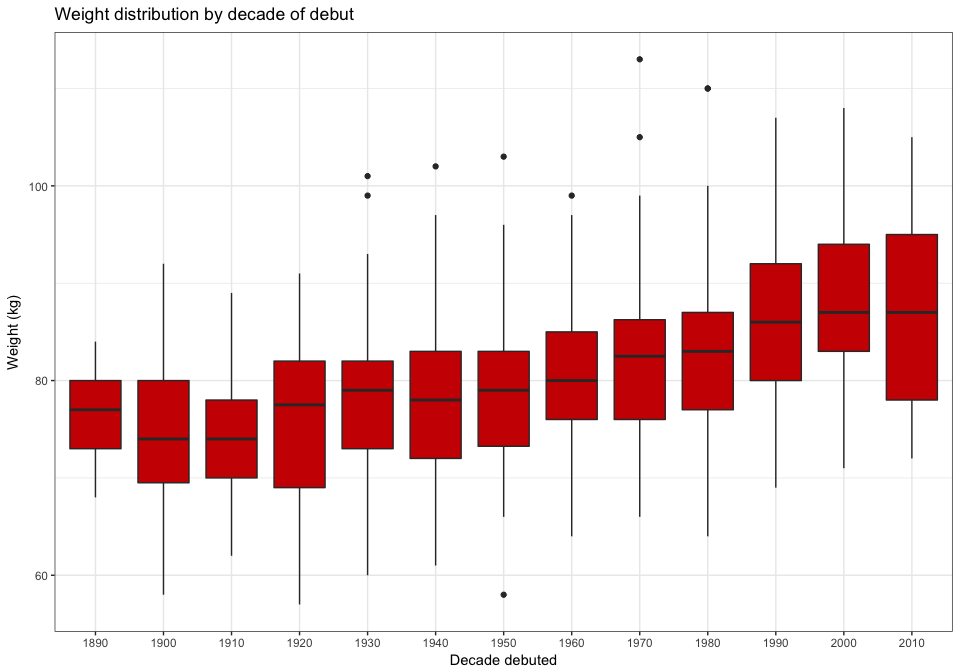
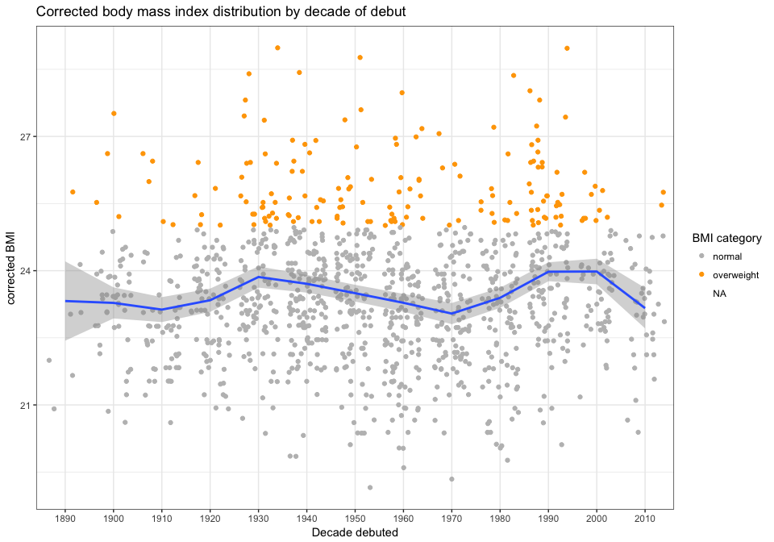
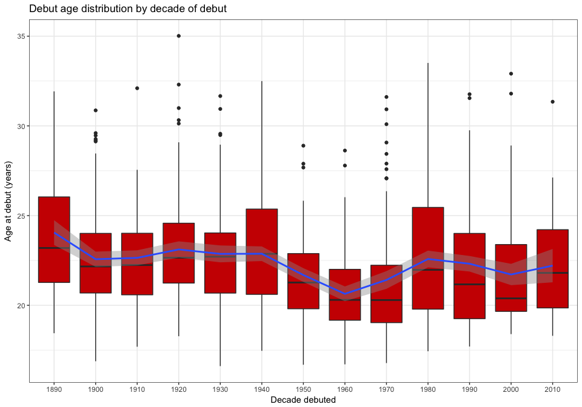

# The Sydney Swans/SMFC all-time player list
Neil Saunders  
21/01/2015  

## Introduction
A collection of "fun facts" derived from the South Melbourne and Sydney all-time player list at [AFL Tables](http://afltables.com/afl/stats/alltime/swans.html).

## 1. Getting the data
Here's the function for reading the player list into a data frame.


```r
library(xtable)
library(ggplot2)
getPlayers <- function(team) {
    require(XML)
    u <- paste("http://afltables.com/afl/stats/alltime/", team, ".html", sep = "")
    players <- readHTMLTable(u, stringsAsFactors = FALSE)
    players <- players[[1]]
    # convert to numerics
    players$HT <- gsub("cm", "", players$HT)
    players$WT <- gsub("kg", "", players$WT)
    players$HT <- as.numeric(players$HT)
    players$WT <- as.numeric(players$WT)
    players$Games <- as.numeric(players$Games)
    players$Goals <- as.numeric(players$Goals)
    # add year and decade of birth and debut
    players$year.birth <- as.numeric(substr(players$DOB, 1, 4))
    players$dec.birth <- as.numeric(substr(players$DOB, 1, 3))
    players$year.debut <- as.numeric(substr(players$Seasons, 1, 4))
    players$dec.debut <- as.numeric(substr(players$Seasons, 1, 3))
    return(players)
}
```


```r
players <- getPlayers("swans")
```
Since the inception of the VFL in 1897, 1392 men have played for the team.

## 2. Games & Goals
### 2.1 Most, least and inbetween

Only 3 players have played 300 or more games.


```r
games.10 <- head(players[order(players$Games, decreasing = TRUE), c("Player", 
    "Games")], 10)
print(xtable(games.10, digits = 0), type = "html", include.rownames = FALSE)
```

<!-- html table generated in R 3.1.2 by xtable 1.7-4 package -->
<!-- Fri Jan 30 10:26:36 2015 -->
<table border=1>
<tr> <th> Player </th> <th> Games </th>  </tr>
  <tr> <td> Goodes, Adam </td> <td align="right"> 351 </td> </tr>
  <tr> <td> Bolton, Jude </td> <td align="right"> 325 </td> </tr>
  <tr> <td> OLoughlin, Michael </td> <td align="right"> 303 </td> </tr>
  <tr> <td> OKeefe, Ryan </td> <td align="right"> 286 </td> </tr>
  <tr> <td> Rantall, John </td> <td align="right"> 260 </td> </tr>
  <tr> <td> Browning, Mark </td> <td align="right"> 251 </td> </tr>
  <tr> <td> Wright, Stephen </td> <td align="right"> 246 </td> </tr>
  <tr> <td> Bayes, Mark </td> <td align="right"> 246 </td> </tr>
  <tr> <td> Cresswell, Daryn </td> <td align="right"> 244 </td> </tr>
  <tr> <td> McVeigh, Jarrad </td> <td align="right"> 244 </td> </tr>
   </table>
<br />
To illustrate further what an achievement this is, note that 75% of players have played only 42 games or less.


```r
games.summary <- as.matrix(summary(players$Games))
colnames(games.summary)[1] <- "Value"
print(xtable(games.summary), type = "html")
```

<!-- html table generated in R 3.1.2 by xtable 1.7-4 package -->
<!-- Fri Jan 30 10:26:36 2015 -->
<table border=1>
<tr> <th>  </th> <th> Value </th>  </tr>
  <tr> <td align="right"> Min. </td> <td align="right"> 1.00 </td> </tr>
  <tr> <td align="right"> 1st Qu. </td> <td align="right"> 4.00 </td> </tr>
  <tr> <td align="right"> Median </td> <td align="right"> 13.00 </td> </tr>
  <tr> <td align="right"> Mean </td> <td align="right"> 33.19 </td> </tr>
  <tr> <td align="right"> 3rd Qu. </td> <td align="right"> 42.00 </td> </tr>
  <tr> <td align="right"> Max. </td> <td align="right"> 351.00 </td> </tr>
   </table>

### 2.2 Milestones
Players who have reached 50, 100, 150, 200, 250, 300 or 350 games.


```r
milestones <- cut(players$Games, breaks = seq(50, 400, by = 50), right = FALSE, 
    labels = c("50-99", "100-149", "150-199", "200-249", "250-299", "300-349", 
        "350-399"))
ggplot() + geom_bar(aes(x = na.omit(milestones)), fill = "red3") + theme_bw() + 
    labs(x = "Games", y = "players", title = "Number of players who reached milestone (50+) games")
```

 

### 2.3 Comebacks
155 players have left the team or missed whole seasons, then returned to play in subsequent seasons.

Of these, 10 left for a second time, then returned for a third career with the team.

We can define the most successful comeback players as those who played the most games overall, following 2 or 3 stints with the team.

**Top 10 2-stint players**

```r
stint2.10 <- head(players[which(sapply(strsplit(players$Seasons, ","), function(x) length(x)) == 
    2), 1:11], 10)
print(xtable(stint2.10, digits = 0), type = "html", include.rownames = FALSE)
```

<!-- html table generated in R 3.1.2 by xtable 1.7-4 package -->
<!-- Fri Jan 30 10:26:36 2015 -->
<table border=1>
<tr> <th> Cap </th> <th> # </th> <th> Player </th> <th> DOB </th> <th> HT </th> <th> WT </th> <th> Games </th> <th> Goals </th> <th> Seasons </th> <th> Debut </th> <th> Last </th>  </tr>
  <tr> <td> 870 </td> <td> 5 </td> <td> Rantall, John </td> <td> 1943-12-09 </td> <td align="right"> 182 </td> <td align="right"> 77 </td> <td align="right"> 260 </td> <td align="right"> 8 </td> <td> 1963-1972,  1976-1979 </td> <td> 19y 132d </td> <td> 35y 266d </td> </tr>
  <tr> <td> 780 </td> <td> 14 </td> <td> Skilton, Bob </td> <td> 1938-11-08 </td> <td align="right"> 171 </td> <td align="right"> 76 </td> <td align="right"> 237 </td> <td align="right"> 412 </td> <td> 1956-1968,  1970-1971 </td> <td> 17y 186d </td> <td> 32y 293d </td> </tr>
  <tr> <td> 635 </td> <td> 23 </td> <td> Clegg, Ron </td> <td> 1927-11-17 </td> <td align="right"> 183 </td> <td align="right"> 84 </td> <td align="right"> 231 </td> <td align="right"> 156 </td> <td> 1945-1954,  1956-1960 </td> <td> 17y 169d </td> <td> 32y 263d </td> </tr>
  <tr> <td> 188 </td> <td> 2 </td> <td> Belcher, Vic </td> <td> 1888-08-24 </td> <td align="right"> 180 </td> <td align="right"> 80 </td> <td align="right"> 226 </td> <td align="right"> 62 </td> <td> 1907-1915,  1917-1920 </td> <td> 18y 246d </td> <td> 32y 11d </td> </tr>
  <tr> <td> 235 </td> <td> 27 </td> <td> Tandy, Mark </td> <td> 1892-09-03 </td> <td align="right"> 173 </td> <td align="right"> 70 </td> <td align="right"> 207 </td> <td align="right"> 47 </td> <td> 1911-1915,  1917-1926 </td> <td> 18y 252d </td> <td> 33y 317d </td> </tr>
  <tr> <td> 1281 </td> <td> 4 </td> <td> Mathews, Ben </td> <td> 1978-11-29 </td> <td align="right"> 181 </td> <td align="right"> 86 </td> <td align="right"> 198 </td> <td align="right"> 45 </td> <td> 1997,  1999-2008 </td> <td> 18y 232d </td> <td> 29y 240d </td> </tr>
  <tr> <td> 1308 </td> <td> 17 </td> <td> Kennelly, Tadhg </td> <td> 1981-07-01 </td> <td align="right"> 190 </td> <td align="right"> 90 </td> <td align="right"> 197 </td> <td align="right"> 30 </td> <td> 2001-2008,  2010-2011 </td> <td> 20y 7d </td> <td> 30y 77d </td> </tr>
  <tr> <td> 401 </td> <td> 12 </td> <td> Thomas, Len </td> <td> 1908-07-20 </td> <td align="right"> 179 </td> <td align="right"> 80 </td> <td align="right"> 187 </td> <td align="right"> 54 </td> <td> 1927-1934,  1936-1938 </td> <td> 18y 321d </td> <td> 30y 38d </td> </tr>
  <tr> <td> 202 </td> <td> 8 </td> <td> Hiskins, Arthur </td> <td> 1886-09-09 </td> <td align="right"> 178 </td> <td align="right"> 76 </td> <td align="right"> 185 </td> <td align="right"> 56 </td> <td> 1908-1915,  1919-1923 </td> <td> 21y 236d </td> <td> 37y 27d </td> </tr>
  <tr> <td> 431 </td> <td> 10 </td> <td> Pratt, Bob </td> <td> 1912-08-31 </td> <td align="right"> 180 </td> <td align="right"> 76 </td> <td align="right"> 158 </td> <td align="right"> 681 </td> <td> 1930-1939,  1946 </td> <td> 17y 245d </td> <td> 33y 234d </td> </tr>
   </table>
<br />
**And - there are only 10 3-stint players**

```r
stint3.10 <- head(players[which(sapply(strsplit(players$Seasons, ","), function(x) length(x)) == 
    3), 1:11], 10)
print(xtable(stint3.10, digits = 0), type = "html", include.rownames = FALSE)
```

<!-- html table generated in R 3.1.2 by xtable 1.7-4 package -->
<!-- Fri Jan 30 10:26:36 2015 -->
<table border=1>
<tr> <th> Cap </th> <th> # </th> <th> Player </th> <th> DOB </th> <th> HT </th> <th> WT </th> <th> Games </th> <th> Goals </th> <th> Seasons </th> <th> Debut </th> <th> Last </th>  </tr>
  <tr> <td> 506 </td> <td> 14 </td> <td> Richards, Reg </td> <td> 1917-12-14 </td> <td align="right"> 173 </td> <td align="right"> 79 </td> <td align="right"> 117 </td> <td align="right"> 57 </td> <td> 1936,  1938-1941,  1943-1947 </td> <td> 18y 231d </td> <td> 29y 252d </td> </tr>
  <tr> <td> 886 </td> <td> 30 </td> <td> Way, Fred </td> <td> 1944-02-09 </td> <td align="right"> 196 </td> <td align="right"> 92 </td> <td align="right"> 81 </td> <td align="right"> 14 </td> <td> 1964,  1966,  1969-1971 </td> <td> 20y 69d </td> <td> 27y 200d </td> </tr>
  <tr> <td> 272 </td> <td> 8 </td> <td> Doherty, Jock </td> <td> 1894-10-03 </td> <td align="right"> 166 </td> <td align="right">  </td> <td align="right"> 67 </td> <td align="right"> 37 </td> <td> 1915,  1917-1920,  1922 </td> <td> 20y 210d </td> <td> 27y 215d </td> </tr>
  <tr> <td> 603 </td> <td> 32 </td> <td> Bywater, Ron </td> <td> 1919-01-08 </td> <td align="right"> 183 </td> <td align="right"> 83 </td> <td align="right"> 58 </td> <td align="right"> 39 </td> <td> 1942,  1944,  1946-1950 </td> <td> 23y 233d </td> <td> 31y 160d </td> </tr>
  <tr> <td> 451 </td> <td> 30 </td> <td> McKenzie, Jock </td> <td> 1911-10-31 </td> <td align="right"> 178 </td> <td align="right"> 75 </td> <td align="right"> 55 </td> <td align="right"> 25 </td> <td> 1931,  1933-1936,  1940 </td> <td> 19y 225d </td> <td> 28y 256d </td> </tr>
  <tr> <td> 324 </td> <td> 19 </td> <td> Sutton, Bert </td> <td> 1901-04-15 </td> <td align="right"> 173 </td> <td align="right"> 66 </td> <td align="right"> 49 </td> <td align="right"> 34 </td> <td> 1921,  1923-1924,  1926-1927 </td> <td> 20y 36d </td> <td> 26y 148d </td> </tr>
  <tr> <td> 270 </td> <td> 26 </td> <td> Stewart, Jim </td> <td> 1889-08-13 </td> <td align="right"> 180 </td> <td align="right"> 75 </td> <td align="right"> 29 </td> <td align="right"> 15 </td> <td> 1915,  1917,  1919-1920 </td> <td> 25y 254d </td> <td> 30y 318d </td> </tr>
  <tr> <td> 573 </td> <td> 15 </td> <td> Baxter, Archie </td> <td> 1921-08-04 </td> <td align="right"> 180 </td> <td align="right"> 78 </td> <td align="right"> 23 </td> <td align="right"> 25 </td> <td> 1941,  1944,  1946 </td> <td> 19y 286d </td> <td> 24y 322d </td> </tr>
  <tr> <td> 1298 </td> <td> 18 </td> <td> James, Heath </td> <td> 1980-03-07 </td> <td align="right"> 189 </td> <td align="right"> 91 </td> <td align="right"> 18 </td> <td align="right"> 1 </td> <td> 1999,  2001,  2003-2004 </td> <td> 19y 153d </td> <td> 24y 146d </td> </tr>
  <tr> <td> 333 </td> <td> 28 </td> <td> Russell, Bert </td> <td> 1899-06-07 </td> <td align="right"> 160 </td> <td align="right"> 61 </td> <td align="right"> 6 </td> <td align="right"> 5 </td> <td> 1921,  1923,  1925 </td> <td> 22y 102d </td> <td> 26y 1d </td> </tr>
   </table>


### 2.4 Goals
Clearly, not every player is going to be a leading goal kicker. Here are the all-time top 10.

```r
goals.10 <- head(players[order(players$Goals, decreasing = TRUE), c("Player", 
    "Goals")], 10)
print(xtable(goals.10, digits = 0), type = "html", include.rownames = FALSE)
```

<!-- html table generated in R 3.1.2 by xtable 1.7-4 package -->
<!-- Fri Jan 30 10:26:36 2015 -->
<table border=1>
<tr> <th> Player </th> <th> Goals </th>  </tr>
  <tr> <td> Pratt, Bob </td> <td align="right"> 681 </td> </tr>
  <tr> <td> OLoughlin, Michael </td> <td align="right"> 521 </td> </tr>
  <tr> <td> Hall, Barry </td> <td align="right"> 467 </td> </tr>
  <tr> <td> Lockett, Tony </td> <td align="right"> 462 </td> </tr>
  <tr> <td> Goodes, Adam </td> <td align="right"> 439 </td> </tr>
  <tr> <td> Skilton, Bob </td> <td align="right"> 412 </td> </tr>
  <tr> <td> Morwood, Tony </td> <td align="right"> 397 </td> </tr>
  <tr> <td> Johnson, Ted </td> <td align="right"> 385 </td> </tr>
  <tr> <td> Bedford, Peter </td> <td align="right"> 325 </td> </tr>
  <tr> <td> Capper, Warwick </td> <td align="right"> 317 </td> </tr>
   </table>

## 3. Physical attributes
### 3.1 Height and weight
It's no surprise that AFL players tend to be taller and heavier than most of us, but how do the Swans compare and how have they changed over time?

Let's start with a boxplot of height by decade that players debuted.

```r
ggplot(players, aes(factor(dec.debut * 10), HT)) + geom_boxplot(fill = "red3") + 
    theme_bw() + labs(x = "Decade debuted", y = "Height (cm)", title = "Height distribution by decade of debut")
```

 

Median height of players who debuted in the 1890s was 177 cm. Median height has increased with time to 188 cm for players who debuted this decade, the 2010s.

The same analysis for weight. Obviously taller players are also heavier.

```r
ggplot(players, aes(factor(dec.debut * 10), WT)) + geom_boxplot(fill = "red3") + 
    theme_bw() + labs(x = "Decade debuted", y = "Weight (kg)", title = "Weight distribution by decade of debut")
```

 

Median weight has increased from 77 kg for players debuting in the 1890s to 87 kg this decade.

For a bit of fun, we can calculate body mass index (BMI). For normal people values greater than 25 are considered overweight, so we'll colour those values.

```r
bmi <- players$WT/(players$HT/100)^2
bmi.cat <- cut(bmi, breaks = c(1, 15, 16, 18.5, 25, 30, 35, 40, 41), right = FALSE, 
    labels = c("very severely underweight", "severely underweight", "underweight", 
        "normal", "overweight", "moderately obese", "severely obese", "very severely obese"))
ggplot(players, aes(factor(dec.debut * 10), y = bmi)) + geom_jitter(aes(color = bmi.cat)) + 
    geom_smooth(aes(group = 1)) + theme_bw() + scale_color_manual(values = c("grey", 
    "orange", "red"), name = "BMI category") + labs(x = "Decade debuted", y = "BMI", 
    title = "Body mass index distribution by decade of debut")
```

 

Athlete are not normal people, since muscle contributes much more to their body mass. Several versions of a BMI calculation modified for athletes have been proposed, including this one.

```r
bmi.ath <- 1.3 * players$WT/(players$HT/100)^2.5
bmi.cat <- cut(bmi.ath, breaks = c(1, 15, 16, 18.5, 25, 30, 35, 40, 41), right = FALSE, 
    labels = c("very severely underweight", "severely underweight", "underweight", 
        "normal", "overweight", "moderately obese", "severely obese", "very severely obese"))
ggplot(players, aes(factor(dec.debut * 10), y = bmi.ath)) + geom_jitter(aes(color = bmi.cat)) + 
    geom_smooth(aes(group = 1)) + theme_bw() + scale_color_manual(values = c("grey", 
    "orange", "red"), name = "BMI category") + labs(x = "Decade debuted", y = "corrected BMI", 
    title = "Corrected body mass index distribution by decade of debut")
```

 

The modified version removes "obese" players, but it's doubtful that many (or even any) players are or were truly overweight - the aim here is to highlight the deficiency of BMI for athletes. It does appear that the 1980s and 1990s were a "beefier" time.

**Tallest...**

```r
print(xtable(players[which(players$HT == max(players$HT, na.rm = T)), 1:11], 
    digits = 0), type = "html", include.rownames = FALSE)
```

<!-- html table generated in R 3.1.2 by xtable 1.7-4 package -->
<!-- Fri Jan 30 10:26:42 2015 -->
<table border=1>
<tr> <th> Cap </th> <th> # </th> <th> Player </th> <th> DOB </th> <th> HT </th> <th> WT </th> <th> Games </th> <th> Goals </th> <th> Seasons </th> <th> Debut </th> <th> Last </th>  </tr>
  <tr> <td> 1392 </td> <td> 35 </td> <td> Naismith, Sam </td> <td> 1992-07-16 </td> <td align="right"> 205 </td> <td align="right"> 104 </td> <td align="right"> 1 </td> <td align="right">  </td> <td> 2014 </td> <td> 22y 45d </td> <td> 22y 45d </td> </tr>
   </table>
<br />
**...and shortest**

```r
print(xtable(players[which(players$HT == min(players$HT, na.rm = T)), 1:11], 
    digits = 0), type = "html", include.rownames = FALSE)
```

<!-- html table generated in R 3.1.2 by xtable 1.7-4 package -->
<!-- Fri Jan 30 10:26:42 2015 -->
<table border=1>
<tr> <th> Cap </th> <th> # </th> <th> Player </th> <th> DOB </th> <th> HT </th> <th> WT </th> <th> Games </th> <th> Goals </th> <th> Seasons </th> <th> Debut </th> <th> Last </th>  </tr>
  <tr> <td> 385 </td> <td> 26 </td> <td> Cameron, Paul </td> <td> 1904-06-12 </td> <td align="right"> 158 </td> <td align="right"> 57 </td> <td align="right"> 22 </td> <td align="right"> 35 </td> <td> 1926,  1928 </td> <td> 21y 323d </td> <td> 23y 363d </td> </tr>
   </table>
<br />
**Heaviest...**

```r
print(xtable(players[which(players$WT == max(players$WT, na.rm = T)), 1:11], 
    digits = 0), type = "html", include.rownames = FALSE)
```

<!-- html table generated in R 3.1.2 by xtable 1.7-4 package -->
<!-- Fri Jan 30 10:26:42 2015 -->
<table border=1>
<tr> <th> Cap </th> <th> # </th> <th> Player </th> <th> DOB </th> <th> HT </th> <th> WT </th> <th> Games </th> <th> Goals </th> <th> Seasons </th> <th> Debut </th> <th> Last </th>  </tr>
  <tr> <td> 1030 </td> <td> 25 </td> <td> Roberts, Brian </td> <td> 1946-04-28 </td> <td align="right"> 199 </td> <td align="right"> 113 </td> <td align="right"> 15 </td> <td align="right"> 2 </td> <td> 1975 </td> <td> 29y 26d </td> <td> 29y 124d </td> </tr>
   </table>
<br />
**...and lightest**

```r
print(xtable(players[which(players$WT == min(players$WT, na.rm = T)), 1:11], 
    digits = 0), type = "html", include.rownames = FALSE)
```

<!-- html table generated in R 3.1.2 by xtable 1.7-4 package -->
<!-- Fri Jan 30 10:26:42 2015 -->
<table border=1>
<tr> <th> Cap </th> <th> # </th> <th> Player </th> <th> DOB </th> <th> HT </th> <th> WT </th> <th> Games </th> <th> Goals </th> <th> Seasons </th> <th> Debut </th> <th> Last </th>  </tr>
  <tr> <td> 385 </td> <td> 26 </td> <td> Cameron, Paul </td> <td> 1904-06-12 </td> <td align="right"> 158 </td> <td align="right"> 57 </td> <td align="right"> 22 </td> <td align="right"> 35 </td> <td> 1926,  1928 </td> <td> 21y 323d </td> <td> 23y 363d </td> </tr>
   </table>

### 3.2 Age
Let's look at debut age by debut decade.

```r
age <- sapply(strsplit(players$Debut, " "), function(x) {
    y <- as.numeric(gsub("y", "", x[1]))
    d <- as.numeric(gsub("d", "", x[2]))
    return(y + d/365)
})
ggplot(players, aes(factor(dec.debut * 10), y = age)) + geom_boxplot(fill = "red3") + 
    geom_smooth(aes(group = 1)) + theme_bw() + labs(x = "Decade debuted", y = "Age at debut (years)", 
    title = "Debut age distribution by decade of debut")
```

 

There may be a slight downwards trend. There's also an interesting dip in debut age from the 1950s to the 1970s.

**The oldest on debut...**

```r
print(xtable(players[which(age == max(age, na.rm = TRUE)), 1:11], digits = 0), 
    type = "html", include.rownames = FALSE)
```

<!-- html table generated in R 3.1.2 by xtable 1.7-4 package -->
<!-- Fri Jan 30 10:26:43 2015 -->
<table border=1>
<tr> <th> Cap </th> <th> # </th> <th> Player </th> <th> DOB </th> <th> HT </th> <th> WT </th> <th> Games </th> <th> Goals </th> <th> Seasons </th> <th> Debut </th> <th> Last </th>  </tr>
  <tr> <td> 356 </td> <td> 20 </td> <td> Billett, Billy </td> <td> 1888-05-21 </td> <td align="right"> 171 </td> <td align="right"> 66 </td> <td align="right"> 3 </td> <td align="right"> 4 </td> <td> 1923 </td> <td> 35y 5d </td> <td> 35y 19d </td> </tr>
   </table>
<br />
**...and the youngest**

```r
print(xtable(players[which(age == min(age, na.rm = TRUE)), 1:11], digits = 0), 
    type = "html", include.rownames = FALSE)
```

<!-- html table generated in R 3.1.2 by xtable 1.7-4 package -->
<!-- Fri Jan 30 10:26:43 2015 -->
<table border=1>
<tr> <th> Cap </th> <th> # </th> <th> Player </th> <th> DOB </th> <th> HT </th> <th> WT </th> <th> Games </th> <th> Goals </th> <th> Seasons </th> <th> Debut </th> <th> Last </th>  </tr>
  <tr> <td> 548 </td> <td> 32 </td> <td> Traynor, Harold </td> <td> 1922-12-04 </td> <td align="right"> 173 </td> <td align="right"> 73 </td> <td align="right"> 37 </td> <td align="right"> 16 </td> <td> 1939-1942 </td> <td> 16y 223d </td> <td> 19y 282d </td> </tr>
   </table>

## 4. Names & Numbers
### 4.1 Common names
We can split names into first names and surnames. Lots of simple, "old-fashioned" names in the top 10: Jack, Bill, John and Jim.

```r
firstnames <- sapply(strsplit(players$Player, ", "), function(x) x[2])
first.10 <- as.data.frame(rev(tail(sort(table(firstnames)), 10)))
colnames(first.10)[1] <- "count"
ggplot(first.10, aes(x = reorder(rownames(first.10), count), y = count)) + geom_bar(stat = "identity", 
    fill = "red3") + theme_bw() + labs(x = "Name", title = "Top 10 player first names") + 
    coord_flip()
```

 

I'd guess that the top 10 surnames are probably what you'd expect from the general populations of the time.

```r
surnames <- sapply(strsplit(players$Player, ", "), function(x) x[1])
last.10 <- as.data.frame(rev(tail(sort(table(surnames)), 10)))
colnames(last.10)[1] <- "count"
ggplot(last.10, aes(x = reorder(rownames(last.10), count), y = count)) + geom_bar(stat = "identity", 
    fill = "red3") + theme_bw() + labs(x = "Name", title = "Top 10 player surnames") + 
    coord_flip()
```

 

Just take care that when discussing the superstars Franklin, Goodes and Tippett, you're not talking about Bob/Tony, Reg or Peter.


```r
stars <- players[grep("Goodes|Franklin|Tippett", players$Player), 1:11]
print(xtable(stars[order(stars$Player), 1:11], digits = 0), type = "html", include.rownames = FALSE)
```

<!-- html table generated in R 3.1.2 by xtable 1.7-4 package -->
<!-- Fri Jan 30 10:26:44 2015 -->
<table border=1>
<tr> <th> Cap </th> <th> # </th> <th> Player </th> <th> DOB </th> <th> HT </th> <th> WT </th> <th> Games </th> <th> Goals </th> <th> Seasons </th> <th> Debut </th> <th> Last </th>  </tr>
  <tr> <td> 180 </td> <td>   </td> <td> Franklin, Bob </td> <td> 1886-10-05 </td> <td align="right">  </td> <td align="right">  </td> <td align="right"> 5 </td> <td align="right"> 1 </td> <td> 1906 </td> <td> 19y 233d </td> <td> 19y 324d </td> </tr>
  <tr> <td> 1385 </td> <td> 23 </td> <td> Franklin, Lance </td> <td> 1987-01-30 </td> <td align="right"> 198 </td> <td align="right"> 102 </td> <td align="right"> 22 </td> <td align="right"> 79 </td> <td> 2014 </td> <td> 27y 44d </td> <td> 27y 240d </td> </tr>
  <tr> <td> 1019 </td> <td> 14 </td> <td> Franklin, Tony </td> <td> 1950-12-18 </td> <td align="right"> 185 </td> <td align="right"> 84 </td> <td align="right"> 32 </td> <td align="right"> 11 </td> <td> 1974-1975 </td> <td> 23y 123d </td> <td> 24y 255d </td> </tr>
  <tr> <td> 1289 </td> <td> 37 </td> <td> Goodes, Adam </td> <td> 1980-01-08 </td> <td align="right"> 194 </td> <td align="right"> 99 </td> <td align="right"> 351 </td> <td align="right"> 439 </td> <td> 1999-2014 </td> <td> 19y 79d </td> <td> 34y 262d </td> </tr>
  <tr> <td> 707 </td> <td> 11 </td> <td> Goodes, Reg </td> <td> 1928-07-28 </td> <td align="right"> 188 </td> <td align="right"> 86 </td> <td align="right"> 1 </td> <td align="right">  </td> <td> 1950 </td> <td> 22y 29d </td> <td> 22y 29d </td> </tr>
  <tr> <td> 1382 </td> <td> 8 </td> <td> Tippett, Kurt </td> <td> 1987-05-08 </td> <td align="right"> 202 </td> <td align="right"> 104 </td> <td align="right"> 26 </td> <td align="right"> 69 </td> <td> 2013-2014 </td> <td> 26y 45d </td> <td> 27y 142d </td> </tr>
  <tr> <td> 638 </td> <td> 21 </td> <td> Tippett, Peter </td> <td> 1926-10-06 </td> <td align="right"> 183 </td> <td align="right"> 78 </td> <td align="right"> 29 </td> <td align="right"> 2 </td> <td> 1945-1947 </td> <td> 18y 253d </td> <td> 20y 253d </td> </tr>
   </table>

### 4.2 Number usage
Who gets what number is clearly a complex business with many factors at play. We can see that most Swans numbers fall into two main blocks, with usage dropping away from around number 34 and up.

```r
number <- as.numeric(players$`#`)
ggplot(players, aes(number)) + geom_histogram(binwidth = 1, fill = "red3") + 
    theme_bw()
```

 

The most used number is 16, taken by 43 players. Numbers used only once: 54, 56.

### 4.3 Last use of numbers
Ordering numbers by the season in which they were last used indicates the retired or "resting" numbers.


```r
season.end <- substr(players$Seasons, nchar(players$Seasons) - 3, nchar(players$Seasons))
n1 <- data.frame(number = number, end = season.end)
n1.agg <- aggregate(as.numeric(as.character(end)) ~ number, n1, max)
colnames(n1.agg)[2] <- "end"
n1.agg$number <- with(n1.agg, reorder(number, end))
ggplot(n1.agg, aes(number, end)) + geom_point(color = "red3") + theme_bw() + 
    labs(y = "Season", title = "Player numbers by season last used")
```

 
