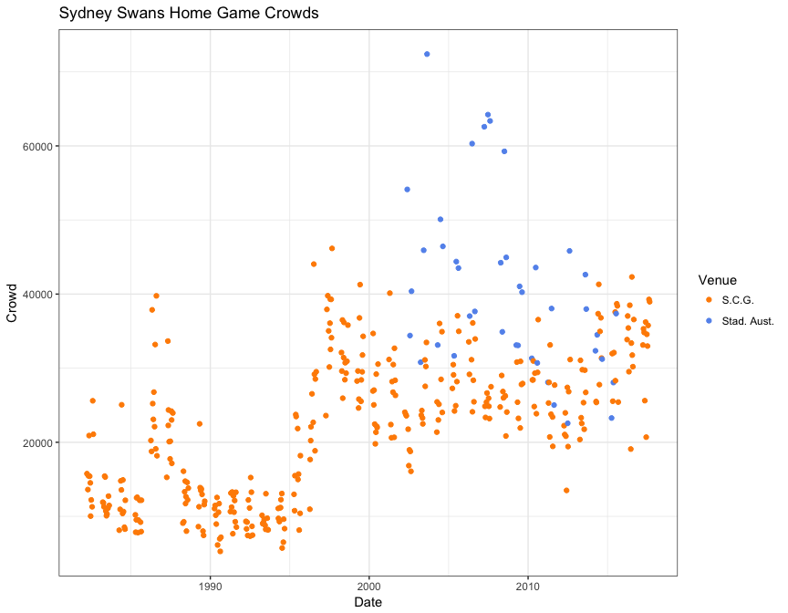
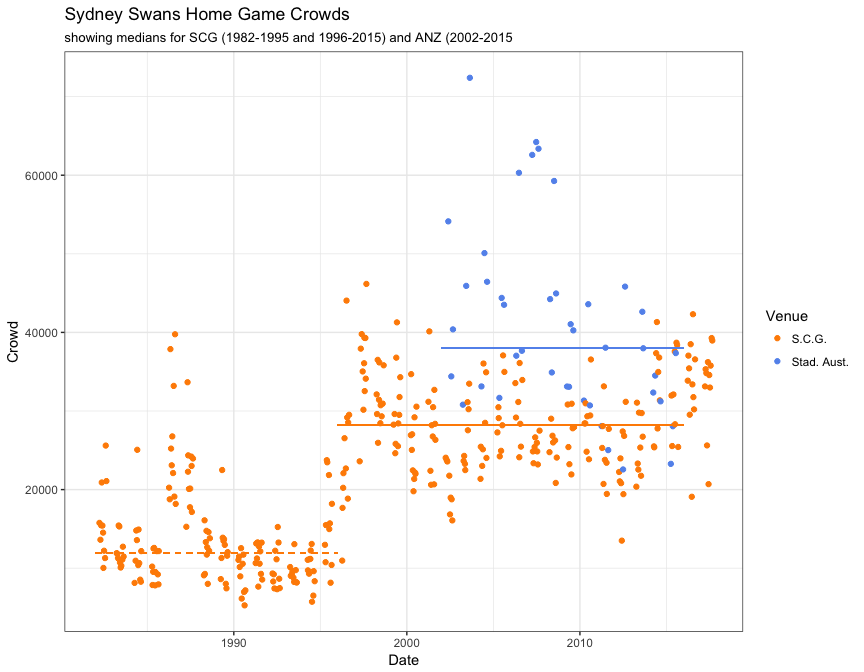
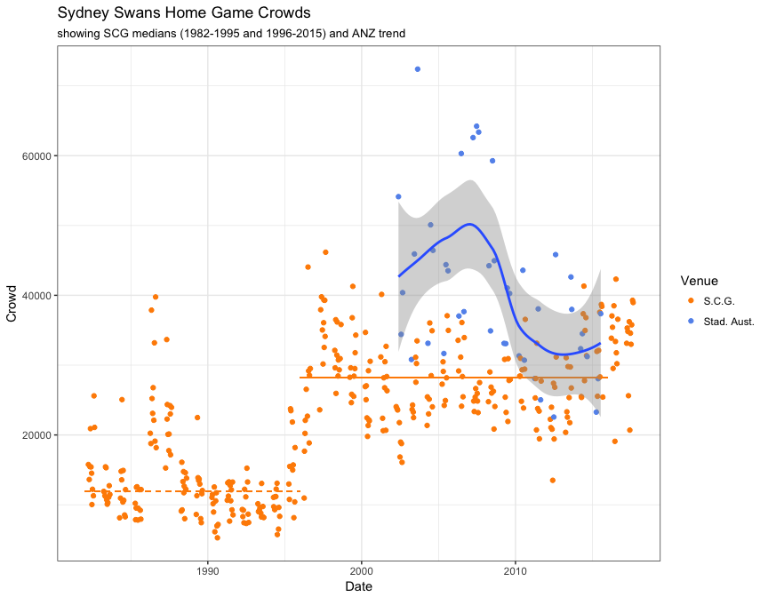

Sydney Swans Home Game Crowds
================
Neil Saunders
19/05/2015

-   [Introduction](#introduction)
-   [Getting the data](#getting-the-data)
-   [Plotting the data](#plotting-the-data)
-   [Summary](#summary)

Introduction
============

This document compares crowds for home games at the Sydney Cricket Ground ("S.C.G.") versus ANZ Stadium (formerly known as Stadium Australia, "Stad. Aust.").

Getting the data
================

Data for all Swans games by season are obtained from [AFL Tables](https://afltables.com/afl/teams/swans/allgames.html).

Plotting the data
=================

We start with a basic scatterplot coloured by Venue.

Clearly there are two "eras" of crowd numbers: small crowds pre-1996 (with spikes in 1986-1987) and larger crowds post-1996. We can indicate the median crowds for those two time periods, for the SCG and ANZ Stadium.

Finally, we can try to superimpose a trend for crowds at ANZ Stadium.

Summary
=======

In general, home game crowds have been larger at ANZ Stadium compared with the SCG. We can speculate that this is due in large part to marketing; games at ANZ Stadium are promoted as "big games" (finals, not included in this analysis or games featuring high-quality opposition).

However, in recent years crowds have declined to levels comparable with the SCG. This may be part of the reason behind [the decision](www.afl.com.au/news/2014-11-24/swans-set-to-quit-homebush) to host all home games at the SCG after 2016.
