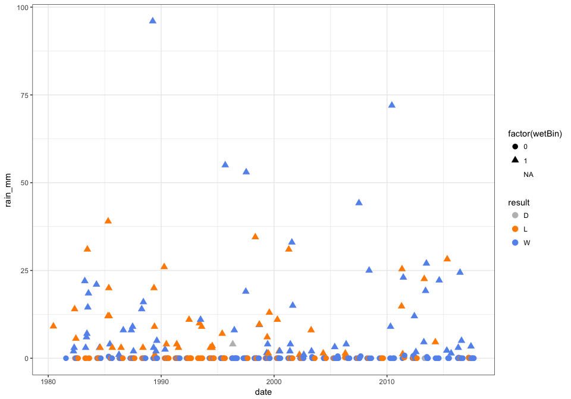
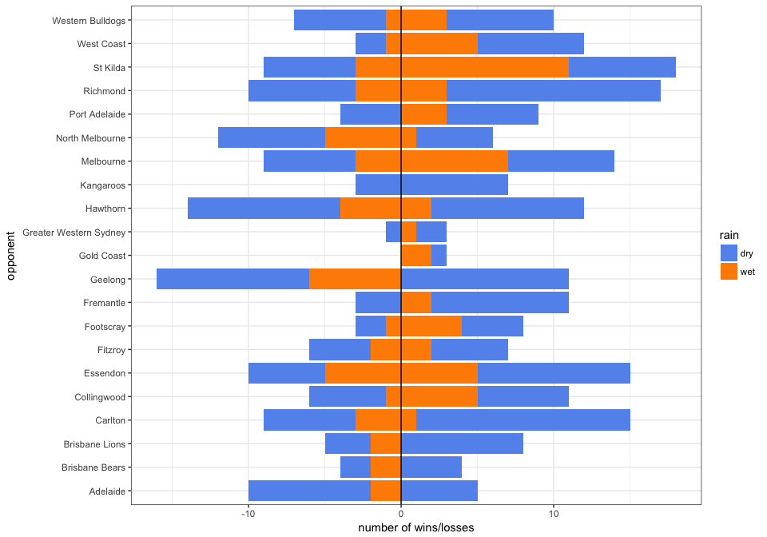

Sydney Swans wet weather performance at the SCG
================
Neil Saunders
compiled 2018-03-27 21:46:16

-   [Introduction](#introduction)
-   [Sydney Swans data](#sydney-swans-data)
-   [Rainfall data](#rainfall-data)
-   [Joining the data](#joining-the-data)
-   [Analysis](#analysis)
    -   [Game results plotted by date and rainfall](#game-results-plotted-by-date-and-rainfall)
    -   [Is the proportion of wins/losses different for wet versus dry days?](#is-the-proportion-of-winslosses-different-for-wet-versus-dry-days)
    -   [Game results by opponent and rainfall](#game-results-by-opponent-and-rainfall)
    -   [Runs of losses in the wet](#runs-of-losses-in-the-wet)
-   [Conclusion](#conclusion)

Introduction
============

"We don't go well in the wet" say Sydney Swans fans. Is that true? An attempt to find out using data.

Sydney Swans data
=================

Load the Swans games data. Data for all games is extracted from [the AFL Tables website](http://afltables.com/afl/teams/swans/allgames.html) and stored as a data frame using [these functions](https://github.com/neilfws/aflstats/blob/master/code/R/afltables.R), which are called by [this code](https://github.com/neilfws/aflstats/blob/master/code/R/plotHalfwayPercent.R).

Rainfall data
=============

How can we find out if it was raining on the day of a game? Our starting point is [this web page](http://www.bom.gov.au/climate/data/stations/) from where we can download meteorological data for Randwick racecourse from 1937 onwards. This station is very close to the SCG. The downloaded zip file uncompresses to a CSV file which is easy to load into R.

We can add a *date* column by combining the Year, Month and Day values. However, note that "observations of Daily rainfall are nominally made at 9 am local clock time and record the total for the previous 24 hours." In theory then, many of the observations include the afternoon and evening of the previous day. We cannot know for sure whether it was raining at game time, so we will assume that any non-zero rain amount at 09:00 indicates rain during the game on the previous day. So we'll substract 1 day from the dates.

Joining the data
================

Now we can subset those games played at the SCG and simply match the date columns. We'll also add some binary variables. *Wet*, *heavy* and *very heavy* are taken from definitions on [this BoM page](http://www.bom.gov.au/climate/data-services/content/faqs-elements.html).

-   *wetBin* = 1 if rain &gt;= 1 mm, otherwise = 0
-   *heavyBin* = 1 if rain &gt;= 10 mm, otherwise = 0
-   *vHeavyBin* = 1 if rain &gt;= 25 mm, otherwise = 0
-   *restBin* = 1 if result (R) = win (W), otherwise = 0

Analysis
========

Game results plotted by date and rainfall
-----------------------------------------

First, we can plot the amount of rain for the day in which each game at the SCG took place. The points are coloured by game result and point shape indicates whether more than 1 mm of rain was recorded. 

If the Swans were in general a team that performed poorly in the wet, we might expect to see more losses (orange) with increasing rainfall. This is not apparent. Note, for example, that there were far more wins than losses (5:1) between 20 and 30 mm rain, and equal numbers of wins and losses between 30 and 40 mm.

Is the proportion of wins/losses different for wet versus dry days?
-------------------------------------------------------------------

We can represent the data as 2x2 contingency tables - win/loss versus dry/wet - and so test for differences using Fisher's exact test.

This table represents: 98 dry + loss/draw; 40 wet + loss/draw; 140 dry + win; 55 wet + win

<table style="width:29%;">
<colgroup>
<col width="12%" />
<col width="8%" />
<col width="8%" />
</colgroup>
<thead>
<tr class="header">
<th align="center">resBin</th>
<th align="center">0</th>
<th align="center">1</th>
</tr>
</thead>
<tbody>
<tr class="odd">
<td align="center">0</td>
<td align="center">101</td>
<td align="center">45</td>
</tr>
<tr class="even">
<td align="center">1</td>
<td align="center">149</td>
<td align="center">57</td>
</tr>
</tbody>
</table>

Wet:

<table>
<caption>Table continues below</caption>
<colgroup>
<col width="14%" />
<col width="13%" />
<col width="14%" />
<col width="16%" />
<col width="41%" />
</colgroup>
<thead>
<tr class="header">
<th align="center">estimate</th>
<th align="center">p.value</th>
<th align="center">conf.low</th>
<th align="center">conf.high</th>
<th align="center">method</th>
</tr>
</thead>
<tbody>
<tr class="odd">
<td align="center">0.859</td>
<td align="center">0.552</td>
<td align="center">0.5257</td>
<td align="center">1.408</td>
<td align="center">Fisher's Exact Test for Count Data</td>
</tr>
</tbody>
</table>

<table style="width:18%;">
<colgroup>
<col width="18%" />
</colgroup>
<thead>
<tr class="header">
<th align="center">alternative</th>
</tr>
</thead>
<tbody>
<tr class="odd">
<td align="center">two.sided</td>
</tr>
</tbody>
</table>

Heavy:

<table>
<caption>Table continues below</caption>
<colgroup>
<col width="14%" />
<col width="13%" />
<col width="14%" />
<col width="16%" />
<col width="41%" />
</colgroup>
<thead>
<tr class="header">
<th align="center">estimate</th>
<th align="center">p.value</th>
<th align="center">conf.low</th>
<th align="center">conf.high</th>
<th align="center">method</th>
</tr>
</thead>
<tbody>
<tr class="odd">
<td align="center">0.8506</td>
<td align="center">0.7336</td>
<td align="center">0.4165</td>
<td align="center">1.757</td>
<td align="center">Fisher's Exact Test for Count Data</td>
</tr>
</tbody>
</table>

<table style="width:18%;">
<colgroup>
<col width="18%" />
</colgroup>
<thead>
<tr class="header">
<th align="center">alternative</th>
</tr>
</thead>
<tbody>
<tr class="odd">
<td align="center">two.sided</td>
</tr>
</tbody>
</table>

Very heavy:

<table>
<caption>Table continues below</caption>
<colgroup>
<col width="14%" />
<col width="13%" />
<col width="14%" />
<col width="16%" />
<col width="41%" />
</colgroup>
<thead>
<tr class="header">
<th align="center">estimate</th>
<th align="center">p.value</th>
<th align="center">conf.low</th>
<th align="center">conf.high</th>
<th align="center">method</th>
</tr>
</thead>
<tbody>
<tr class="odd">
<td align="center">0.8028</td>
<td align="center">0.7904</td>
<td align="center">0.248</td>
<td align="center">2.666</td>
<td align="center">Fisher's Exact Test for Count Data</td>
</tr>
</tbody>
</table>

<table style="width:18%;">
<colgroup>
<col width="18%" />
</colgroup>
<thead>
<tr class="header">
<th align="center">alternative</th>
</tr>
</thead>
<tbody>
<tr class="odd">
<td align="center">two.sided</td>
</tr>
</tbody>
</table>

None of these tests indicate a significant difference in wins/losses due to rain.

Game results by opponent and rainfall
-------------------------------------

Do the Swans tend to win/lose against particular opponents when conditions are wet/dry?

There are no general trends in this chart, but some points of interest. For example: more losses when wet versus wins than wet versus North Melbourne, more wins than wet versus losses when wet versus Saint Kilda. However, it seems that for most teams, rain makes little difference to win/loss ratios.

Runs of losses in the wet
-------------------------

It may be that wet weather performance varies over time, for example with different players in the team. In this case, assuming that personnel are relatively stable across a period of weeks within a season, we might expect to see runs of losses whenever conditions were wet.

Since most (71.5%) of SCG games have been dry, there are very few runs of consecutive wet games. The longest is 5, which occurred in 1983. The Swans won 4 of those games.

    ## [1] 5

<table style="width:99%;">
<caption>Table continues below</caption>
<colgroup>
<col width="13%" />
<col width="8%" />
<col width="9%" />
<col width="16%" />
<col width="33%" />
<col width="16%" />
</colgroup>
<thead>
<tr class="header">
<th align="center"> </th>
<th align="center">rnd</th>
<th align="center">type</th>
<th align="center">opponent</th>
<th align="center">scoring_for</th>
<th align="center">points_for</th>
</tr>
</thead>
<tbody>
<tr class="odd">
<td align="center"><strong>323</strong></td>
<td align="center">R14</td>
<td align="center">H</td>
<td align="center">Geelong</td>
<td align="center">6.2 7.6 14.8 17.11</td>
<td align="center">113</td>
</tr>
<tr class="even">
<td align="center"><strong>324</strong></td>
<td align="center">R16</td>
<td align="center">H</td>
<td align="center">Essendon</td>
<td align="center">3.5 8.9 15.16 24.18</td>
<td align="center">162</td>
</tr>
<tr class="odd">
<td align="center"><strong>325</strong></td>
<td align="center">R17</td>
<td align="center">H</td>
<td align="center">Melbourne</td>
<td align="center">7.6 14.7 22.12 29.15</td>
<td align="center">189</td>
</tr>
<tr class="even">
<td align="center"><strong>326</strong></td>
<td align="center">R19</td>
<td align="center">H</td>
<td align="center">Hawthorn</td>
<td align="center">1.5 6.8 6.11 10.13</td>
<td align="center">73</td>
</tr>
<tr class="odd">
<td align="center"><strong>327</strong></td>
<td align="center">R21</td>
<td align="center">H</td>
<td align="center">St Kilda</td>
<td align="center">8.4 11.10 16.17 20.20</td>
<td align="center">140</td>
</tr>
</tbody>
</table>

<table style="width:81%;">
<colgroup>
<col width="13%" />
<col width="31%" />
<col width="23%" />
<col width="11%" />
</colgroup>
<thead>
<tr class="header">
<th align="center"> </th>
<th align="center">scoring_against</th>
<th align="center">points_against</th>
<th align="center">result</th>
</tr>
</thead>
<tbody>
<tr class="odd">
<td align="center"><strong>323</strong></td>
<td align="center">4.2 6.6 8.7 13.13</td>
<td align="center">91</td>
<td align="center">W</td>
</tr>
<tr class="even">
<td align="center"><strong>324</strong></td>
<td align="center">4.1 6.7 10.10 15.13</td>
<td align="center">103</td>
<td align="center">W</td>
</tr>
<tr class="odd">
<td align="center"><strong>325</strong></td>
<td align="center">0.2 3.7 7.8 9.11</td>
<td align="center">65</td>
<td align="center">W</td>
</tr>
<tr class="even">
<td align="center"><strong>326</strong></td>
<td align="center">6.4 14.4 18.8 27.9</td>
<td align="center">171</td>
<td align="center">L</td>
</tr>
<tr class="odd">
<td align="center"><strong>327</strong></td>
<td align="center">5.4 8.10 12.12 16.15</td>
<td align="center">111</td>
<td align="center">W</td>
</tr>
</tbody>
</table>

There have been only three consecutive games which were losses in the wet.

    ## [1] 3

Of course, this analysis does not include the intervening games at venues other than the SCG. However, it seems that whilst the Swans have had their share of long runs of losing games, rain was not a factor in any of the losing streaks.

Conclusion
==========

These analyses are incomplete and should be treated with caution. In particular, we cannot know for certain whether it rained during a game based on the available rainfall data. However, based on what is available, there is no evidence that the Swans have systemic or long-term performance problems due to rain when playing at the SCG.
