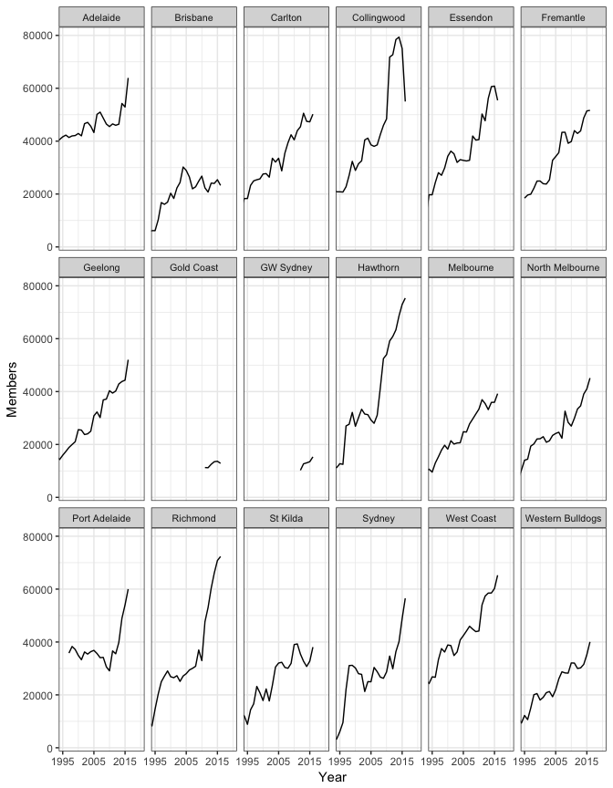

Sydney Swans versus the rest
================
Neil Saunders
2018-03-28 20:36:03

-   [Introduction](#introduction)
    -   [Versus teams and venues](#versus-teams-and-venues)
        -   [Win/loss record versus teams](#winloss-record-versus-teams)
        -   [Win/loss record at venues](#winloss-record-at-venues)
    -   [Versus teams: members](#versus-teams-members)
    -   [Versus teams: club payments](#versus-teams-club-payments)
    -   [Coaches](#coaches)

Introduction
============

In "Swans versus the rest" we look at the South Melbourne (SMFC) and Sydney Swans record versus teams and venues in terms of wins/losses, members, finances and coaching history.

Versus teams and venues
-----------------------

First we get the data for all South Melbourne/Sydney Swans games. For these analyses we'll look only at the "modern" Swans era, 1982 onwards.

### Win/loss record versus teams

Still unbeaten versus Gold Coast :)

Could do better versus the Cats and Hawks.

### Win/loss record at venues

Gives some weight to the notion that the Swans struggle at the MCG.

Versus teams: members
---------------------

We fetch membership numbers from [this site](http://www.footyindustry.com/?page_id=226). The original data sources are not known. Most of the figures seems accurate when compared with other sources.

Note that there is often more to these numbers to meet the eye; for example, the rapid rise in Collingwood's numbers occurred when they changed how members were counted.

Versus teams: club payments
---------------------------

These figures are taken from the most recent AFL annual report, which is for the year 2013. Club payments are divided into "base" (the same for all clubs), "future" (different for some clubs) and "other" (various payments, different for all clubs).

In this plot clubs are sorted by "other" and the median total payment is shown. Note that overall the Swans rank 7/18 for "other" payments and are in the lower 50% of total payments.

Coaches
-------

First we get the coaching data, label the team (South Melbourne or Sydney) and indicate grand final appearance in each year.

**TO DO**

-   Coaches win/loss record coloured by teams coached
-   Coaches win/loss record coloured by years with SMFC/Sydney
-   Coaches win/loss record coloured by grand finals with SMFC/Sydney
